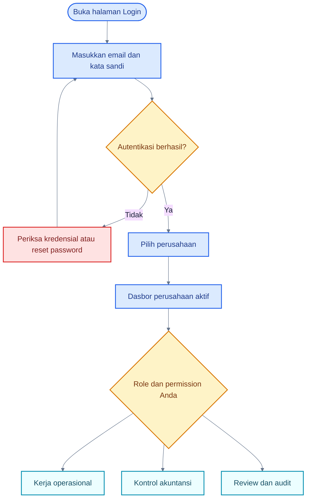
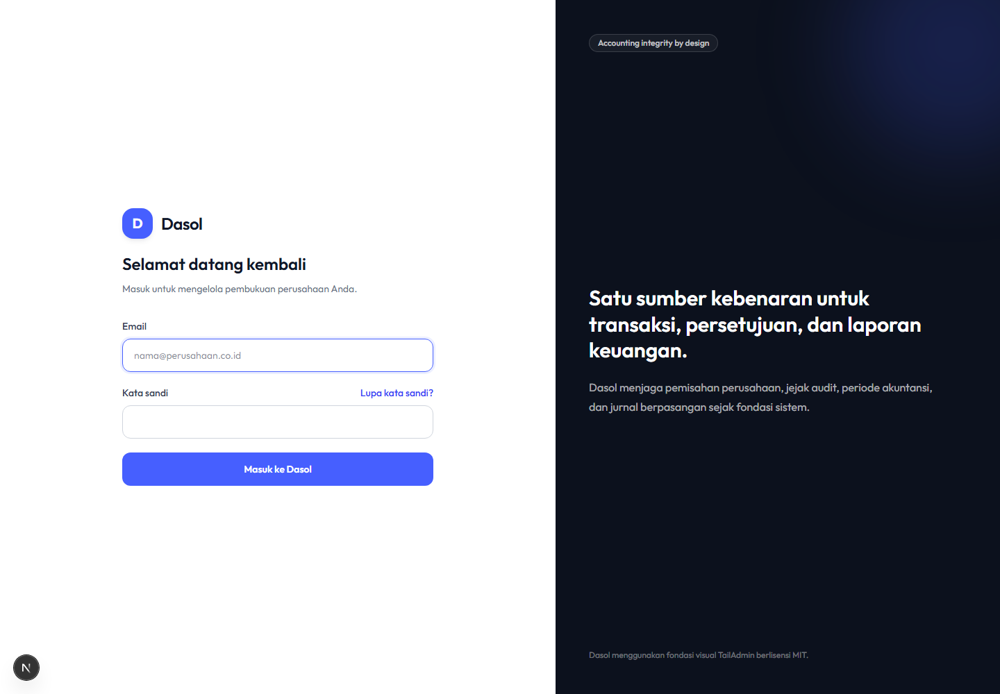
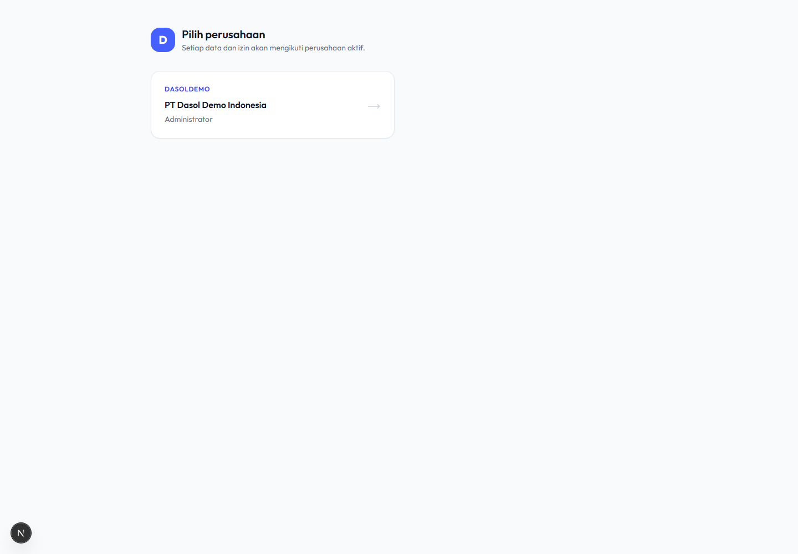
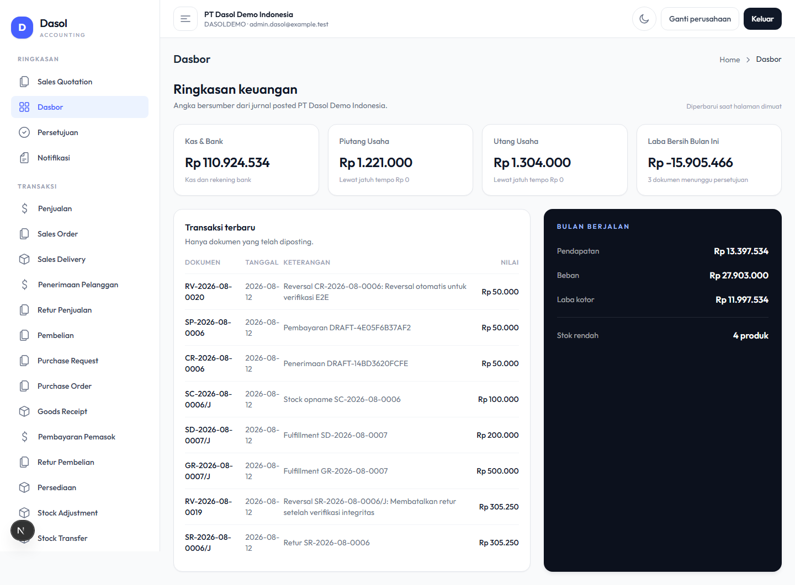
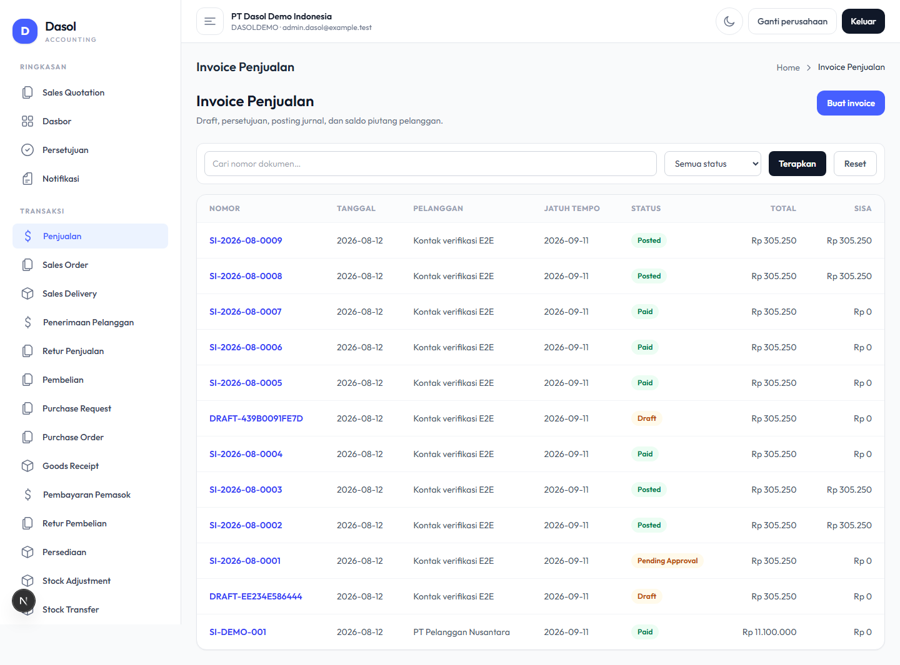

# Pengenalan Dasol

## 1. Apa Itu Dasol?

Dasol adalah aplikasi akuntansi berbasis web untuk mengelola beberapa perusahaan. Dalam satu aplikasi, pengguna dapat mengerjakan penjualan, pembelian, persediaan, kas dan bank, aset tetap, approval, jurnal, laporan, pajak, serta audit trail.

Dasol memakai pembagian tugas. Operator memasukkan transaksi, Approver memeriksa, role berwenang memposting, Akuntan mengontrol hasil akuntansi, dan Viewer/Auditor meninjau tanpa mengubah data.

> **Penting:** Nama role membantu menjelaskan tanggung jawab, tetapi akses sebenarnya ditentukan oleh permission pada perusahaan aktif.

## 2. Hasil yang Diharapkan dari Dasol

- Transaksi tersimpan sebagai dokumen yang dapat ditelusuri.
- Perubahan status mengikuti urutan yang valid.
- Posting membuat jurnal seimbang dan, bila relevan, memperbarui stok serta piutang/utang.
- Dokumen posted tidak diedit atau dihapus; koreksi memakai reversal atau retur.
- Data antarperusahaan dipisahkan melalui membership, permission, dan RLS.
- Laporan keuangan membaca jurnal berstatus posted.

## 3. Perjalanan Pertama Pengguna

### Cara Membaca Flowchart

1. Semua pengguna masuk melalui halaman Login.
2. Setelah autentikasi, pengguna memilih perusahaan dari membership aktif.
3. Dasbor dan menu mengikuti permission pada perusahaan tersebut.
4. Pengguna tidak otomatis memperoleh semua jalur; role menentukan pekerjaan yang dapat dilakukan.

## 4. Login, Memilih Perusahaan, dan Logout

### Login

1. Buka `/login`.
2. Masukkan email dan kata sandi.
3. Klik **Masuk ke Dasol**.
4. Jika berhasil, halaman **Pilih Perusahaan** akan tampil.

### Memilih perusahaan

1. Periksa kode dan nama perusahaan.
2. Klik kartu/tombol perusahaan yang akan dikerjakan.
3. Pastikan nama perusahaan di header sesuai sebelum memasukkan transaksi.

### Mengganti perusahaan

Gunakan tautan pilihan perusahaan pada header. Dasol akan memvalidasi ulang membership; cookie perusahaan hanya berfungsi sebagai pilihan, bukan sebagai bukti akses.

### Logout

Gunakan menu pengguna di header, lalu pilih keluar. Jangan meninggalkan sesi aktif di komputer bersama.

## 5. Mengenal Dasbor

Dasbor menampilkan angka perusahaan aktif yang berasal dari jurnal posted:

- Kas & Bank;
- Piutang Usaha dan nilai lewat jatuh tempo;
- Utang Usaha dan nilai lewat jatuh tempo;
- Laba Bersih bulan berjalan;
- Pendapatan, beban, dan laba kotor bulan berjalan;
- jumlah produk dengan stok rendah;
- jumlah dokumen menunggu approval;
- transaksi posted terbaru.

> **Catatan:** Angka diperbarui saat halaman dimuat. Refresh halaman untuk membaca perubahan terbaru.

## 6. Skenario yang Digunakan dalam Buku Ini

Contoh konsisten memakai **PT Dasol Demo Indonesia**:

1. Operator membuat transaksi untuk pelanggan atau pemasok demo.
2. Dokumen disimpan sebagai Draft dan kemudian diajukan.
3. Approver memeriksa dan menyetujui atau menolak.
4. Role dengan permission posting memposting dokumen.
5. Akuntan memeriksa jurnal dan laporan.
6. Auditor menelusuri dokumen, jurnal, dan audit log.

Nominal dan kode pajak dalam data demo adalah contoh konfigurasi, bukan pernyataan tarif atau nasihat perpajakan.

## 7. Bagaimana Mengetahui Proses Berhasil?

- URL atau pesan sukses berubah setelah action.
- Status dokumen berubah sesuai tahap berikutnya.
- Nomor final menggantikan nomor `DRAFT-*` setelah submit pada dokumen tertentu.
- Detail posted menampilkan tautan jurnal jika transaksi menghasilkan jurnal.
- Saldo invoice berubah setelah receipt/payment/return.
- Stock card menampilkan movement baru setelah fulfillment atau operasi stok.
- Audit Log mencatat action penting.

## 8. Jika Terjadi Kesalahan

- Draft/rejected: edit lalu simpan kembali.
- Pending approval: tunggu keputusan; cancel submission/request revision belum tersedia.
- Rejected: baca alasan, edit, dan submit ulang.
- Posted: jangan mengubah data sumber; gunakan reversal atau return bila action tersedia.
- Periode terkunci: hubungi Administrator/Akuntan berwenang. Reopen membutuhkan alasan.

## 9. Tampilan Aktual Aplikasi

### Login

Masukkan email dan kata sandi yang diberikan Administrator. Jangan berbagi kredensial.

### Pilih Perusahaan

Pilih company tempat Anda akan bekerja. Company aktif menentukan data yang tampil dan tidak menggantikan pemeriksaan permission di server/database.

### Dasbor Administrator

Angka pada gambar berasal dari data demo saat screenshot dibuat dan bukan contoh target bisnis. Role lain melihat metrik dasar yang sama, tetapi menu samping mengikuti permission.

### Daftar Sales Invoice

List menunjukkan pencarian, filter status, nomor dokumen, tanggal, customer, jatuh tempo, total, sisa, dan status aktual.

## 10. Panduan Terkait

- [Konsep Dasar Dasol](./01-konsep-dasar-dasol.md)
- [Peta Role dan Permission](./02-peta-role-dan-permission.md)
- [Troubleshooting](./16-troubleshooting.md)
- [Quick Reference](./18-quick-reference.md)
