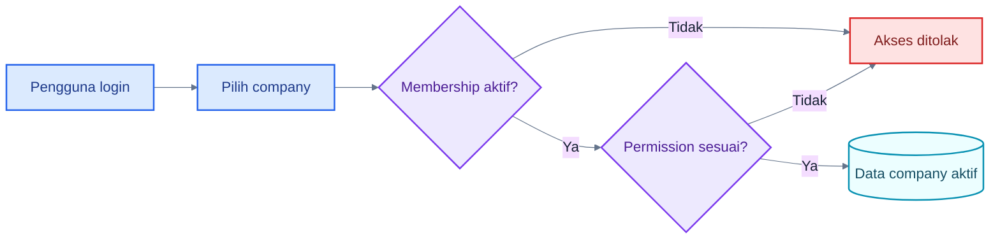
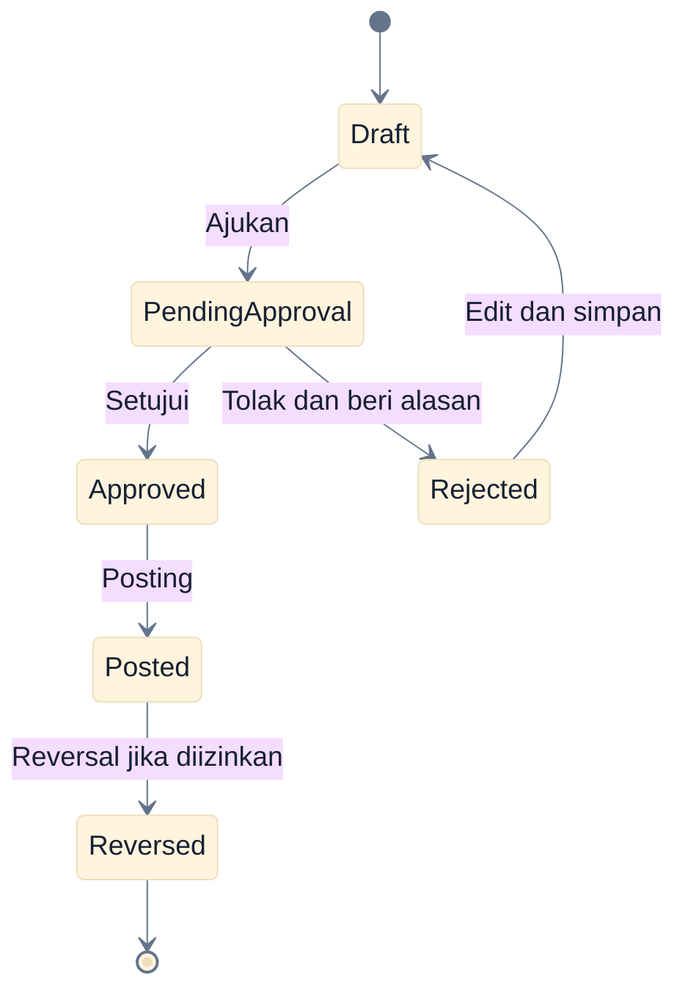
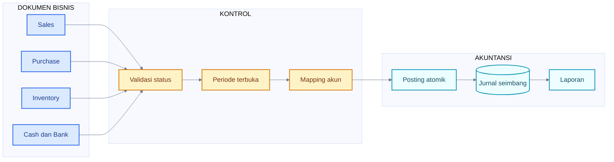

# Konsep Dasar Dasol

## 1. Company Aktif dan Isolasi Data

Setiap transaksi, master data, jurnal, dan laporan dimiliki satu perusahaan. Pengguna hanya dapat memilih perusahaan tempat ia memiliki membership aktif. Setelah perusahaan dipilih, server masih memeriksa user, membership, permission, dan kepemilikan data pada setiap operasi.

### Cara Membaca Flowchart

1. Pilihan company bukan pengganti authorization.
2. Membership harus aktif.
3. Permission diperiksa untuk menu dan action.
4. RLS menjaga agar data company lain tidak ikut terbaca atau berubah.

## 2. Draft, Approval, dan Posting

**Draft** adalah dokumen kerja. **Submit/Ajukan** mengunci draft dari pengeditan dan mengirimnya ke approval. **Approve** menyatakan dokumen layak diproses. **Posting** menghasilkan dampak akuntansi, stok, atau subledger.

### Cara Membaca Flowchart

1. Lifecycle ini berlaku untuk invoice, order/fulfillment, return, kas, dan operasi stok yang memakai approval.
2. UI Dasol menampilkan status `pending_approval`, bukan status `submitted` terpisah.
3. Rejected dapat diperbaiki dan diajukan ulang.
4. Posted tidak kembali menjadi Draft; koreksi memakai Reversed.
5. Receipt/payment dan manual journal memiliki lifecycle yang lebih pendek.

## 3. Lifecycle yang Berbeda

| Dokumen                                                        | Lifecycle aktual                                                                    |
| -------------------------------------------------------------- | ----------------------------------------------------------------------------------- |
| Invoice, order, fulfillment, return, cash, inventory operation | Draft → Pending Approval → Approved → Posted/Reversed, dengan cabang Rejected       |
| Customer Receipt / Supplier Payment                            | Draft → Posted → Reversed                                                           |
| Manual Journal                                                 | Langsung Posted saat form berhasil disimpan → Reversed                              |
| Sales Quotation / Purchase Request                             | Sampai Approved lalu dapat dikonversi; source menjadi Completed                     |
| Sales Order / Purchase Order                                   | Sampai Approved/Completed; fulfillment yang diposting mengurangi remaining quantity |
| Fixed Asset                                                    | Draft → Active → Disposed; penyusutan diposting per jadwal                          |
| Bank Reconciliation                                            | Draft → Reconciled                                                                  |
| Master data                                                    | Active ↔ Inactive, bukan hard delete                                                |

## 4. Posting dan General Ledger

### Cara Membaca Flowchart

1. Posting hanya dimulai dari status yang diizinkan.
2. Database memeriksa periode dan akun yang diperlukan.
3. Seluruh perubahan dilakukan atomik: jika satu bagian gagal, semuanya dibatalkan.
4. Laporan resmi Dasol membaca jurnal posted.

## 5. Reversal Bukan Delete

Reversal membuat jurnal baru dengan debit/kredit yang berlawanan dan menyimpan dokumen sumber. Untuk inventory, reversal juga membuat movement pembalik. Beberapa reversal diblokir jika sudah ada transaksi lanjutan, saldo telah dialokasikan, atau periode tidak terbuka.

> **Penting:** Jangan memakai reversal untuk menyembunyikan transaksi. Isikan tanggal dan alasan koreksi yang dapat dipertanggungjawabkan.

## 6. Piutang dan Utang

- Posting Sales Invoice membuat Accounts Receivable (AR).
- Customer Receipt mengalokasikan pembayaran dan mengurangi outstanding AR.
- Posting Purchase Invoice membuat Accounts Payable (AP).
- Supplier Payment mengalokasikan pembayaran dan mengurangi outstanding AP.
- Return mengurangi saldo sumber secara proporsional dan mencatat customer credit/supplier debit.
- `Partially Paid` berarti saldo belum nol; `Paid` berarti outstanding nol.

## 7. Persediaan dan Biaya Rata-Rata

Dasol memakai moving weighted average untuk inventory. Goods receipt menambah kuantitas dan memperbarui biaya rata-rata. Delivery mengurangi kuantitas dengan biaya rata-rata saat posting. Stok negatif diblokir pada konfigurasi demo.

Backdated movement yang mendahului movement terbaru dapat diblokir untuk menjaga nilai persediaan. Transfer antargudang tidak mengubah total nilai perusahaan. Stock opname memotret expected quantity; jika snapshot sudah usang karena movement baru, posting harus diulang dari data terbaru.

## 8. Periode Akuntansi

Periode `open` menerima posting. Periode `locked` menolak posting dan reversal bertanggal dalam periode tersebut. Permission `period.close` dapat mengunci; `period.reopen` dapat membuka kembali dan alasan wajib diisi.

## 9. Audit Trail dan Notifikasi

Audit Log menyimpan actor, action, entity, waktu, alasan, serta data sebelum/sesudah bila tersedia. Notifikasi durable dibuat untuk permintaan approval, approved/rejected, status posting/pembayaran tertentu, dan low stock. Notifikasi dapat ditandai terbaca.

> **Status implementasi:** Notifikasi belum realtime di header dan belum mengirim email.

## 10. Handoff Dasar

```mermaid
%%{init: {"theme":"base","themeVariables":{"fontSize":"18px","fontFamily":"Inter, ui-sans-serif, Arial, sans-serif","primaryTextColor":"#172033","lineColor":"#64748b"},"flowchart":{"curve":"basis"}}}%%
flowchart LR
    H1["Operator membuat dan submit"] --> H2["Approver memvalidasi"]
    H2 --> H3{"Keputusan"}
    H3 -- Tolak --> H1
    H3 -- Setujui --> H4["Role berwenang posting"]
    H4 --> H5["Akuntan kontrol ledger"]
    H5 --> H6["Auditor review evidence"]
    classDef input fill:#dbeafe,stroke:#2563eb,stroke-width:2px,color:#1e3a8a;
    classDef approval fill:#ede9fe,stroke:#7c3aed,stroke-width:2px,color:#4c1d95;
    classDef decision fill:#fef3c7,stroke:#d97706,stroke-width:2px,color:#78350f;
    classDef done fill:#dcfce7,stroke:#16a34a,stroke-width:2px,color:#14532d;
    classDef neutral fill:#f1f5f9,stroke:#64748b,stroke-width:2px,color:#334155;
    class H1 input;
    class H2 approval;
    class H3 decision;
    class H4,H5 done;
    class H6 neutral;
```

### Cara Membaca Flowchart

1. Tanggung jawab berpindah saat dokumen disubmit.
2. Penolakan mengembalikan pekerjaan ke pembuat untuk diperbaiki.
3. Approval dan posting adalah dua permission berbeda.
4. Akuntan dan Auditor bekerja dari hasil posted, bukan mengubah draft milik Operator.

## Panduan Terkait

- [Alur lintas role](./08-cross-role-workflows.md)
- [Alur akuntansi](./09-accounting-workflows.md)
- [Glosarium](./17-glossary.md)
