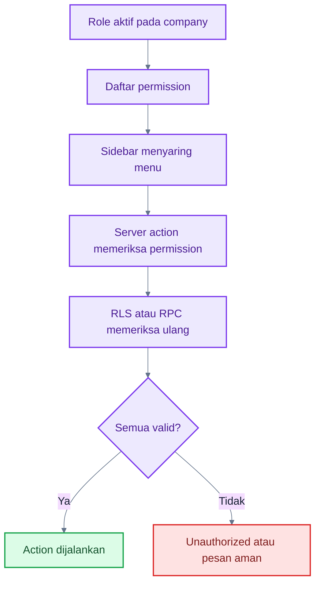

# Peta Role dan Permission

## 1. Role adalah Pembagian Fungsi

Administrator bukan atasan teknis semua role. Kelima role default memisahkan fungsi konfigurasi, pencatatan, validasi, kontrol akuntansi, dan pemeriksaan.

```mermaid
%%{init: {"theme":"base","themeVariables":{"fontSize":"19px","fontFamily":"Inter, ui-sans-serif, Arial, sans-serif","primaryTextColor":"#172033","lineColor":"#64748b"},"flowchart":{"curve":"basis","nodeSpacing":48,"rankSpacing":60}}}%%
flowchart LR
    R1["Administrator<br/>Konfigurasi dan governance"]
    R2["Operator<br/>Membuat transaksi"]
    R3["Approver<br/>Validasi dan keputusan"]
    R4["Akuntan<br/>Kontrol ledger dan laporan"]
    R5["Viewer atau Auditor<br/>Review read-only"]
    R1 -. menyiapkan akses .-> R2
    R1 -. menyiapkan kontrol .-> R3
    R2 --> R3 --> R4 --> R5
    classDef admin fill:#ede9fe,stroke:#7c3aed,stroke-width:2px,color:#4c1d95;
    classDef input fill:#dbeafe,stroke:#2563eb,stroke-width:2px,color:#1e3a8a;
    classDef approval fill:#fef3c7,stroke:#d97706,stroke-width:2px,color:#78350f;
    classDef accounting fill:#ecfeff,stroke:#0891b2,stroke-width:2px,color:#164e63;
    classDef audit fill:#f1f5f9,stroke:#64748b,stroke-width:2px,color:#334155;
    class R1 admin;
    class R2 input;
    class R3 approval;
    class R4 accounting;
    class R5 audit;
```

### Cara Membaca Flowchart

1. Administrator menyiapkan lingkungan kerja dan akses.
2. Operator bertanggung jawab atas draft dan kelengkapan data.
3. Approver memberi keputusan tanpa mengubah nilai dokumen.
4. Akuntan memastikan dampak posting benar.
5. Viewer/Auditor menilai bukti tanpa mutation permission.

## 2. Permission Default yang Benar-Benar Diberikan

Tabel ini merangkum preset demo setelah seluruh migrasi. Administrator memperoleh semua permission. Custom role dapat berbeda.

| Area                            | Administrator | Akuntan                                 | Operator                | Approver                  | Viewer/Auditor         |
| ------------------------------- | ------------- | --------------------------------------- | ----------------------- | ------------------------- | ---------------------- |
| Company identity                | Kelola        | Tidak                                   | Tidak                   | Tidak                     | Tidak                  |
| Accounting settings/mapping/tax | Kelola        | Kelola                                  | Tidak                   | Tidak                     | Tidak                  |
| User dan role                   | Kelola        | Tidak                                   | Tidak                   | Tidak                     | Tidak                  |
| COA                             | Lihat/kelola  | Lihat/kelola                            | Lihat                   | Lihat                     | Lihat                  |
| Contact                         | Lihat/kelola  | Lihat                                   | Lihat/kelola            | Tidak langsung            | Lihat                  |
| Product                         | Lihat/kelola  | Lihat                                   | Lihat/kelola            | Tidak langsung            | Lihat                  |
| Sales/Purchase                  | Semua action  | Tidak                                   | Create/edit/submit      | Read/approve/post         | Read-only              |
| Inventory operation             | Semua action  | Read/post/reverse                       | Read/create/edit/submit | Read/approve/post/reverse | Read-only              |
| Cash transaction                | Semua action  | Read/create/edit/submit/post/reverse    | Read/create/edit/submit | Read/approve/post/reverse | Read-only              |
| Journal                         | Semua action  | Read/create/submit/approve/post/reverse | Tidak                   | Read                      | Read-only              |
| Fixed assets                    | Semua action  | Read/write/post/dispose                 | Tidak                   | Tidak                     | Read-only              |
| Period                          | Close/reopen  | Close                                   | Tidak                   | Tidak                     | Tidak                  |
| Reports                         | Read/export   | Read/export                             | Tidak                   | Tidak                     | Read-only tanpa export |
| Approval queue                  | Lihat         | Lihat                                   | Tidak                   | Lihat                     | Lihat                  |
| Audit log                       | Lihat/export  | Lihat/export                            | Tidak                   | Tidak                     | Lihat tanpa export     |

> **Catatan:** Akuntan dan Approver dapat memiliki permission posting tanpa permission approval untuk domain tertentu. Dokumen harus tetap mencapai status Approved oleh role yang sesuai.

## 3. Matrix Action per Role

| Role           | Lihat             | Tambah                         | Edit                | Hapus/Arsip              | Submit                        | Approve                  | Post                             | Reverse                             | Export                                 |
| -------------- | ----------------- | ------------------------------ | ------------------- | ------------------------ | ----------------------------- | ------------------------ | -------------------------------- | ----------------------------------- | -------------------------------------- |
| Administrator  | ✅                | ✅                             | ✅                  | ✅                       | ✅                            | ✅                       | ✅                               | ✅                                  | ✅                                     |
| Akuntan        | ✅                | ⚠️ domain accounting/cash/aset | ⚠️ domain yang sama | ⚠️ draft/master tertentu | ⚠️ cash dan permission jurnal | ❌ transaksi operasional | ✅ accounting/inventory/cash     | ✅ sesuai domain                    | ✅ laporan/master/audit yang diizinkan |
| Operator       | ✅ domain operasi | ✅                             | ✅ Draft/Rejected   | ✅ Draft                 | ✅                            | ❌                       | ❌                               | ❌                                  | ❌                                     |
| Approver       | ✅ domain review  | ❌                             | ❌                  | ❌                       | ❌                            | ✅                       | ✅ sales/purchase/inventory/cash | ⚠️ inventory/cash dan journal guard | ❌                                     |
| Viewer/Auditor | ✅                | ❌                             | ❌                  | ❌                       | ❌                            | ❌                       | ❌                               | ❌                                  | ❌ pada preset                         |

## 4. RACI Proses Utama

R = Responsible, A = Accountable, C = Consulted/Controller, I = Informed/Reviewer. Matrix ini menggambarkan cara kerja yang direkomendasikan dengan preset role, bukan hirarki organisasi.

| Proses                          | Admin | Akuntan | Operator | Approver | Auditor |
| ------------------------------- | ----- | ------- | -------- | -------- | ------- |
| Setup user dan role             | A/R   | I       | -        | -        | I       |
| Master contact/product          | C     | C       | R        | -        | I       |
| Sales/Purchase document         | I     | C       | R        | A        | I       |
| Fulfillment dan stock operation | I     | C       | R        | A        | I       |
| Cash transaction                | I     | C/R     | R        | A        | I       |
| Manual journal                  | I     | A/R     | -        | -        | I       |
| Rekonsiliasi bank               | I     | A/R     | -        | -        | C       |
| Period close                    | A     | R       | I        | I        | I       |
| Financial reporting             | I     | A/R     | -        | I        | C/R     |
| Audit investigation             | C     | C       | I        | I        | R       |

## 5. Bagaimana Permission Bekerja

### Cara Membaca Flowchart

1. Menu yang hilang biasanya berarti permission tidak diberikan.
2. Mengetik URL secara manual tidak melewati kontrol server.
3. Database memeriksa ulang company dan permission.
4. Hubungi Administrator bila akses memang dibutuhkan untuk pekerjaan.

## 6. Self-Approval dan Approval Level

Company memiliki pengaturan `allow_self_approval`. Pada demo nilainya **false**, sehingga pembuat/submittor tidak boleh menyetujui dokumennya sendiri.

Schema menyimpan workflow steps dan batas nilai, tetapi engine/UI aktif saat ini menyelesaikan approval pada satu keputusan. Karena itu:

- one-level approval: tersedia;
- two-level approval: belum diterapkan end-to-end;
- amount threshold: belum diterapkan oleh keputusan aktif;
- request revision/cancel submission: belum tersedia di UI;
- reject dengan alasan: tersedia dan wajib.

## 7. Custom Role

Administrator dapat membuat custom role, memilih minimal satu permission, mengedit role custom, dan menonaktifkannya bila tidak dipakai anggota aktif. Role sistem tidak dapat diedit/dinonaktifkan. Sistem juga mencegah pengguna mencabut akses kritis miliknya sendiri secara tidak aman.

## 8. Pilih Panduan Role

- [Administrator](./03-administrator-guide.md)
- [Akuntan](./04-accountant-guide.md)
- [Operator](./05-operator-guide.md)
- [Approver](./06-approver-guide.md)
- [Viewer/Auditor](./07-viewer-auditor-guide.md)
