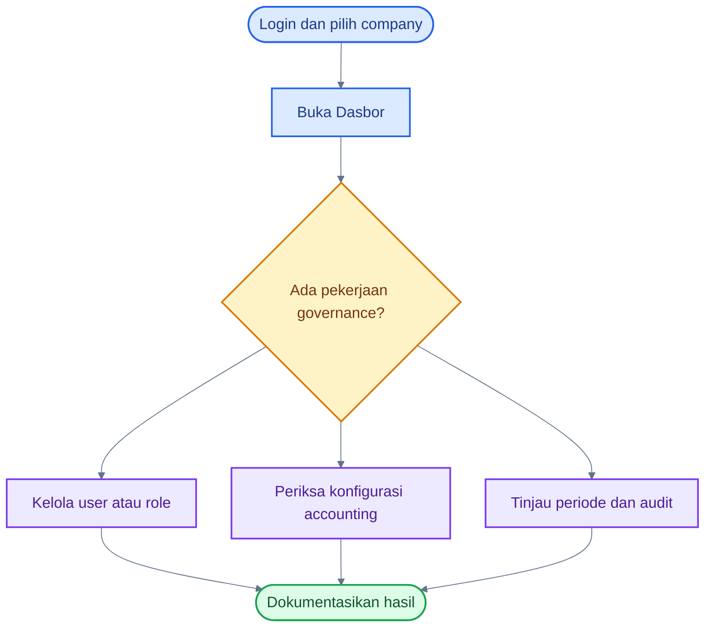
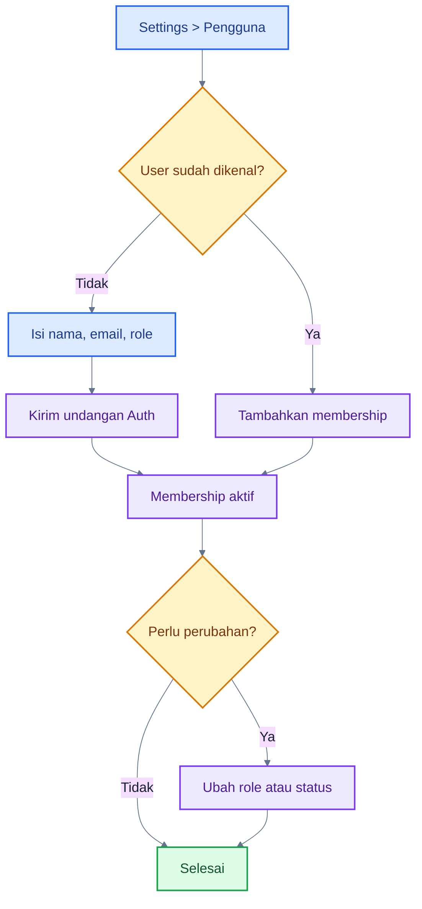
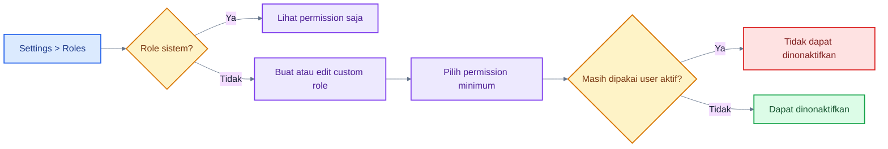
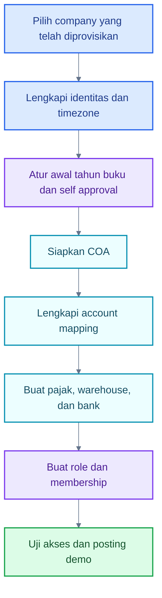
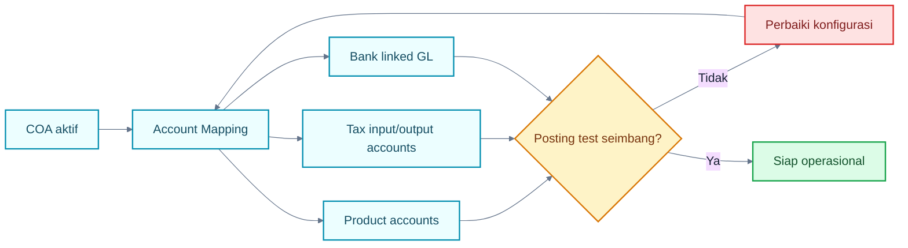
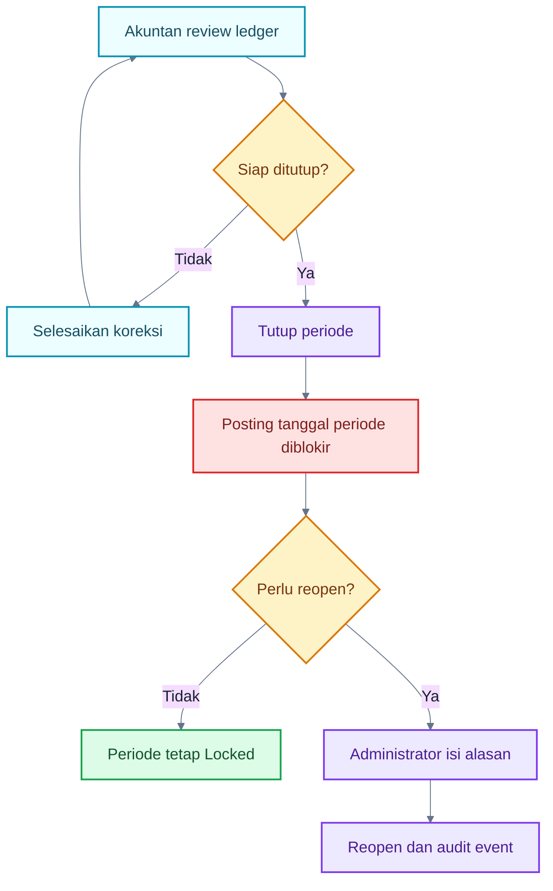
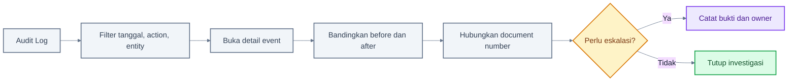

# Panduan Administrator

## 1. Tentang Role Ini

Administrator menjaga konfigurasi, akses, dan governance Dasol. Administrator dapat memiliki seluruh permission, tetapi bukan berarti harus mengerjakan setiap transaksi harian. Pemisahan tugas tetap dianjurkan: Operator membuat, Approver memvalidasi, Akuntan mengontrol, dan Auditor meninjau.

Tanggung jawab utama:

- memastikan user dan membership benar;
- mengelola custom role dan permission;
- menjaga company identity dan accounting settings;
- menyiapkan COA, account mapping, pajak, warehouse, dan bank account;
- menutup/membuka kembali periode sesuai kebijakan;
- menyelidiki audit trail dan exception akses.

> **Status implementasi:** Company baru, branch CRUD, feature flag, dan approval-workflow designer belum memiliki UI. Company aktif dapat diedit; branch yang sudah ada dipilih melalui form terkait.

## 2. Hak Akses

| Modul             | Lihat | Tambah          | Edit             | Hapus/Arsip    | Submit                  | Approve                    | Post | Reverse         | Export |
| ----------------- | ----- | --------------- | ---------------- | -------------- | ----------------------- | -------------------------- | ---- | --------------- | ------ |
| Company/settings  | ✅    | ❌ company baru | ✅               | ❌             | N/A                     | N/A                        | N/A  | N/A             | ❌     |
| Users/memberships | ✅    | ✅ undang       | ✅               | ✅ nonaktifkan | N/A                     | N/A                        | N/A  | N/A             | ❌     |
| Roles/permissions | ✅    | ✅ custom       | ✅ custom        | ✅ nonaktifkan | N/A                     | N/A                        | N/A  | N/A             | ❌     |
| Master data       | ✅    | ✅              | ✅               | ✅ nonaktifkan | N/A                     | N/A                        | N/A  | N/A             | ✅ CSV |
| Sales/Purchase    | ✅    | ✅              | ✅ draft         | ✅ draft       | ✅                      | ✅                         | ✅   | ✅ sesuai guard | ❌     |
| Inventory/Cash    | ✅    | ✅              | ✅ draft         | ✅ draft       | ✅                      | ✅                         | ✅   | ✅              | ❌     |
| Journal/period    | ✅    | ✅ jurnal       | ❌ jurnal posted | ❌             | ⚠️ jurnal langsung post | ⚠️ tidak dipakai UI jurnal | ✅   | ✅              | ❌     |
| Reports/Audit     | ✅    | N/A             | N/A              | N/A            | N/A                     | N/A                        | N/A  | N/A             | ✅ CSV |

## 3. Dashboard Administrator

Dasbor tidak memiliki versi khusus role. Administrator melihat ringkasan company aktif: kas/bank, AR/AP, laba bulanan, transaksi posted terbaru, pending approval, dan low-stock count. Gunakan ini sebagai indikator awal, lalu buka laporan atau audit log untuk investigasi.

## 4. Menu yang Dapat Diakses

Administrator melihat seluruh sidebar:

- **Ringkasan:** Dasbor, Persetujuan, Notifikasi, Sales Quotation.
- **Transaksi:** seluruh sales, purchase, inventory, receipt/payment, return, dan fulfillment.
- **Akuntansi:** COA, contacts, products, warehouses, journal, period, reports, fixed assets.
- **Administrasi:** bank account, cash transaction, reconciliation, taxes, audit, company settings, mapping, users, roles.

## 5. Aktivitas Harian

1. Periksa notifikasi dan exception pada dasbor.
2. Tinjau user/membership yang baru diundang atau perlu dinonaktifkan.
3. Pastikan mapping akun dan master aktif sebelum transaksi dimulai.
4. Tangani permintaan akses melalui custom role, bukan berbagi kredensial.
5. Tinjau Audit Log untuk perubahan konfigurasi kritis.
6. Koordinasikan close/reopen period dengan Akuntan.

## 6. Flowchart Utama Role

### A. Daily Overview

### Cara Membaca Flowchart

1. Mulai dari company yang benar.
2. Dasbor membantu memilih area investigasi.
3. Perubahan akses, konfigurasi, dan periode harus dapat dijelaskan.
4. Simpan alasan atau tiket internal untuk perubahan kritis.

### B. User Management

### Cara Membaca Flowchart

1. Undangan memakai konfigurasi Supabase Auth dan service-role di server.
2. User yang sudah ada tidak perlu dibuat ulang; membership baru dapat ditambahkan.
3. Role harus aktif.
4. Administrator tidak dapat mengubah role/status membership miliknya sendiri melalui UI, untuk mencegah self-lockout.

### C. Role dan Permission

### Cara Membaca Flowchart

1. Lima role demo adalah role sistem dan tidak dapat diedit.
2. Custom role wajib memiliki minimal satu permission.
3. Gunakan prinsip least privilege.
4. Role aktif yang masih dipakai membership tidak dapat dinonaktifkan.

### D. Initial Company Setup

### Cara Membaca Flowchart

1. Company harus sudah diprovisikan; create-company UI belum ada.
2. Pastikan COA aktif sebelum dipakai mapping.
3. Tax rate dibuat sebagai versi efektif, bukan mengubah histori.
4. Uji dengan transaksi kecil sebelum onboarding massal.

### E. Accounting Configuration

### Cara Membaca Flowchart

1. Mapping company menangani akun kontrol umum.
2. Produk membawa akun revenue/expense/inventory/COGS.
3. Pajak dan bank memiliki akun terkait masing-masing.
4. Posting gagal dengan aman bila mapping wajib kosong.

### F. Period Close/Reopen Governance

### Cara Membaca Flowchart

1. Close dilakukan setelah review, bukan sekadar karena kalender berakhir.
2. Akuntan preset dapat close tetapi tidak reopen.
3. Administrator preset dapat reopen dengan alasan wajib.
4. Semua posting dan reversal pada periode Locked ditolak.

### G. Audit Investigation

### Cara Membaca Flowchart

1. Mulai dari filter yang sempit agar event relevan mudah ditemukan.
2. Detail menampilkan metadata dan perubahan data bila tersedia.
3. Audit Log tidak diedit atau dihapus dari UI.
4. Export CSV tersedia bagi Administrator dengan `report.export` dan `audit.read`.

## 7. Panduan Setiap Aktivitas

### Mengundang pengguna

1. Buka **Pengaturan → Pengguna**.
2. Klik tambah/undang.
3. Masukkan nama, email, dan role aktif.
4. Simpan. Jika user belum ada, Dasol meminta Supabase Auth mengirim undangan.
5. Konfirmasi membership muncul pada daftar.

### Mengelola custom role

1. Buka **Roles & Permission**.
2. Buat role dengan kode, nama, dan minimal satu permission.
3. Review permission berisiko tinggi: manage, approve, post, reverse, dan period.
4. Simpan dan uji dengan user non-admin.

### Menyiapkan account mapping

1. Pastikan akun aktif dan tipe/normal balance benar.
2. Buka **Pemetaan Akun**.
3. Isi AR, AP, inventory, COGS, revenue, GRNI, tax, bank fee, rounding, retained earnings, dan exchange accounts yang dipakai.
4. Simpan, lalu uji posting relevan.

## 8. Status yang Relevan

- Membership: `active` atau `inactive`.
- Role: active/inactive; role sistem tidak dapat diubah.
- Master: active/inactive.
- Period: `open` atau `locked`.
- Audit: append-only, tanpa lifecycle edit.

## 9. Kesalahan yang Sering Terjadi

- Mengubah company yang salah sebelum konfigurasi.
- Memberikan permission `*.post`, `*.reverse`, atau `period.reopen` terlalu luas.
- Menonaktifkan master yang masih diperlukan tanpa koordinasi.
- Mengubah setting self-approval tanpa kebijakan tertulis.
- Menganggap approval threshold/two-level sudah aktif karena tabel database tersedia.

## 10. Tips

- Buat custom role per fungsi, bukan per nama orang.
- Uji negative access setelah perubahan permission.
- Catat alasan reopen period dan perubahan mapping.
- Gunakan inactive untuk master historis; jangan mengejar hard delete.

## 11. Checklist Administrator

- [ ] Company aktif sudah benar.
- [ ] User memiliki membership dan role yang tepat.
- [ ] Mapping akun wajib terisi.
- [ ] Tax rate efektif tidak tumpang tindih.
- [ ] Warehouse dan bank account aktif.
- [ ] Self-approval sesuai kebijakan.
- [ ] Close/reopen memiliki persetujuan internal.
- [ ] Audit Log ditinjau setelah perubahan kritis.

## 12. FAQ

**Apakah Administrator boleh posting?**

Secara permission default, ya. Secara governance sebaiknya hanya untuk kondisi yang disetujui dan tidak menghilangkan separation of duties.

**Bisakah membuat company baru dari UI?**

Belum. Company harus diprovisikan di luar alur self-service, lalu identitasnya dapat diedit.

**Bisakah mengatur two-level approval?**

Belum end-to-end. Schema step ada, tetapi engine/UI aktif masih satu keputusan.

**Mengapa role tidak dapat dinonaktifkan?**

Role sistem dilindungi, dan custom role yang masih dipakai anggota aktif juga diblokir.

## Belajar Dasol dalam 30 Menit

1. Login dan pilih company.
2. Kenali KPI Dasbor.
3. Buka Pengguna dan detail membership.
4. Buka role sistem dan custom role.
5. Tinjau COA dan Account Mapping.
6. Buka Kode Pajak dan versi rate.
7. Tinjau Periode Akuntansi.
8. Cari satu dokumen pada Audit Log.
9. Uji satu akun user dengan permission terbatas.

### Demo 5 Menit

1. Tunjukkan company aktif.
2. Buka daftar user dan role.
3. Buka satu custom role dan permission-nya.
4. Buka Account Mapping.
5. Tunjukkan Audit Log sebelum/after perubahan yang aman.

## Handoff ke Role Lain

- Setup selesai → Operator mulai membuat master/transaksi.
- Dokumen submitted → Approver memvalidasi.
- Transaksi posted → Akuntan merekonsiliasi.
- Bukti ledger/audit → Viewer/Auditor meninjau.
- Exception permission/configuration → kembali ke Administrator.

## Panduan Terkait

- [Peta Role dan Permission](./02-peta-role-dan-permission.md)
- [Panduan Akuntan](./04-accountant-guide.md)
- [Alur lintas role](./08-cross-role-workflows.md)
- [Troubleshooting](./16-troubleshooting.md)
