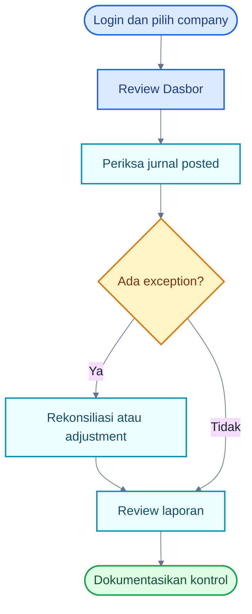
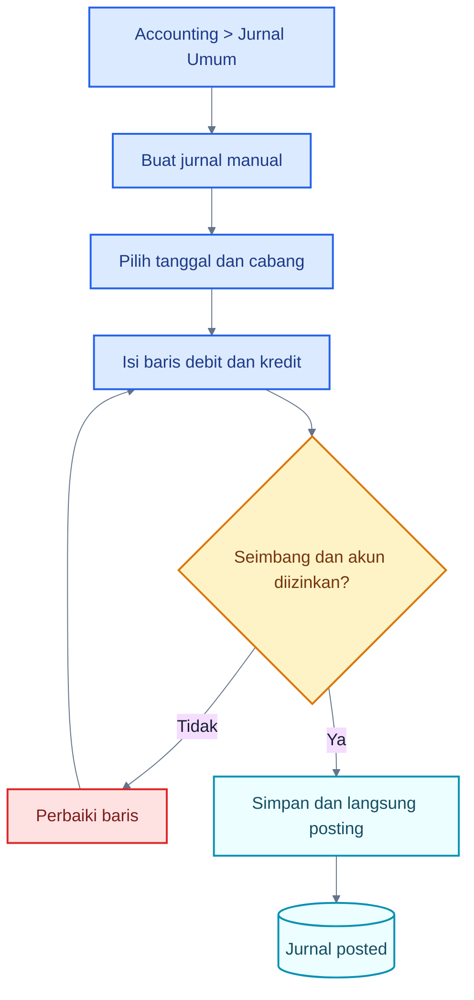
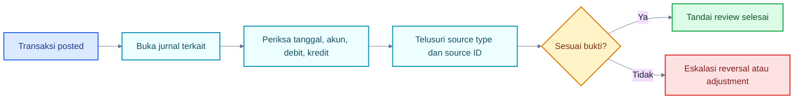
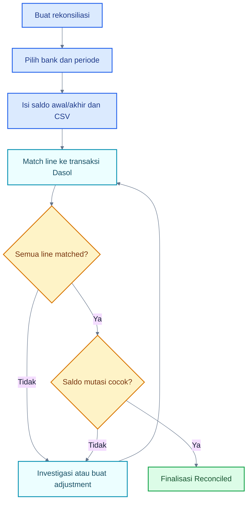
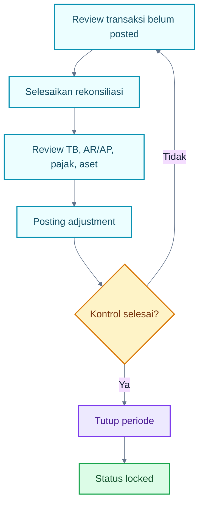
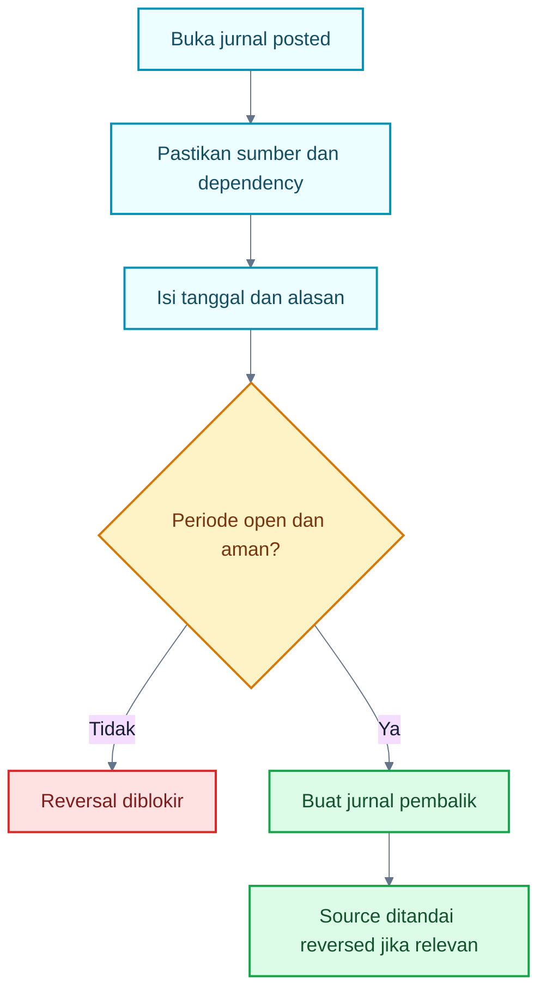
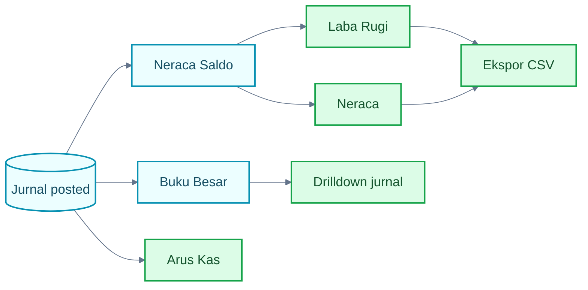
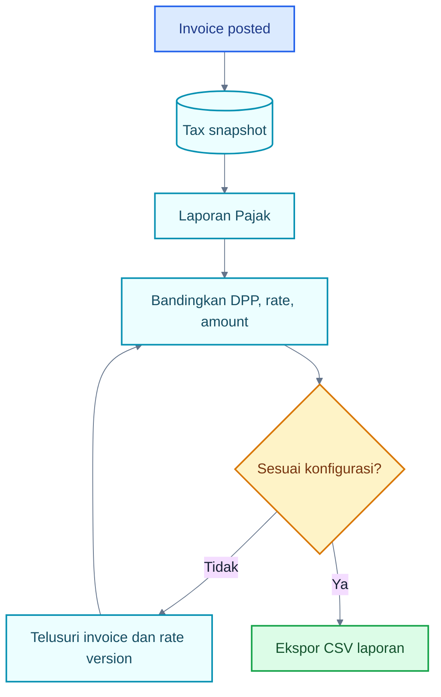

# Panduan Akuntan / Standard User

## 1. Tentang Role Ini

Akuntan menjaga kualitas pencatatan setelah aktivitas operasional masuk ke ledger. Fokusnya adalah jurnal, account mapping, rekonsiliasi, pajak, aset tetap, periode, dan laporan. Akuntan default bukan pembuat atau Approver transaksi sales/purchase.

Hubungan kerja:

- menerima hasil posted dari Operator/Approver;
- memeriksa akun, tanggal, nilai, AR/AP, stok, dan jurnal;
- membuat adjusting journal jika diperlukan;
- merekonsiliasi bank;
- menutup periode setelah kontrol selesai;
- menyediakan laporan kepada manajemen dan Auditor.

## 2. Hak Akses

| Modul                 | Lihat                            | Tambah           | Edit            | Hapus/Arsip              | Submit                        | Approve | Post                | Reverse              | Export   |
| --------------------- | -------------------------------- | ---------------- | --------------- | ------------------------ | ----------------------------- | ------- | ------------------- | -------------------- | -------- |
| COA                   | ✅                               | ✅               | ✅              | ✅ nonaktifkan           | N/A                           | N/A     | N/A                 | N/A                  | ✅       |
| Journals              | ✅                               | ✅ langsung post | ❌              | ❌                       | ⚠️ lifecycle UI tidak dipakai | ❌      | ✅                  | ✅                   | ❌       |
| Period                | ✅                               | ❌               | N/A             | N/A                      | N/A                           | N/A     | ✅ close            | ❌ reopen preset     | ❌       |
| Financial/Tax reports | ✅                               | N/A              | N/A             | N/A                      | N/A                           | N/A     | N/A                 | N/A                  | ✅       |
| Reconciliation        | ✅                               | ✅               | ✅ match/adjust | N/A                      | N/A                           | N/A     | ✅ finalize         | N/A                  | N/A      |
| Fixed assets          | ✅                               | ✅               | ✅ draft        | ✅ draft/category status | N/A                           | N/A     | ✅                  | ❌ disposal reversal | ❌       |
| Cash transactions     | ✅                               | ✅               | ✅ draft        | ✅ draft                 | ✅                            | ❌      | ✅ setelah approved | ✅                   | ❌       |
| Inventory operations  | ✅                               | ❌               | ❌              | ❌                       | ❌                            | ❌      | ✅ setelah approved | ✅                   | ❌       |
| Sales/Purchase        | ❌ preset                        | ❌               | ❌              | ❌                       | ❌                            | ❌      | ❌                  | ❌                   | ❌       |
| Settings/Audit        | ✅ accounting settings dan audit | ⚠️ mapping       | ✅              | N/A                      | N/A                           | N/A     | N/A                 | N/A                  | ✅ audit |

## 3. Dashboard Role

Dasbor menampilkan seluruh KPI company aktif, tidak hanya area Akuntan. Gunakan kas/bank, AR/AP overdue, laba bulanan, low stock, pending approval, dan transaksi terbaru untuk menentukan prioritas review.

## 4. Menu yang Dapat Diakses

- **Dasbor, Persetujuan, Notifikasi** untuk overview.
- **Persediaan dan operasi stok** untuk review serta posting/reversal setelah approval.
- **COA, contacts, products, warehouses** untuk referensi; COA dapat dikelola.
- **Jurnal Umum dan Periode Akuntansi** untuk kontrol ledger.
- **Laporan** untuk GL, TB, P&L, Neraca, Cash Flow, AR/AP Aging, dan Pajak.
- **Aset Tetap** untuk register, aktivasi, penyusutan, dan disposal.
- **Bank & Kas, Transaksi Kas, Rekonsiliasi** untuk kontrol kas.
- **Kode Pajak, Pengaturan, Pemetaan Akun, Audit Log** sesuai permission settings/audit.

## 5. Aktivitas Harian

1. Review transaksi posted terbaru dan pending approval.
2. Buka jurnal sumber yang material atau tidak biasa.
3. Periksa transaksi kas dan rekening bank.
4. Cocokkan bank statement dan selesaikan unmatched line.
5. Review Trial Balance, AR/AP Aging, pajak, dan laba/rugi.
6. Buat jurnal penyesuaian hanya dengan bukti.
7. Jalankan penyusutan jatuh tempo.
8. Menjelang tutup buku, pastikan seluruh posting selesai lalu close period.

## 6. Flowchart Utama Role

### A. Daily Workflow

### Cara Membaca Flowchart

1. Dasbor hanya indikator; kontrol rinci dilakukan pada jurnal dan laporan.
2. Exception ditangani melalui rekonsiliasi, reversal, atau adjusting journal.
3. Simpan bukti dan alasan untuk setiap koreksi.

### B. Manual Journal Workflow

### Cara Membaca Flowchart

1. Form jurnal tidak menyimpan Draft; submit berhasil langsung membuat jurnal posted.
2. Total debit harus sama dengan kredit dan tiap baris hanya memakai satu sisi.
3. Control account atau akun yang tidak mengizinkan manual entry tidak tersedia.
4. Periode harus open.

### C. Review Posted Transactions

### Cara Membaca Flowchart

1. Jurnal detail menampilkan source, totals, dan lines.
2. Cocokkan jurnal dengan detail dokumen bisnis.
3. Posted source tidak diperbaiki dengan edit.

### D. Reconciliation Workflow

### Cara Membaca Flowchart

1. CSV memakai kolom tanggal, deskripsi, reference, dan amount.
2. Line dapat di-match ke customer receipt, supplier payment, atau cash transaction.
3. Match dapat dibatalkan sebelum finalisasi.
4. Adjustment membuat jurnal untuk selisih yang sah.
5. Finalisasi memerlukan seluruh line matched dan persamaan saldo terpenuhi.

### E. Period Closing Workflow

### Cara Membaca Flowchart

1. Close period adalah langkah terakhir kontrol.
2. Status UI untuk periode tertutup adalah `locked`.
3. Akuntan preset dapat close, tetapi reopen harus dilakukan Administrator yang memiliki `period.reopen` dan mengisi alasan.

### F. Adjusting Journal Workflow

```mermaid
%%{init: {"theme":"base","themeVariables":{"fontSize":"18px","fontFamily":"Inter, ui-sans-serif, Arial, sans-serif","primaryTextColor":"#172033","lineColor":"#64748b"},"flowchart":{"curve":"basis"}}}%%
flowchart LR
    AJ1["Temuan rekonsiliasi"] --> AJ2["Kumpulkan bukti"]
    AJ2 --> AJ3["Tentukan akun dan tanggal"]
    AJ3 --> AJ4["Buat manual journal"]
    AJ4 --> AJ5["Jurnal langsung posted"]
    AJ5 --> AJ6["Review laporan ulang"]
    classDef warning fill:#fef3c7,stroke:#d97706,stroke-width:2px,color:#78350f;
    classDef input fill:#dbeafe,stroke:#2563eb,stroke-width:2px,color:#1e3a8a;
    classDef accounting fill:#ecfeff,stroke:#0891b2,stroke-width:2px,color:#164e63;
    classDef done fill:#dcfce7,stroke:#16a34a,stroke-width:2px,color:#14532d;
    class AJ1 warning;
    class AJ2,AJ3 input;
    class AJ4,AJ5 accounting;
    class AJ6 done;
```

### Cara Membaca Flowchart

1. Adjustment dimulai dari bukti, bukan dari target angka laporan.
2. Karena tidak ada draft/approval UI jurnal, review sebelum klik submit sangat penting.
3. Refresh laporan setelah posting untuk memastikan dampak.

### G. Reversal Workflow

### Cara Membaca Flowchart

1. Gunakan reversal dari dokumen sumber bila tersedia agar subledger/stok ikut dipulihkan.
2. Reversal jurnal generik tidak boleh menggantikan business reversal yang dibutuhkan.
3. Periode reversal harus open dan alasan minimal harus dipenuhi.

### H. Financial Reporting Workflow

### Cara Membaca Flowchart

1. Semua laporan keuangan bersumber dari journal lines posted.
2. Pilih rentang tanggal yang benar.
3. GL memiliki link menuju jurnal sumber.
4. CSV mengikuti filter tanggal aktif.

### I. Tax Reconciliation Workflow

### Cara Membaca Flowchart

1. Tax report memakai snapshot pajak invoice posted.
2. Rate tidak diasumsikan dari hukum; baca versi konfigurasi efektif.
3. CSV report tersedia, tetapi bukan file resmi Coretax.

## 7. Panduan Setiap Aktivitas

### Membuat jurnal manual

1. Buka **Accounting → Jurnal Umum → Buat jurnal**.
2. Pilih tanggal posting dan cabang.
3. Isi deskripsi yang dapat ditelusuri.
4. Tambahkan minimal dua baris.
5. Pilih akun yang mengizinkan manual entry.
6. Pastikan debit = kredit.
7. Submit hanya setelah review; jurnal langsung posted.

### Menutup periode

1. Pastikan transaksi, penyusutan, rekonsiliasi, dan adjustment selesai.
2. Review Trial Balance dan laporan utama.
3. Buka **Periode Akuntansi**.
4. Klik **Tutup periode**, lalu konfirmasi.
5. Uji bahwa posting pada rentang itu ditolak bila kebijakan mensyaratkan.

## 8. Status Dokumen

Akuntan paling sering melihat `posted`, `partially_paid`, `paid`, `reversed`, serta period `open/locked`. Untuk cash transaction yang dibuat Akuntan, lifecycle approval tetap berlaku dan self-approval default diblokir.

## 9. Kesalahan yang Sering Terjadi

- Membuat journal adjustment tanpa bukti.
- Menggunakan manual journal pada transaksi yang seharusnya direversal dari source.
- Menutup periode sebelum bank reconciliation selesai.
- Menganggap saldo TB saja cukup tanpa review subledger.
- Menganggap CSV pajak sebagai file resmi Coretax.

## 10. Tips

- Drill down dari report ke jurnal, lalu ke source.
- Gunakan deskripsi jurnal yang menyebutkan dokumen/tiket koreksi.
- Rekonsiliasi bank secara periodik, tidak hanya saat year-end.
- Review unposted/approved documents sebelum close.

## 11. Checklist Akuntan

- [ ] Company dan rentang tanggal benar.
- [ ] Jurnal seimbang dan akun sesuai.
- [ ] AR/AP aging direview.
- [ ] Bank reconciliation finalized.
- [ ] Pajak dibandingkan dengan invoice snapshot.
- [ ] Penyusutan jatuh tempo diposting.
- [ ] Adjustment memiliki bukti.
- [ ] Periode baru ditutup setelah review.

## 12. FAQ

**Mengapa saya tidak dapat membuka sales invoice?**

Preset Akuntan tidak memiliki `sales.read`. Administrator dapat membuat custom role bila proses bisnis membutuhkannya.

**Mengapa tombol reopen tidak muncul?**

Preset Akuntan memiliki `period.close`, bukan `period.reopen`.

**Apakah manual journal mempunyai approval?**

Schema memiliki permission jurnal, tetapi UI aktual langsung memposting jurnal saat form valid disimpan.

**Apakah cash transaction Akuntan perlu approval?**

Ya. Akuntan dapat membuat/submit dan post, tetapi tidak memiliki `cash.approve` pada preset.

## Belajar Dasol dalam 30 Menit

1. Buka Jurnal Umum dan satu detail jurnal.
2. Drill down dari Buku Besar.
3. Buka Trial Balance, Laba Rugi, dan Neraca.
4. Tinjau AR/AP Aging.
5. Buat rekonsiliasi contoh dan coba match/unmatch.
6. Tinjau aset dan jadwal depresiasi.
7. Pelajari close period.
8. Buat jurnal kecil yang seimbang di lingkungan training.

### Demo 5 Menit

1. Buka Trial Balance.
2. Drill down satu jurnal.
3. Tunjukkan source type dan baris debit/kredit.
4. Buka bank reconciliation yang sudah finalized.
5. Tunjukkan period locked dan Audit Log.

## Handoff ke Role Lain

- Exception source → Operator/Approver menjelaskan bukti.
- Reversal transaksi bisnis → role pemilik domain mengeksekusi sesuai permission.
- Reopen period → Administrator dengan alasan.
- Laporan final → manajemen dan Viewer/Auditor.

## Panduan Terkait

- [Alur Akuntansi](./09-accounting-workflows.md)
- [Kas dan Bank](./13-cash-bank-workflows.md)
- [Pajak](./14-tax-workflows.md)
- [Laporan](./15-reporting-guide.md)
