# Panduan Operator Penjualan / Pembelian

## 1. Tentang Role Ini

Operator menyiapkan master operasional dan dokumen transaksi. Tanggung jawab Operator berhenti ketika data lengkap telah diajukan atau draft pembayaran telah diserahkan untuk posting. Operator tidak menyetujui atau memposting pada preset default.

Role ini mencakup dua area:

- **Penjualan:** customer, quotation, sales order, delivery, invoice, receipt, return.
- **Pembelian:** supplier, purchase request, purchase order, goods receipt, invoice, payment, return.

Operator juga dapat membuat dan submit stock adjustment, transfer, stock opname, serta cash transaction. Ia dapat melihat COA untuk memilih akun yang diizinkan, tetapi tidak mengelolanya.

## 2. Hak Akses

| Modul                           | Lihat        | Tambah   | Edit              | Hapus/Arsip    | Submit | Approve | Post | Reverse | Export |
| ------------------------------- | ------------ | -------- | ----------------- | -------------- | ------ | ------- | ---- | ------- | ------ |
| Contact/Product                 | ✅           | ✅       | ✅                | ✅ nonaktifkan | N/A    | N/A     | N/A  | N/A     | ❌     |
| Sales/Purchase documents        | ✅           | ✅       | ✅ Draft/Rejected | ✅ Draft       | ✅     | ❌      | ❌   | ❌      | ❌     |
| Receipt/Payment                 | ✅           | ✅ Draft | ✅ Draft          | ✅ Draft       | N/A    | ❌      | ❌   | ❌      | ❌     |
| Inventory operation             | ✅           | ✅       | ✅ Draft/Rejected | ✅ Draft       | ✅     | ❌      | ❌   | ❌      | ❌     |
| Cash transaction                | ✅           | ✅       | ✅ Draft/Rejected | ✅ Draft       | ✅     | ❌      | ❌   | ❌      | ❌     |
| COA/Stock/Warehouse             | ✅ read-only | ❌       | ❌                | ❌             | N/A    | N/A     | N/A  | N/A     | ❌     |
| Approval queue/Journals/Reports | ❌           | ❌       | ❌                | ❌             | ❌     | ❌      | ❌   | ❌      | ❌     |

## 3. Dashboard Role

Dasbor menampilkan KPI company secara umum. Operator paling membutuhkan transaksi terbaru, jumlah pending approval, low stock, dan AR/AP overdue. Operator tidak dapat membuka queue Persetujuan pada preset, tetapi dapat memantau status melalui daftar/detail dokumennya dan Notifikasi.

## 4. Menu yang Dapat Diakses

- **Sales:** Quotation, Order, Delivery, Invoice, Penerimaan Pelanggan, Retur.
- **Purchase:** Request, Order, Goods Receipt, Invoice, Pembayaran Pemasok, Retur.
- **Inventory:** Stock, Adjustment, Transfer, Opname.
- **Master:** Daftar Akun (read), Contacts, Products, Warehouses (read).
- **Cash:** Transaksi Kas & Bank.
- **Ringkasan:** Dasbor dan Notifikasi.

## 5. Aktivitas Harian

1. Pastikan company aktif benar.
2. Periksa customer/supplier, product, warehouse, dan harga.
3. Buat atau perbaiki Draft.
4. Review tanggal, cabang, lines, kuantitas, harga, discount, pajak, dan notes.
5. Submit dokumen yang memakai approval.
6. Pantau Notifikasi/detail dokumen.
7. Jika Rejected, baca alasan, edit, dan submit ulang.
8. Untuk receipt/payment, koordinasikan draft dengan pemegang permission post karena tidak ada approval stage.

## 6. Flowchart Operator Penjualan

### A. Standard Sales Flow yang Tersedia

```mermaid
%%{init: {"theme":"base","themeVariables":{"fontSize":"18px","fontFamily":"Inter, ui-sans-serif, Arial, sans-serif","primaryTextColor":"#172033","lineColor":"#64748b"},"flowchart":{"curve":"basis"}}}%%
flowchart LR
    S1["Customer aktif"] --> S2["Sales Quotation"]
    S2 --> S3["Approve quotation"]
    S3 --> S4["Convert ke Sales Order"]
    S4 --> S5["Approve order"]
    S5 --> S6["Convert ke Delivery"]
    S6 --> S7["Approve dan post delivery"]
    S7 -. dibuat terpisah .-> S8["Sales Invoice"]
    S8 --> S9["Approve dan post invoice"]
    S9 --> S10["Customer Receipt"]
    classDef input fill:#dbeafe,stroke:#2563eb,stroke-width:2px,color:#1e3a8a;
    classDef approval fill:#ede9fe,stroke:#7c3aed,stroke-width:2px,color:#4c1d95;
    classDef done fill:#dcfce7,stroke:#16a34a,stroke-width:2px,color:#14532d;
    class S1,S2,S4,S6,S8,S10 input;
    class S3,S5,S7,S9 approval;
```

### Cara Membaca Flowchart

1. Quotation dapat dikonversi ke order setelah approved.
2. Order dapat dikonversi ke delivery; remaining quantity dikontrol.
3. Delivery posted mengurangi stok dan membuat jurnal COGS/inventory.
4. Invoice saat ini dibuat terpisah; belum ada action order/delivery-to-invoice.
5. Receipt mengalokasikan invoice posted dan membutuhkan role dengan `sales.post` untuk posting.

### B. Direct Sales Invoice Flow

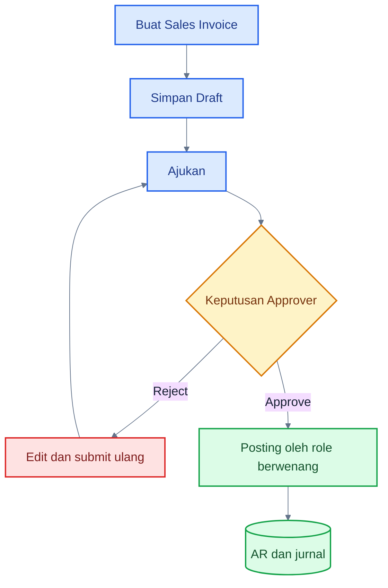

### Cara Membaca Flowchart

1. Direct invoice tidak memerlukan quotation/order.
2. Service/non-inventory invoice dapat mengikuti alur ini.
3. Inventory invoice tetap tunduk pada guard fulfillment agar stok dan ledger tidak berbeda.

### C. Sales Delivery Flow

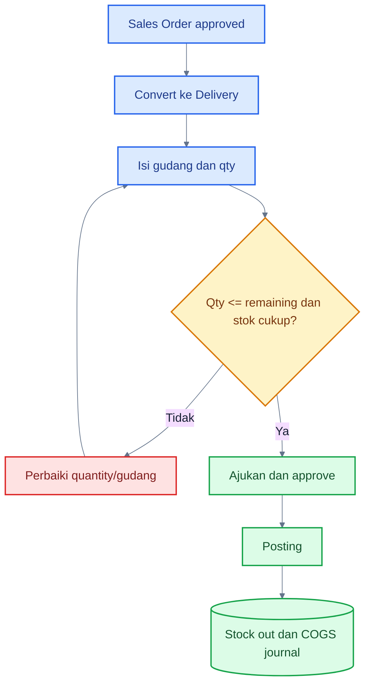

### Cara Membaca Flowchart

1. Delivery berasal dari Sales Order yang approved.
2. Partial delivery diperbolehkan selama tidak melebihi remaining.
3. Posting memerlukan stok cukup dan periode open.
4. Source order diperbarui sesuai quantity delivered.

### D. Customer Receipt Flow

```mermaid
%%{init: {"theme":"base","themeVariables":{"fontSize":"18px","fontFamily":"Inter, ui-sans-serif, Arial, sans-serif","primaryTextColor":"#172033","lineColor":"#64748b"},"flowchart":{"curve":"basis"}}}%%
flowchart LR
    CR1["Pilih customer"] --> CR2["Pilih bank dan tanggal"]
    CR2 --> CR3["Alokasikan invoice outstanding"]
    CR3 --> CR4["Simpan Draft"]
    CR4 --> CR5["Handoff ke pemegang sales.post"]
    CR5 --> CR6["Posting Receipt"]
    CR6 --> CR7[("Bank naik, AR turun")]
    classDef input fill:#dbeafe,stroke:#2563eb,stroke-width:2px,color:#1e3a8a;
    classDef approval fill:#ede9fe,stroke:#7c3aed,stroke-width:2px,color:#4c1d95;
    classDef done fill:#dcfce7,stroke:#16a34a,stroke-width:2px,color:#14532d;
    class CR1,CR2,CR3,CR4 input;
    class CR5 approval;
    class CR6,CR7 done;
```

### Cara Membaca Flowchart

1. Satu receipt dapat mengalokasikan beberapa invoice milik customer yang sama.
2. Partial payment didukung.
3. Receipt tidak memakai submit/approval queue; Draft diposting langsung oleh role berwenang.
4. Overpayment/unapplied receipt belum tersedia.

### E. Sales Return Flow

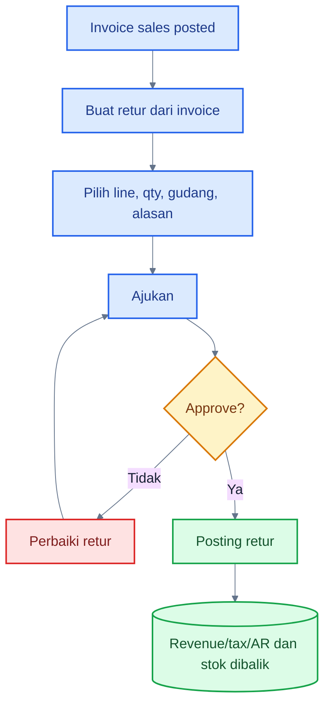

### Cara Membaca Flowchart

1. Return hanya memilih line dari invoice sumber.
2. Cumulative returned quantity tidak boleh melebihi invoice.
3. Produk inventory wajib memiliki gudang.
4. Posting menghitung nilai/tax proporsional dan memperbarui customer balance.

### F. Submit-to-Approval Flow

### Cara Membaca Flowchart

1. Setelah Ajukan, dokumen tidak dapat diedit.
2. Operator preset tidak membuka queue Persetujuan.
3. Pantau status melalui daftar/detail atau Notifikasi.

### G. Rejected Document Correction

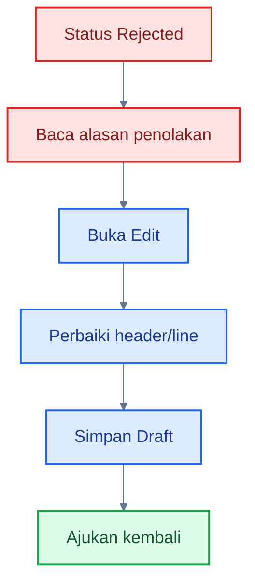

### Cara Membaca Flowchart

1. Alasan rejection menjadi panduan koreksi.
2. Save mengembalikan dokumen ke Draft dan membersihkan alasan lama bila workflow mendukungnya.
3. Submit ulang membuat permintaan approval pending kembali.

## 7. Flowchart Operator Pembelian

### A. Standard Purchase Flow yang Tersedia

```mermaid
%%{init: {"theme":"base","themeVariables":{"fontSize":"18px","fontFamily":"Inter, ui-sans-serif, Arial, sans-serif","primaryTextColor":"#172033","lineColor":"#64748b"},"flowchart":{"curve":"basis"}}}%%
flowchart LR
    P1["Supplier aktif"] --> P2["Purchase Request"]
    P2 --> P3["Approve request"]
    P3 --> P4["Convert ke Purchase Order"]
    P4 --> P5["Approve order"]
    P5 --> P6["Convert ke Goods Receipt"]
    P6 --> P7["Approve dan post receipt"]
    P7 -. dibuat terpisah .-> P8["Purchase Invoice"]
    P8 --> P9["Approve dan post invoice"]
    P9 --> P10["Supplier Payment"]
    classDef input fill:#dbeafe,stroke:#2563eb,stroke-width:2px,color:#1e3a8a;
    classDef approval fill:#ede9fe,stroke:#7c3aed,stroke-width:2px,color:#4c1d95;
    class P1,P2,P4,P6,P8,P10 input;
    class P3,P5,P7,P9 approval;
```

### Cara Membaca Flowchart

1. Request dapat dikonversi ke PO setelah approved.
2. PO dapat dikonversi ke Goods Receipt secara partial.
3. Purchase Invoice saat ini dibuat terpisah; belum ada PO/GR-to-invoice action.
4. Supplier Payment mengalokasikan AP invoice posted.

### B. Purchase Request to PO

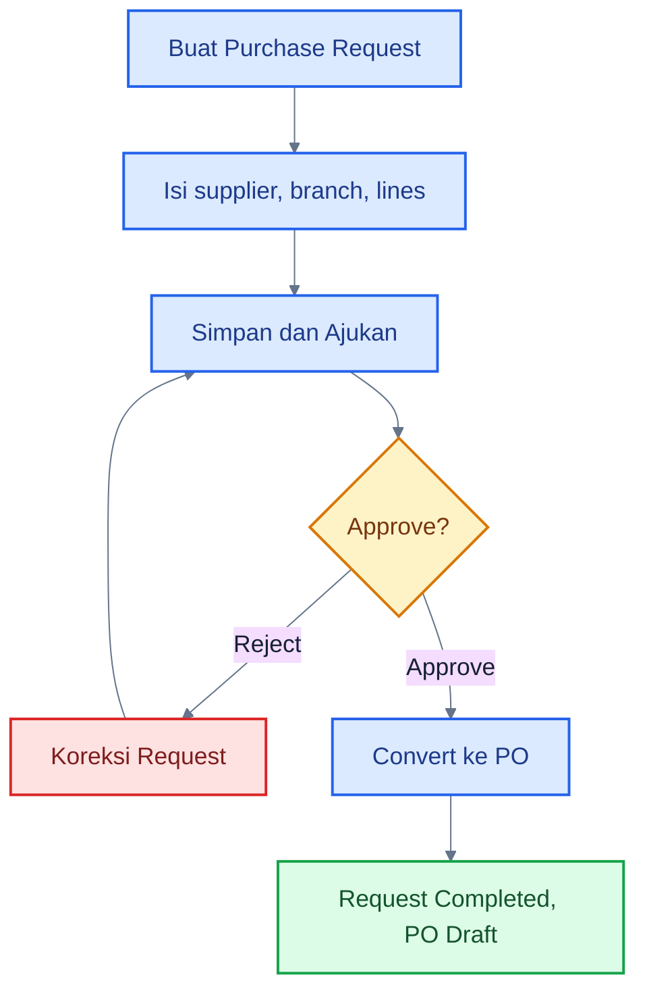

### Cara Membaca Flowchart

1. Conversion membutuhkan permission `purchase.create`.
2. Data sumber disalin ke PO Draft.
3. PO Draft masih perlu review dan approval sendiri.

### C. Goods Receipt

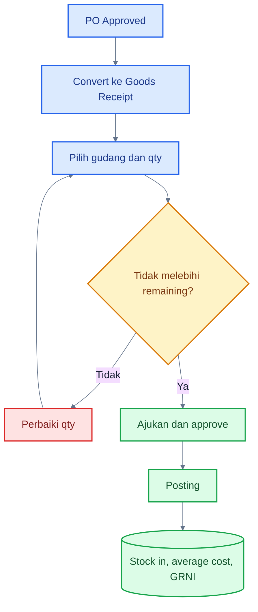

### Cara Membaca Flowchart

1. Partial receipt didukung.
2. Posting memperbarui remaining received quantity pada PO.
3. Inventory bertambah dan moving average dihitung ulang.
4. Jurnal fulfillment mendebit Inventory dan mengkredit GRNI.

### D. Purchase Invoice

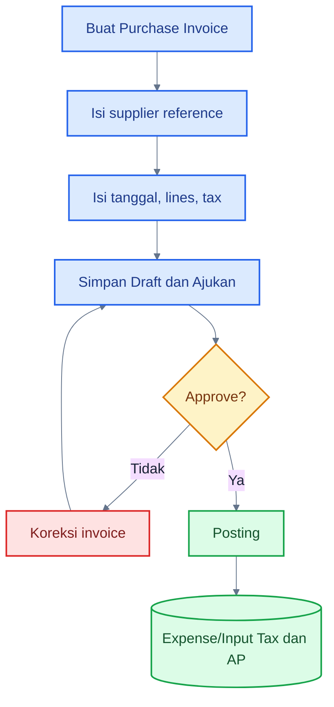

### Cara Membaca Flowchart

1. Supplier reference wajib untuk invoice pembelian.
2. Server menghitung ulang totals dan tax.
3. Inventory item mengikuti guard receipt; invoice jasa/non-inventory memposting expense/asset account produk.

### E. Supplier Payment

```mermaid
%%{init: {"theme":"base","themeVariables":{"fontSize":"18px","fontFamily":"Inter, ui-sans-serif, Arial, sans-serif","primaryTextColor":"#172033","lineColor":"#64748b"},"flowchart":{"curve":"basis"}}}%%
flowchart LR
    SP1["Pilih supplier"] --> SP2["Pilih bank dan tanggal"]
    SP2 --> SP3["Alokasikan AP invoice"]
    SP3 --> SP4["Simpan Draft"]
    SP4 --> SP5["Handoff ke purchase.post"]
    SP5 --> SP6["Posting Payment"]
    SP6 --> SP7[("AP turun, bank turun")]
    classDef input fill:#dbeafe,stroke:#2563eb,stroke-width:2px,color:#1e3a8a;
    classDef approval fill:#ede9fe,stroke:#7c3aed,stroke-width:2px,color:#4c1d95;
    classDef done fill:#dcfce7,stroke:#16a34a,stroke-width:2px,color:#14532d;
    class SP1,SP2,SP3,SP4 input;
    class SP5 approval;
    class SP6,SP7 done;
```

### Cara Membaca Flowchart

1. Multi-invoice dan partial allocation didukung.
2. Payment tidak memakai approval queue.
3. Role `purchase.post` memposting draft setelah review.

### F. Purchase Return

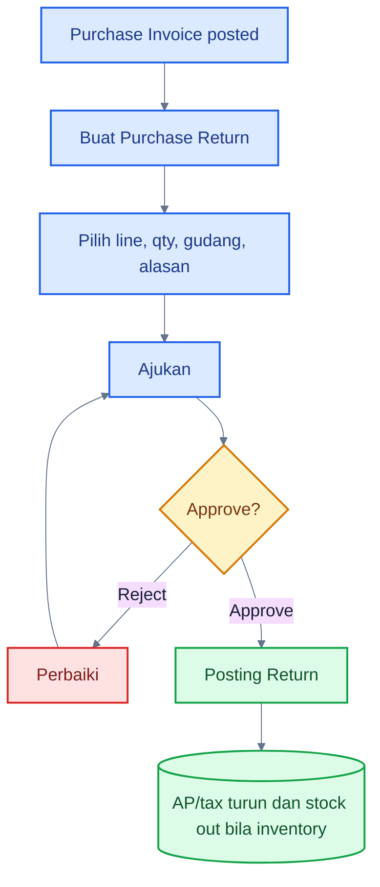

### Cara Membaca Flowchart

1. Source UI aktual adalah Purchase Invoice posted, bukan Goods Receipt langsung.
2. Stock harus cukup untuk inventory return.
3. Quantity cumulative tidak boleh melebihi invoice.

### G. Rejected Purchase Document

```mermaid
%%{init: {"theme":"base","themeVariables":{"fontSize":"18px","fontFamily":"Inter, ui-sans-serif, Arial, sans-serif","primaryTextColor":"#172033","lineColor":"#64748b"},"flowchart":{"curve":"basis"}}}%%
flowchart LR
    RPD1["Notifikasi Rejected"] --> RPD2["Buka detail"]
    RPD2 --> RPD3["Baca komentar"]
    RPD3 --> RPD4["Edit Draft"]
    RPD4 --> RPD5["Review supplier, qty, tax"]
    RPD5 --> RPD6["Submit ulang"]
    classDef blocked fill:#fee2e2,stroke:#dc2626,stroke-width:2px,color:#7f1d1d;
    classDef input fill:#dbeafe,stroke:#2563eb,stroke-width:2px,color:#1e3a8a;
    classDef done fill:#dcfce7,stroke:#16a34a,stroke-width:2px,color:#14532d;
    class RPD1,RPD2,RPD3 blocked;
    class RPD4,RPD5 input;
    class RPD6 done;
```

### Cara Membaca Flowchart

1. Rejection bukan pembatalan permanen.
2. Koreksi hanya tersedia pada status Rejected/Draft.
3. Pastikan akar masalah sudah diperbaiki sebelum submit ulang.

## 8. Status Dokumen

- `draft`: dapat diedit/dihapus.
- `pending_approval`: menunggu Approver, tidak dapat diedit.
- `approved`: menunggu posting atau conversion.
- `rejected`: baca alasan, edit, submit ulang.
- `completed`: source preorder/order telah dikonversi/terpenuhi.
- `posted`: dampak ledger/stok sudah dibuat.
- `partially_paid` / `paid`: saldo invoice berkurang/nol.
- `reversed`: dampak posted sudah dibalik.

## 9. Kesalahan yang Sering Terjadi

- Salah memilih company, contact, branch, atau warehouse.
- Quantity fulfillment melebihi remaining.
- Menggunakan inventory product tanpa warehouse.
- Menekan Ajukan sebelum memeriksa tax dan tanggal.
- Mengira receipt/payment masuk approval queue.
- Membuat invoice dari order secara manual lalu menganggap ada linkage otomatis.

## 10. Tips

- Gunakan notes/reason yang jelas.
- Simpan Draft lebih dulu dan review detail sebelum submit.
- Periksa status customer/supplier/product harus active.
- Gunakan Notifikasi untuk mengetahui rejected/approved.
- Jangan meminta Approver mengubah dokumen; Approver hanya memutuskan.

## 11. Checklist Operator

- [ ] Company dan branch benar.
- [ ] Contact dan product aktif.
- [ ] Tanggal dokumen/posting/jatuh tempo benar.
- [ ] Quantity, price, discount, tax, dan warehouse diperiksa.
- [ ] Source dan remaining quantity benar.
- [ ] Notes/reason dapat dipahami Approver.
- [ ] Draft direview sebelum Ajukan.
- [ ] Rejected document sudah diperbaiki.

## 12. FAQ

**Mengapa menu Persetujuan tidak terlihat?**

Preset Operator tidak memiliki `approval.read`. Pantau dokumen melalui list/detail dan Notifikasi.

**Siapa yang memposting receipt/payment?**

Role dengan `sales.post` untuk customer receipt atau `purchase.post` untuk supplier payment, biasanya Approver atau Administrator. Tidak ada approval stage terpisah untuk settlement.

**Bisakah membuat invoice langsung dari order?**

Belum. Invoice dibuat terpisah dalam UI aktual.

**Bisakah mengubah dokumen Pending Approval?**

Tidak. Dokumen harus ditolak terlebih dahulu agar menjadi editable.

## Belajar Dasol dalam 30 Menit

1. Login sebagai Operator dan pilih company.
2. Buka Contacts dan Products.
3. Buat Draft Sales Invoice.
4. Edit dan submit.
5. Pantau status di detail.
6. Buat Purchase Request dan convert setelah approval latihan.
7. Buka Stock dan buat Adjustment Draft.
8. Pelajari receipt/payment allocation.
9. Perbaiki satu dokumen Rejected di lingkungan training.

### Demo 5 Menit

1. Buka Sales Invoice.
2. Klik **Buat invoice**.
3. Pilih customer, branch, product, dan tax.
4. Simpan Draft.
5. Tunjukkan detail, Edit, lalu Ajukan.
6. Tunjukkan status Pending Approval dan Notifikasi.

## Handoff ke Role Lain

- Dokumen Ajukan → Approver.
- Dokumen Rejected → kembali ke Operator.
- Dokumen Approved → role dengan permission post.
- Receipt/Payment Draft → langsung ke role post untuk review/post.
- Posted journal dan ledger → Akuntan.
- Bukti final → Viewer/Auditor.

## Panduan Terkait

- [Panduan Approver](./06-approver-guide.md)
- [Alur Penjualan](./10-sales-workflows.md)
- [Alur Pembelian](./11-purchase-workflows.md)
- [Alur Persediaan](./12-inventory-workflows.md)
