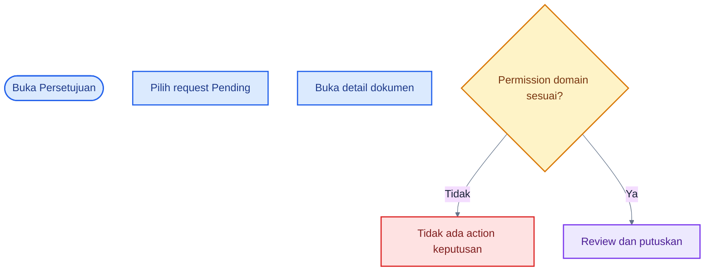
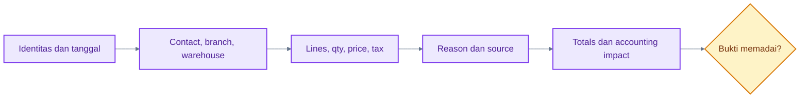
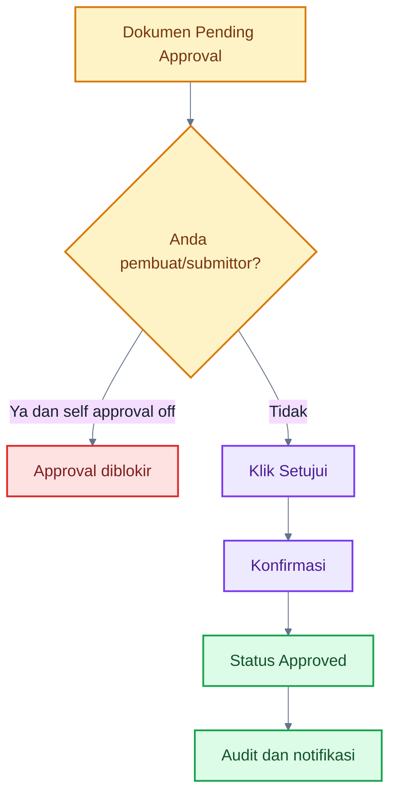
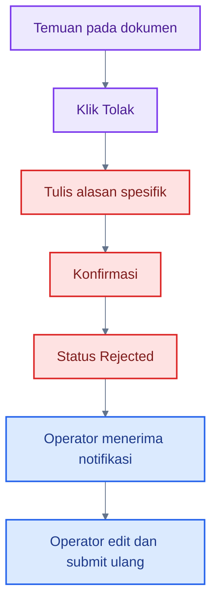
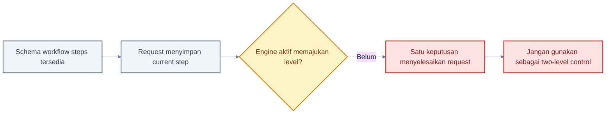
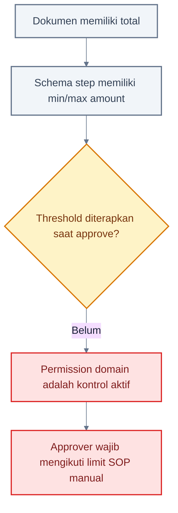
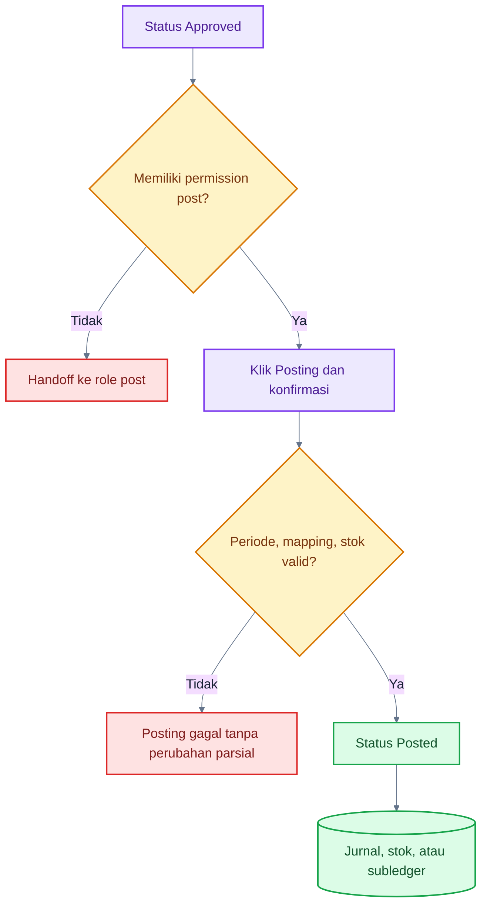

# Panduan Approver / Validator

## 1. Tentang Role Ini

Approver memeriksa transaksi yang dibuat orang lain. Tugas utamanya adalah **review → validate → approve/reject**, kemudian posting bila permission dan kebijakan perusahaan mengizinkan.

Approver bukan editor. Jika data salah, pilih **Tolak** dan tulis alasan agar Operator memperbaiki source. Pemisahan ini membuat siapa yang membuat, menyetujui, dan memposting dapat ditelusuri.

## 2. Hak Akses

| Modul                  | Lihat     | Tambah | Edit | Hapus/Arsip | Submit | Approve           | Post      | Reverse                            | Export |
| ---------------------- | --------- | ------ | ---- | ----------- | ------ | ----------------- | --------- | ---------------------------------- | ------ |
| Approval queue         | ✅        | N/A    | N/A  | N/A         | N/A    | ✅ melalui detail | N/A       | N/A                                | ❌     |
| Sales/Purchase         | ✅        | ❌     | ❌   | ❌          | ❌     | ✅                | ✅        | ⚠️ bila guard/permission terpenuhi | ❌     |
| Inventory operations   | ✅        | ❌     | ❌   | ❌          | ❌     | ✅                | ✅        | ✅                                 | ❌     |
| Cash transactions      | ✅        | ❌     | ❌   | ❌          | ❌     | ✅                | ✅        | ✅                                 | ❌     |
| Receipt/Payment        | ✅        | ❌     | ❌   | ❌          | N/A    | N/A               | ✅ Draft  | ✅                                 | ❌     |
| Journal/COA/Stock      | ✅ review | ❌     | ❌   | ❌          | ❌     | ❌                | ❌ manual | ⚠️ sebagai guard reversal          | ❌     |
| Reports/Audit/Settings | ❌ preset | ❌     | ❌   | ❌          | ❌     | ❌                | ❌        | ❌                                 | ❌     |

## 3. Dashboard Role

Dasbor menampilkan pending approval count dan transaksi posted terbaru. Menu **Persetujuan** menampilkan request company. Klik nomor dokumen untuk membuka detail dan action keputusan.

Notifikasi durable juga memberi tahu approval requested dan perubahan status. Notifikasi belum realtime; refresh halaman bila diperlukan.

## 4. Menu yang Dapat Diakses

- Dasbor, Persetujuan, Notifikasi.
- Seluruh daftar/detail sales dan purchase.
- Stock, Adjustment, Transfer, Opname.
- Cash Transaction.
- COA dan Jurnal Umum untuk konteks review.

Approver preset tidak memiliki Contacts/Products sebagai menu master, report, tax settings, audit log, atau user management.

## 5. Aktivitas Harian

1. Buka queue Persetujuan.
2. Urutkan pekerjaan berdasarkan tanggal dan urgensi bisnis.
3. Buka detail sumber; periksa pihak, cabang, tanggal, lines, quantity, account/tax, reason, dan totals.
4. Setujui bila lengkap; tolak dengan alasan spesifik bila salah.
5. Untuk status Approved, posting bila menjadi tanggung jawab Anda.
6. Review jurnal/stock impact sesudah posting.
7. Jangan melakukan reversal tanpa bukti dan koordinasi Akuntan.

## 6. Flowchart Utama Role

### A. Approval Queue

### Cara Membaca Flowchart

1. Queue adalah pintu masuk, tetapi keputusan dilakukan pada detail dokumen.
2. `approval.read` tidak otomatis memberi `sales.approve`, `purchase.approve`, `inventory.approve`, atau `cash.approve`.
3. Jika action tidak muncul, periksa permission domain dan status.

### B. Document Review

### Cara Membaca Flowchart

1. Review header dan lines, bukan hanya total.
2. Pada fulfillment/return/stock, periksa source dan warehouse.
3. Pada cash, periksa rekening dan akun lawan.
4. Bila bukti eksternal tidak tersedia di UI, minta melalui prosedur internal; attachment UI belum tersedia.

### C. Approve Flow

### Cara Membaca Flowchart

1. Demo company mematikan self-approval.
2. Approver hanya memutuskan dokumen pada status Pending Approval.
3. Approval tidak otomatis sama dengan posting.
4. Riwayat action disimpan.

### D. Reject Flow

### Cara Membaca Flowchart

1. Alasan rejection wajib; beberapa workflow mensyaratkan sedikitnya lima karakter.
2. Tulis field dan koreksi yang diperlukan, bukan hanya “salah”.
3. Request Revision belum menjadi action terpisah; gunakan Reject untuk mengembalikan pekerjaan.

### E. Two-Level Approval — Batas Implementasi

### Cara Membaca Flowchart

1. Database memiliki tabel workflow step.
2. UI dan function keputusan saat ini tidak memproses level berikutnya.
3. Approval aktif harus diperlakukan sebagai one-level.
4. Gunakan kontrol manual di luar sistem bila organisasi wajib memiliki dua level, sampai fitur dilengkapi.

### F. Amount Threshold — Batas Implementasi

### Cara Membaca Flowchart

1. Field threshold ada pada schema tetapi belum ditegakkan oleh engine approval aktif.
2. Jangan mengklaim sistem memblokir approval di atas limit.
3. Administrator harus membatasi permission dan organisasi harus memakai SOP manual bila diperlukan.

### G. Approval ke Posting

### Cara Membaca Flowchart

1. Approve dan Posting adalah action terpisah.
2. Posting divalidasi ulang oleh database.
3. Jika posting gagal, dokumen tetap Approved dan tidak ada perubahan parsial.
4. Baca pesan aman dan minta role terkait memperbaiki konfigurasi/data.

## 7. Panduan Setiap Aktivitas

### Menyetujui dokumen

1. Buka **Persetujuan**.
2. Klik nomor dokumen.
3. Review header, lines, total, source, dan status.
4. Pastikan Anda bukan submittor jika self-approval tidak diizinkan.
5. Klik **Setujui**, konfirmasi, lalu pastikan status menjadi Approved.

### Menolak dokumen

1. Temukan masalah yang dapat dijelaskan.
2. Klik **Tolak**.
3. Isi komentar spesifik, misalnya “Warehouse line 2 salah; gunakan WH-SBY”.
4. Konfirmasi dan pastikan status Rejected.

### Memposting

1. Lakukan hanya setelah Approved.
2. Review tanggal posting dan periode.
3. Klik Posting dan konfirmasi dampak.
4. Pastikan status Posted serta jurnal/movement tampil.

## 8. Status Dokumen

Approver berfokus pada `pending_approval`, `approved`, dan `rejected`. `posted` berarti keputusan sudah dieksekusi ke ledger/stok. `reversed` berarti koreksi sudah dibuat; source tetap tersedia.

## 9. Kesalahan yang Sering Terjadi

- Menyetujui hanya dari nomor/total tanpa membuka detail.
- Menulis alasan penolakan yang tidak actionable.
- Mengira approval otomatis memposting.
- Menyetujui dokumen sendiri ketika setting melarang.
- Menganggap amount threshold atau two-level sudah enforced.
- Mereversal tanpa mengecek transaksi lanjutan.

## 10. Tips

- Gunakan checklist per tipe dokumen.
- Periksa source dan remaining quantity pada fulfillment.
- Periksa warehouse/stock pada inventory/return.
- Setelah posting, buka jurnal terkait bila ada.
- Pisahkan user approver dari shared account.

## 11. Checklist Approver

- [ ] Company dan dokumen benar.
- [ ] Saya bukan pembuat/submittor yang dilarang self-approve.
- [ ] Contact, branch, warehouse, tanggal, dan reason benar.
- [ ] Quantity/harga/tax/total masuk akal.
- [ ] Source dan remaining quantity valid.
- [ ] Alasan rejection spesifik bila menolak.
- [ ] Posting dilakukan hanya setelah Approved.
- [ ] Jurnal/movement diperiksa setelah Posting.

## 12. FAQ

**Bisakah Approver mengedit angka?**

Tidak. Tolak dan minta Operator memperbaiki.

**Apakah semua request di queue dapat saya approve?**

Hanya tipe yang permission domain-nya Anda miliki.

**Mengapa tombol Posting belum muncul setelah approve?**

Refresh detail dan pastikan status Approved serta permission `*.post` tersedia.

**Apakah approval dua tingkat tersedia?**

Belum end-to-end. Sistem aktif adalah one-level.

## Belajar Dasol dalam 30 Menit

1. Login dan buka queue Persetujuan.
2. Review satu Sales Invoice.
3. Setujui satu dokumen training.
4. Tolak dokumen lain dengan alasan spesifik.
5. Buka dokumen Rejected dan lihat riwayat.
6. Posting satu dokumen Approved.
7. Buka jurnal atau stock effect.
8. Pelajari kondisi self-approval dan reversal.

### Demo 5 Menit

1. Buka Persetujuan.
2. Klik satu invoice Pending Approval.
3. Tunjukkan header, lines, tax, dan history.
4. Klik Setujui.
5. Klik Posting.
6. Tunjukkan status Posted dan link jurnal.

## Handoff ke Role Lain

- Reject → Operator melakukan koreksi.
- Approve tanpa permission post → user post yang berwenang.
- Posted → Akuntan melakukan kontrol ledger.
- Temuan governance → Administrator.
- Evidence final → Viewer/Auditor.

## Panduan Terkait

- [Panduan Operator](./05-operator-guide.md)
- [Alur lintas role](./08-cross-role-workflows.md)
- [Alur Akuntansi](./09-accounting-workflows.md)
- [Troubleshooting](./16-troubleshooting.md)
