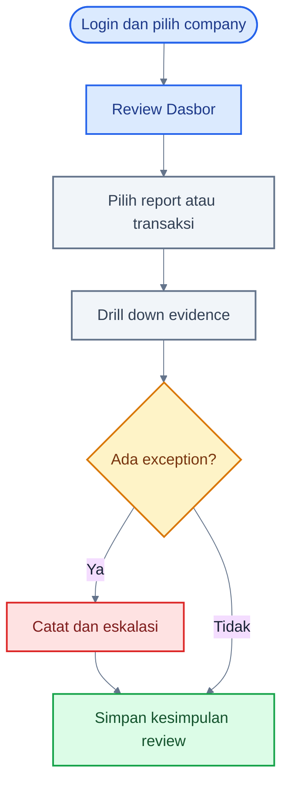
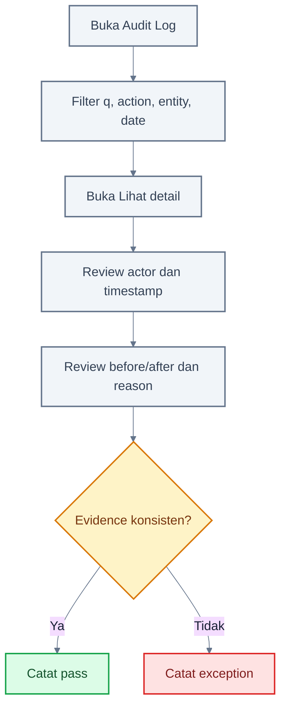
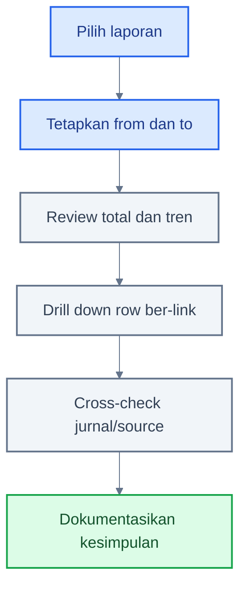
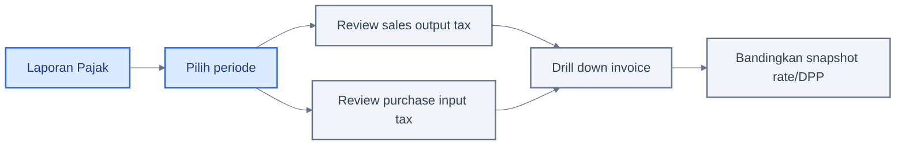
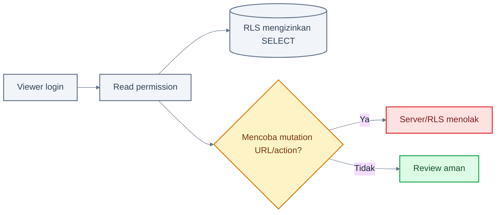

# Panduan Viewer / Auditor

## 1. Tentang Role Ini

Viewer/Auditor adalah role read-only. Role ini meninjau transaksi, jurnal, laporan, approval history, stock, fixed assets, cash transaction, reconciliation, dan audit log tanpa membuat atau mengubah data.

Viewer/Auditor tidak boleh menjadi jalan pintas untuk melakukan koreksi. Temuan diteruskan kepada pemilik proses, Akuntan, atau Administrator.

> **Status implementasi:** Attachment table/storage policy tersedia pada backend, tetapi tidak ada attachment UI pada dokumen. Jangan mengandalkan attachment sebagai evidence yang dapat diakses dari panduan ini.

## 2. Hak Akses

| Modul                           | Lihat | Tambah | Edit | Hapus/Arsip | Submit | Approve | Post | Reverse | Export    |
| ------------------------------- | ----- | ------ | ---- | ----------- | ------ | ------- | ---- | ------- | --------- |
| Sales/Purchase                  | ✅    | ❌     | ❌   | ❌          | ❌     | ❌      | ❌   | ❌      | ❌        |
| Inventory/Cash                  | ✅    | ❌     | ❌   | ❌          | ❌     | ❌      | ❌   | ❌      | ❌        |
| COA/Contacts/Products/Warehouse | ✅    | ❌     | ❌   | ❌          | N/A    | N/A     | N/A  | N/A     | ❌        |
| Journal/Approval history        | ✅    | ❌     | ❌   | ❌          | ❌     | ❌      | ❌   | ❌      | ❌        |
| Reports/Tax                     | ✅    | N/A    | N/A  | N/A         | N/A    | N/A     | N/A  | N/A     | ❌ preset |
| Fixed assets                    | ✅    | ❌     | ❌   | ❌          | N/A    | N/A     | ❌   | ❌      | ❌        |
| Audit Log                       | ✅    | ❌     | ❌   | ❌          | N/A    | N/A     | N/A  | N/A     | ❌ preset |

## 3. Dashboard Role

Viewer melihat KPI yang sama seperti role lain untuk company aktif. Fokuskan review pada:

- kas/bank dan perubahan besar;
- overdue AR/AP;
- laba dan beban bulan berjalan;
- transaksi posted terbaru;
- jumlah pending approval dan low stock sebagai indikator risiko.

## 4. Menu yang Dapat Diakses

- Dasbor, Persetujuan, Notifikasi.
- Semua list/detail sales dan purchase.
- Stock dan seluruh operasi inventory.
- COA, Contacts, Products, Warehouses.
- Journals, Reports, Fixed Assets.
- Bank Accounts, Cash Transactions, Bank Reconciliation.
- Audit Log.

Tax code setup, Settings, Users, dan Roles tidak terlihat pada preset Viewer. Tax Report tetap dapat dibuka melalui Reports.

## 5. Aktivitas Harian/Periodik

1. Pilih company dan periode review.
2. Review report dan analytical movement.
3. Drill down report → journal → source document.
4. Bandingkan status, approval history, dan audit event.
5. Catat temuan dengan ID/nomor dokumen dan waktu.
6. Eskalasi tanpa meminta akses write yang tidak diperlukan.

## 6. Flowchart Utama Role

### A. Auditor Daily Review

### Cara Membaca Flowchart

1. Review selalu dibatasi company dan periode.
2. Kesimpulan harus didukung link/nomor evidence.
3. Viewer tidak memperbaiki data sendiri.

### B. Transaction-to-Journal Trace

```mermaid
%%{init: {"theme":"base","themeVariables":{"fontSize":"18px","fontFamily":"Inter, ui-sans-serif, Arial, sans-serif","primaryTextColor":"#172033","lineColor":"#64748b"},"flowchart":{"curve":"basis"}}}%%
flowchart LR
    TJ1["Buka transaksi Posted"] --> TJ2["Catat nomor dan total"]
    TJ2 --> TJ3["Klik jurnal terkait"]
    TJ3 --> TJ4["Periksa debit = kredit"]
    TJ4 --> TJ5["Bandingkan akun dan amount"]
    TJ5 --> TJ6["Tinjau reversal bila ada"]
    classDef neutral fill:#f1f5f9,stroke:#64748b,stroke-width:2px,color:#334155;
    classDef accounting fill:#ecfeff,stroke:#0891b2,stroke-width:2px,color:#164e63;
    class TJ1,TJ2 neutral;
    class TJ3,TJ4,TJ5,TJ6 accounting;
```

### Cara Membaca Flowchart

1. Detail invoice, fulfillment, return, cash, inventory, dan fixed asset menampilkan jurnal bila relevan.
2. Cocokkan total sumber dengan line akuntansi sesuai posting map.
3. Reversal harus memiliki jurnal baru dan alasan.

### C. Journal-to-Source Trace

```mermaid
%%{init: {"theme":"base","themeVariables":{"fontSize":"18px","fontFamily":"Inter, ui-sans-serif, Arial, sans-serif","primaryTextColor":"#172033","lineColor":"#64748b"},"flowchart":{"curve":"basis"}}}%%
flowchart LR
    JS1["Buka Jurnal Umum"] --> JS2["Filter nomor/status"]
    JS2 --> JS3["Buka detail jurnal"]
    JS3 --> JS4["Baca source type dan ID"]
    JS4 --> JS5["Cari source pada modul terkait"]
    JS5 --> JS6["Bandingkan tanggal dan status"]
    classDef accounting fill:#ecfeff,stroke:#0891b2,stroke-width:2px,color:#164e63;
    classDef neutral fill:#f1f5f9,stroke:#64748b,stroke-width:2px,color:#334155;
    class JS1,JS2,JS3,JS4 accounting;
    class JS5,JS6 neutral;
```

### Cara Membaca Flowchart

1. Journal detail menyimpan source type/ID.
2. Tidak semua source memiliki link langsung dari journal UI; gunakan nomor/source untuk mencari modul.
3. Manual journal memiliki source `manual_journal` dan tidak memiliki dokumen bisnis terpisah.

### D. Audit Trail Investigation

### Cara Membaca Flowchart

1. Gunakan kombinasi filter agar hasil tidak terlalu luas.
2. Actor adalah user yang melakukan action, bukan selalu pembuat awal.
3. Reason sangat penting untuk rejection, reversal, dan reopen.
4. Preset Viewer tidak melihat tombol export.

### E. Financial Report Review

### Cara Membaca Flowchart

1. Trial Balance dan Balance Sheet menghitung saldo sampai tanggal `to`.
2. P&L, GL, Cash Flow, dan Tax memakai rentang `from`–`to`.
3. Aging memakai outstanding per tanggal batas laporan sesuai data yang tersedia.
4. Viewer preset tidak dapat ekspor CSV.

### F. Tax Report Review

### Cara Membaca Flowchart

1. Report menampilkan tax snapshot invoice posted/reversed dalam periode.
2. Debit mewakili purchase/input tax; kredit mewakili sales/output tax pada tampilan report.
3. Ini bukan bukti integrasi langsung Coretax.

### G. Read-Only Security Boundary

### Cara Membaca Flowchart

1. Read-only bukan hanya tombol yang disembunyikan.
2. Server permission dan PostgreSQL RLS menolak mutation.
3. Mengetik route `/new` secara manual tidak memberi akses.

## 7. Panduan Setiap Aktivitas

### Menelusuri invoice sampai jurnal

1. Buka Sales/Purchase Invoice.
2. Filter status atau nomor, lalu buka detail.
3. Catat status, total, outstanding, approval history, dan jurnal.
4. Buka jurnal terkait dan cocokkan debit/kredit.
5. Buka Audit Log dan cari nomor dokumen/action.

### Meninjau stock

1. Buka Inventory Stock.
2. Pilih baris produk/warehouse.
3. Review on hand, average cost, valuation, dan movement history.
4. Cocokkan source movement dengan delivery/receipt/adjustment/transfer/opname/return.

## 8. Status Dokumen

Viewer perlu memahami seluruh status, tetapi tidak mengubahnya. Perhatian utama adalah apakah evidence `posted/reversed/paid` konsisten dengan journal, movement, subledger, dan audit trail.

## 9. Kesalahan yang Sering Terjadi

- Salah company atau periode.
- Menganggap report kosong berarti tidak ada transaksi tanpa mengecek filter.
- Menjumlahkan kembali row Balance Sheet/P&L tanpa memahami normal balance.
- Menganggap Viewer dapat export karena dapat melihat report.
- Menilai transaksi hanya dari badge tanpa membaca journal/source.

## 10. Tips

- Catat URL, nomor dokumen, dan timestamp dalam working paper.
- Mulai dari materiality/risk, lalu drill down.
- Gunakan read-only role untuk menjaga independence.
- Minta Administrator membuat custom read/export role bila ekspor memang dibutuhkan.

## 11. Checklist Viewer/Auditor

- [ ] Company dan periode benar.
- [ ] Report berasal dari data posted.
- [ ] Sample transaksi ditelusuri ke jurnal.
- [ ] Sample jurnal ditelusuri ke source.
- [ ] Reversal memiliki reason dan linked journal.
- [ ] Approval actor berbeda dari submitter bila self-approval off.
- [ ] Stock movement dan subledger konsisten.
- [ ] Exception memiliki nomor evidence dan owner.

## 12. FAQ

**Mengapa tombol export tidak ada?**

Preset Viewer tidak memiliki `report.export`. Akses ini dapat diberikan melalui custom role bila disetujui.

**Mengapa saya dapat melihat approval tetapi tidak approve?**

`approval.read` hanya melihat queue/history; decision membutuhkan permission domain.

**Bisakah saya melihat attachment?**

Belum melalui UI aktual.

**Bagaimana melaporkan temuan?**

Gunakan prosedur organisasi dan sertakan company, nomor dokumen, URL/detail, tanggal, actor, dan deskripsi discrepancy.

## Belajar Dasol dalam 30 Menit

1. Buka Dasbor dan pahami KPI.
2. Review satu Sales/Purchase Invoice.
3. Tautkan invoice ke jurnal.
4. Tautkan jurnal ke source.
5. Review GL, TB, P&L, dan Balance Sheet.
6. Review AR/AP Aging dan Tax Report.
7. Buka Stock Card.
8. Investigasi satu Audit Log event.
9. Coba route mutation dan pastikan unauthorized.

### Demo 5 Menit

1. Buka Trial Balance.
2. Drill down ke jurnal.
3. Buka source transaction.
4. Buka Audit Log dan cari event terkait.
5. Tunjukkan bahwa action mutation tidak tersedia.

## Handoff ke Role Lain

- Temuan dokumen → Operator/Approver.
- Temuan accounting → Akuntan.
- Temuan permission/governance → Administrator.
- Auditor tetap menerima evidence final tanpa mengambil alih mutation.

## Panduan Terkait

- [Panduan Laporan](./15-reporting-guide.md)
- [Alur lintas role](./08-cross-role-workflows.md)
- [Glosarium](./17-glossary.md)
- [Troubleshooting](./16-troubleshooting.md)
