# Alur Kerja Lintas Role

Panduan ini menunjukkan siapa yang membuat, memeriksa, memposting, dan mengaudit transaksi. Preset permission dapat diubah melalui custom role; diagram memakai preset bawaan Dasol.

## Prinsip Handoff

- Operator menyiapkan dokumen operasional dan mengirimkannya.
- Approver memeriksa dokumen yang masuk antrean approval dan dapat approve/reject.
- Akuntan menjaga jurnal, periode, laporan, rekonsiliasi, serta kontrol akuntansi.
- Administrator menjaga identitas company, user, role, master keuangan, dan reopen periode.
- Viewer/Auditor menelusuri bukti secara read-only.

> **Batas implementasi:** approval aktif saat ini satu tingkat. Konfigurasi `current_step`, minimum, dan maksimum tersimpan di skema, tetapi workflow approval bertingkat/berbasis nominal belum berjalan end-to-end di UI dan decision engine.

## 1. Sales Invoice

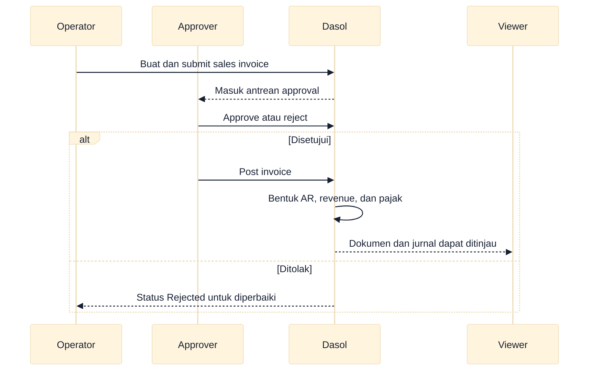

### Cara Membaca Flowchart

Baca dari atas ke bawah. Invoice baru memengaruhi ledger setelah Approver memilih **Post**; approval saja belum membentuk jurnal.

## 2. Customer Receipt

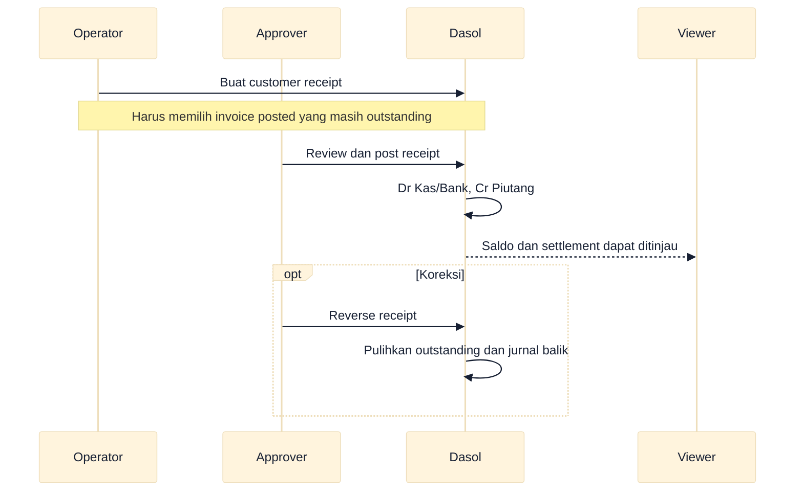

### Cara Membaca Flowchart

Receipt tidak memakai antrean approval. Pemisahan tugas muncul dari `sales.create` milik Operator dan `sales.post`/`journal.reverse` milik Approver atau role lain yang diberi izin tersebut.

## 3. Purchase Order

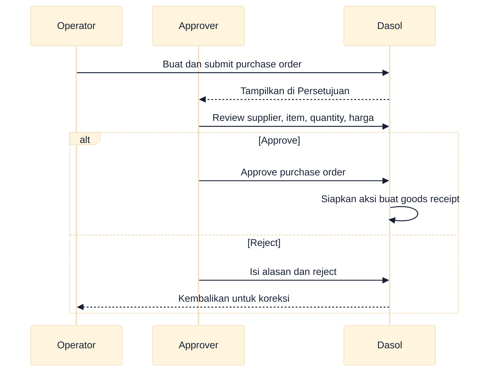

### Cara Membaca Flowchart

Purchase order adalah komitmen operasional dan belum menjurnal. Goods receipt dibuat sebagai dokumen Draft terpisah setelah PO disetujui.

## 4. Goods Receipt

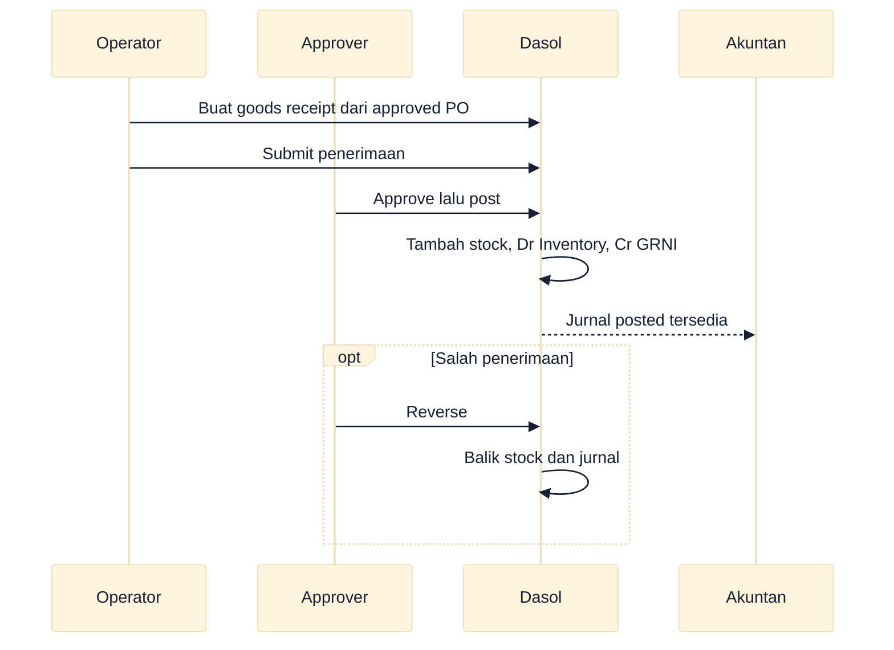

### Cara Membaca Flowchart

Stock dan GRNI baru berubah ketika goods receipt diposting. Purchase invoice bukan hasil konversi otomatis dari goods receipt pada versi ini.

## 5. Purchase Invoice

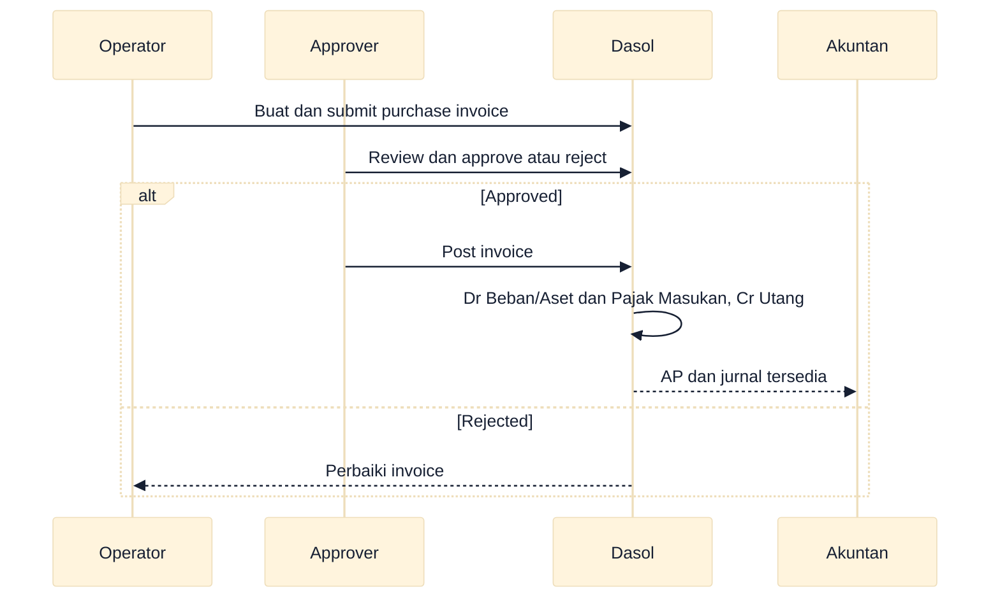

### Cara Membaca Flowchart

Purchase invoice berdiri sendiri dari goods receipt. Pastikan rekonsiliasi dokumen sumber dilakukan secara prosedural karena three-way matching otomatis belum tersedia.

## 6. Supplier Payment

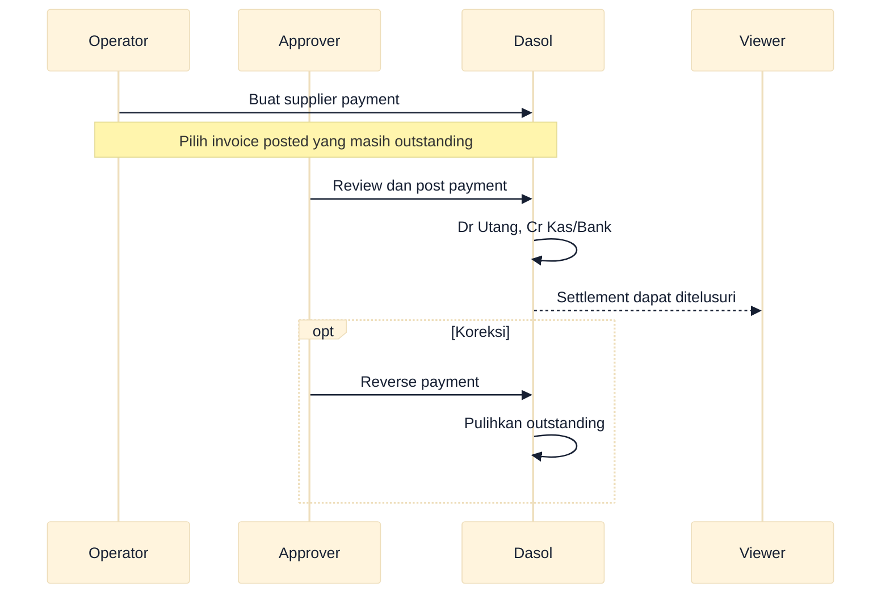

### Cara Membaca Flowchart

Payment memiliki lifecycle Draft → Posted → Reversed dan tidak masuk approval queue. Posting memakai `purchase.post`; overpayment, withholding, bank fee, dan write-off belum ditangani oleh form settlement.

## 7. Stock Adjustment

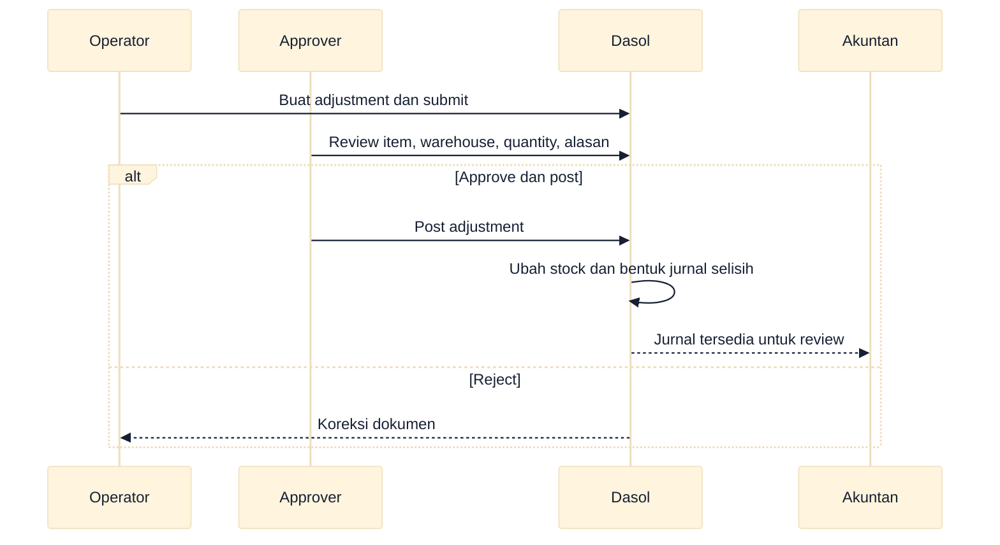

### Cara Membaca Flowchart

Pengecekan quantity dan nilai terjadi saat posting. Reversal membalik stock movement dan jurnal terkait.

## 8. Manual Journal

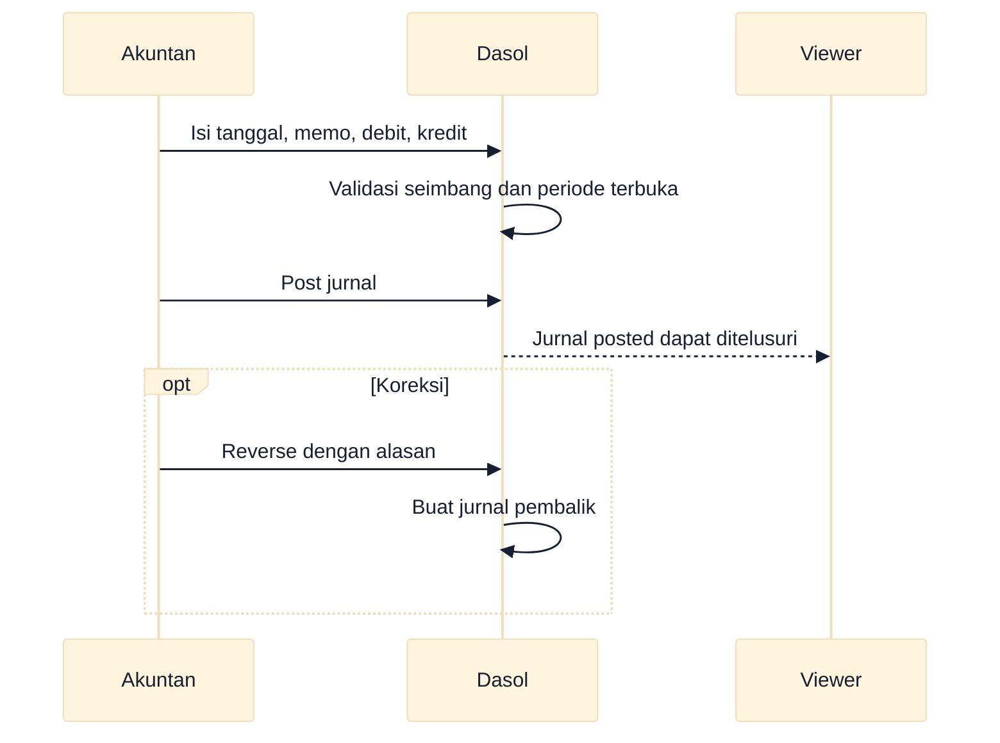

### Cara Membaca Flowchart

Form jurnal manual saat ini langsung memposting. Belum ada UI Draft → Submit → Approval untuk jurnal manual, sehingga review internal harus diatur sebagai prosedur organisasi.

## 9. Period Closing

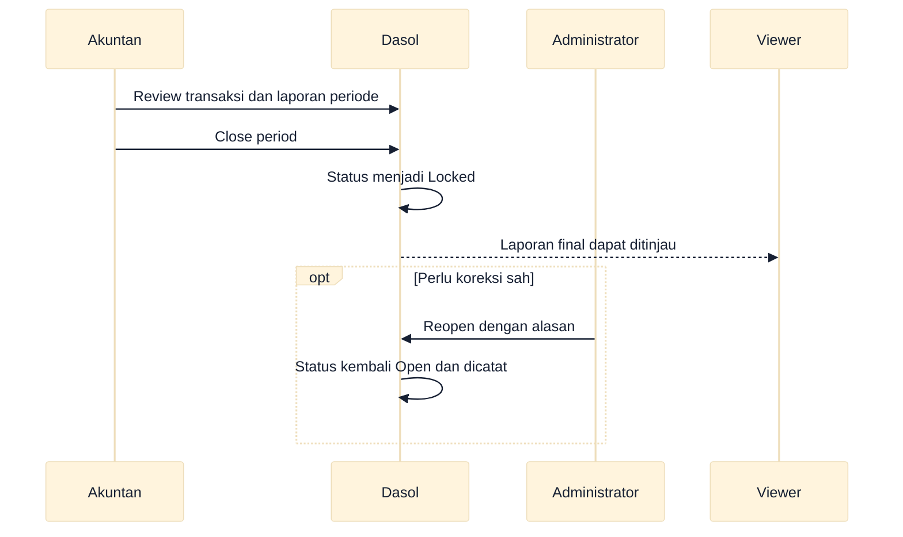

### Cara Membaca Flowchart

Preset Akuntan dapat menutup periode, tetapi hanya Administrator yang dapat membuka kembali. Jangan reopen tanpa alasan dan otorisasi yang dapat diaudit.

## 10. Sales Return

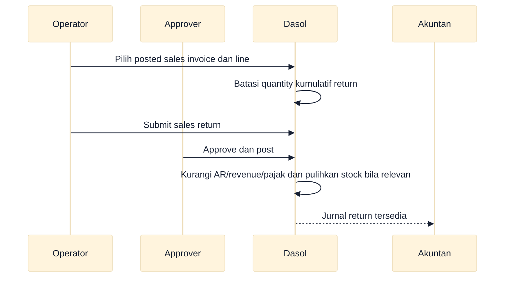

### Cara Membaca Flowchart

Sumber sales return wajib sales invoice berstatus Posted. Untuk item inventory, warehouse wajib dan posting juga membalik COGS sesuai nilai yang dihitung sistem.

## 11. Purchase Return

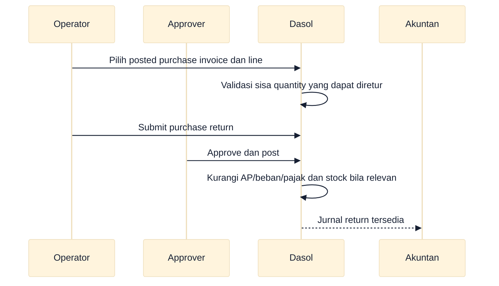

### Cara Membaca Flowchart

Sumber implementasi saat ini adalah purchase invoice, bukan goods receipt. Return inventory gagal diposting jika stock tidak cukup atau warehouse belum dipilih.

## 12. Tax Report dan Export

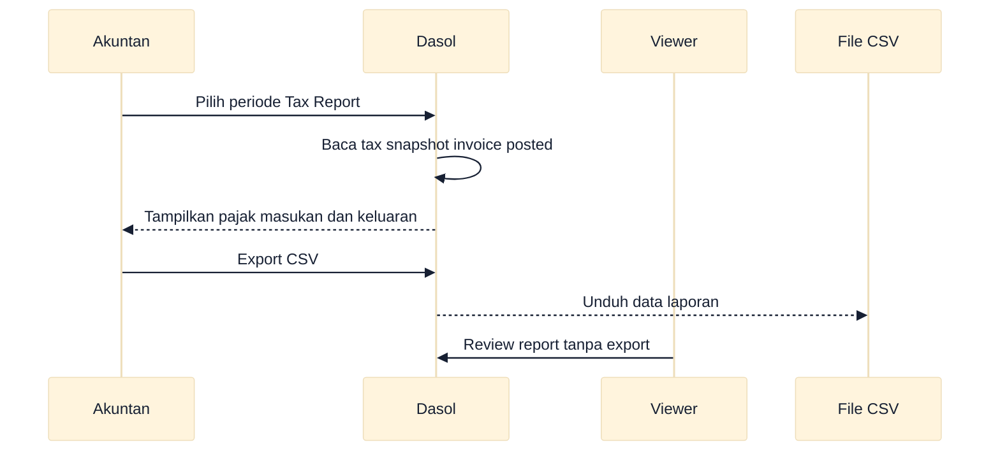

### Cara Membaca Flowchart

Tax report mengambil snapshot pajak yang dibekukan saat invoice diposting. Export adalah CSV Dasol; ini bukan pengiriman langsung atau format resmi Coretax.

## 13. Ringkasan Alur Sales

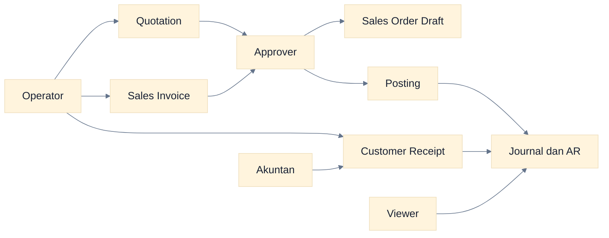

### Cara Membaca Flowchart

Quotation dapat dikonversi ke sales order, tetapi sales invoice dibuat terpisah. Garis ke jurnal hanya muncul dari invoice dan receipt yang sudah diposting.

## 14. Ringkasan Alur Purchase

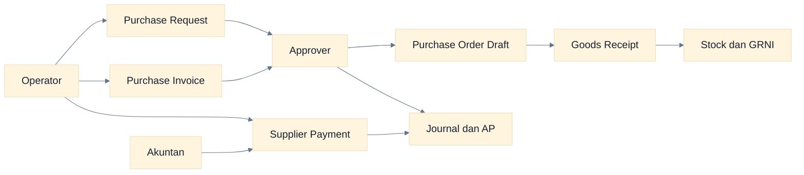

### Cara Membaca Flowchart

Goods receipt menambah stock/GRNI, sedangkan purchase invoice membentuk AP. Keduanya belum dihubungkan oleh three-way matching otomatis.

## 15. Ringkasan Alur Accounting

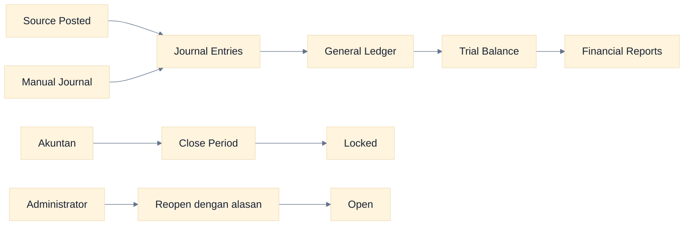

### Cara Membaca Flowchart

Laporan berasal dari jurnal posted. Closing mengunci mutation bertanggal dalam periode tersebut; reopen adalah tindakan administratif yang harus beralasan.

## Checklist Handoff

- Sertakan nomor dokumen, company, tanggal, nominal, dan masalah.
- Pastikan status terakhir terlihat sebelum menyerahkan pekerjaan.
- Jangan meminta penerima melewati permission; eskalasi ke Administrator bila role keliru.
- Untuk rejection/reversal/reopen, tulis alasan yang spesifik dan dapat diaudit.
- Setelah posting, cocokkan source, jurnal, saldo, serta laporan yang terpengaruh.

## Panduan Terkait

- [Peta role dan permission](./02-peta-role-dan-permission.md)
- [Workflow accounting](./09-accounting-workflows.md)
- [Troubleshooting](./16-troubleshooting.md)
