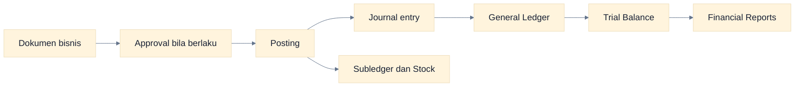
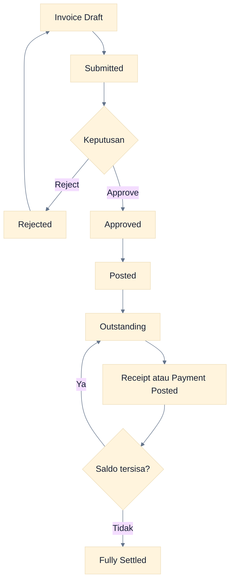
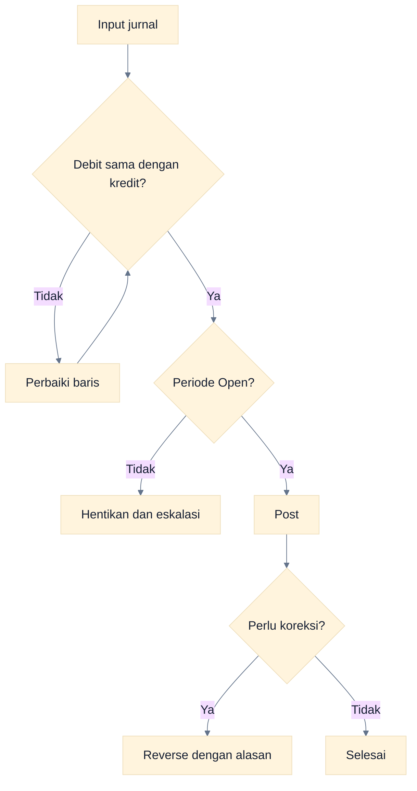
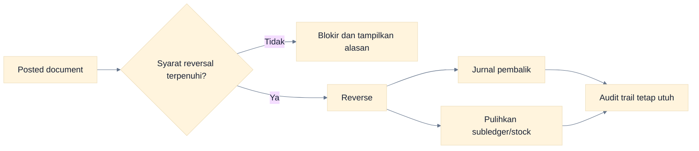
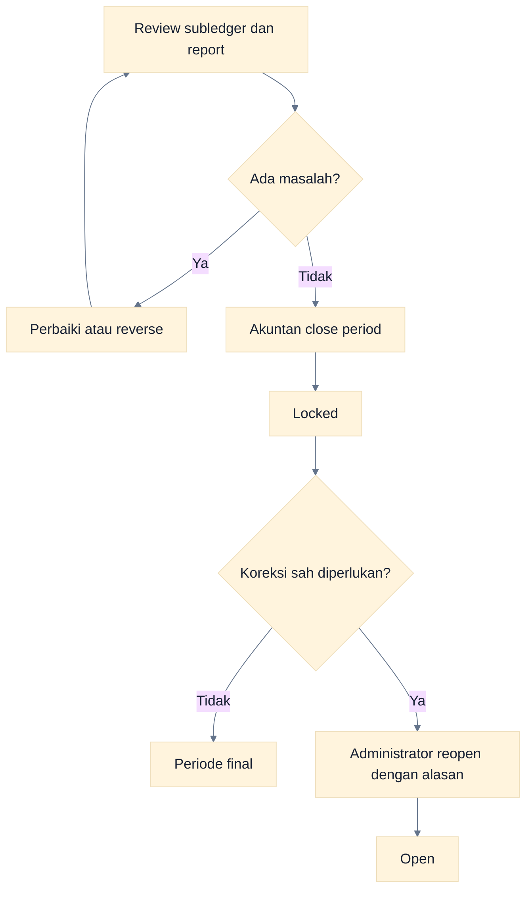
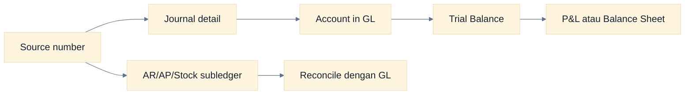

# Workflow Accounting

Panduan ini menjelaskan hubungan dokumen operasional, posting, jurnal, ledger, dan laporan. Dasol memakai **double-entry accounting**: total debit harus sama dengan total kredit.

## Rantai Data Accounting

### Cara Membaca Flowchart

Dokumen Draft belum memengaruhi buku. Posting adalah batas transaksi: Dasol membentuk jurnal dan, sesuai domain, memperbarui AR, AP, kas, aset, atau stock.

## Matriks Posting Utama

| Transaksi posted             | Debit                         | Kredit                            | Dampak non-GL                             |
| ---------------------------- | ----------------------------- | --------------------------------- | ----------------------------------------- |
| Sales invoice                | Piutang usaha                 | Pendapatan; pajak keluaran        | Membentuk outstanding customer            |
| Customer receipt             | Kas/Bank                      | Piutang usaha                     | Mengurangi outstanding invoice            |
| Purchase invoice             | Beban/Aset; pajak masukan     | Utang usaha                       | Membentuk outstanding supplier            |
| Supplier payment             | Utang usaha                   | Kas/Bank                          | Mengurangi outstanding invoice            |
| Sales delivery               | HPP/COGS                      | Persediaan                        | Mengurangi quantity stock                 |
| Goods receipt                | Persediaan                    | GRNI                              | Menambah quantity stock                   |
| Sales return                 | Pendapatan dan pajak keluaran | Piutang usaha                     | Pulihkan stock bila inventory; balik COGS |
| Purchase return              | Utang usaha                   | Beban/pembelian dan pajak masukan | Kurangi stock bila inventory              |
| Stock adjustment/count naik  | Persediaan                    | Akun offset                       | Tambah stock                              |
| Stock adjustment/count turun | Akun offset                   | Persediaan                        | Kurangi stock                             |
| Stock transfer               | Tidak ada                     | Tidak ada                         | Pindah quantity/nilai antar-warehouse     |
| Cash in                      | Kas/Bank                      | Akun offset                       | Tambah saldo rekening                     |
| Cash out                     | Akun offset                   | Kas/Bank                          | Kurangi saldo rekening                    |
| Bank transfer                | Bank tujuan                   | Bank sumber                       | Pindah saldo rekening                     |
| Depreciation                 | Beban depresiasi              | Akumulasi depresiasi              | Perbarui schedule aset                    |
| Manual journal               | Sesuai input                  | Sesuai input                      | Tidak memiliki subledger otomatis         |

> Akun aktual berasal dari mapping master data dan company. Jangan menebak akun; periksa jurnal hasil posting.

## Invoice hingga Settlement

### Cara Membaca Flowchart

Status dokumen dan status outstanding adalah dua hal berbeda. Invoice dapat berstatus Posted tetapi masih belum lunas atau baru dibayar sebagian.

## Jurnal Manual

1. Buka **Accounting → Journals → New**.
2. Pilih tanggal yang berada di periode Open.
3. Isi memo yang menjelaskan tujuan dan bukti sumber.
4. Tambahkan minimal dua baris akun.
5. Isi debit atau kredit pada setiap baris; jangan isi keduanya pada satu baris.
6. Pastikan total debit = total kredit.
7. Post jurnal dan tinjau detail hasilnya.

### Cara Membaca Flowchart

Dua kontrol wajib adalah jurnal seimbang dan periode terbuka. Form saat ini langsung memposting; tidak ada tahapan Draft/Approval jurnal manual di UI.

## Reversal

Reversal tidak menghapus sejarah. Sistem mempertahankan transaksi awal dan menambahkan efek kebalikan yang dapat diaudit.

### Cara Membaca Flowchart

Sistem memvalidasi domain sebelum reversal. Contoh: invoice yang sudah memiliki settlement tidak dapat direverse sampai settlement terkait dibalik.

## Period Closing dan Reopen

### Sebelum Close

- pastikan semua transaksi periode telah diposting atau ditindaklanjuti;
- review Trial Balance, General Ledger, AR/AP Aging, kas/bank, stock, dan pajak;
- selesaikan bank reconciliation yang relevan;
- post depresiasi aset yang jatuh tempo;
- dokumentasikan review dan approval internal di luar sistem bila diperlukan.

### Cara Membaca Flowchart

Close dilakukan Akuntan setelah review. Reopen hanya tersedia untuk Administrator dan harus diperlakukan sebagai pengecualian terkontrol.

## Menelusuri Source ke Laporan

1. Catat nomor source document dan statusnya.
2. Buka jurnal yang terkait dan cocokkan tanggal, mata uang dasar, debit, serta kredit.
3. Buka General Ledger untuk akun yang terkena.
4. Pastikan saldo akun masuk ke Trial Balance.
5. Verifikasi klasifikasi akun menentukan posisi di P&L atau Balance Sheet.
6. Untuk AR/AP, cocokkan dengan Aging; untuk pajak, cocokkan Tax Report.

### Cara Membaca Flowchart

Gunakan dua jalur: ledger dan subledger. Keduanya harus menjelaskan nilai yang sama, walaupun penyajian dan dimensinya berbeda.

## Kontrol dan Error Umum

| Gejala                              | Penyebab paling mungkin                                                          | Tindakan                                         |
| ----------------------------------- | -------------------------------------------------------------------------------- | ------------------------------------------------ |
| Posting ditolak                     | Periode Locked, permission kurang, status salah, atau mapping akun tidak lengkap | Periksa pesan, status, periode, dan master data  |
| Jurnal tidak seimbang               | Input jurnal manual salah                                                        | Perbaiki debit/kredit sebelum post               |
| Invoice tidak dapat direverse       | Sudah memiliki receipt/payment                                                   | Reverse settlement lebih dahulu                  |
| Saldo aging berbeda dari ekspektasi | Cutoff/filter atau settlement belum posted                                       | Samakan tanggal filter dan telusuri transaksi    |
| Stock transfer tidak muncul di GL   | Perilaku yang diharapkan                                                         | Transfer hanya memindahkan nilai antar-warehouse |
| Laporan kosong                      | Tidak ada jurnal posted pada rentang/company aktif                               | Periksa company, tanggal, dan status transaksi   |

## Batasan yang Perlu Diketahui

- Belum ada approval bertingkat dan threshold nominal end-to-end.
- Belum ada recurring journal, budget, konsolidasi, atau multi-currency revaluation.
- Belum ada automated three-way matching PO–receipt–invoice.
- Tidak ada penghapusan jurnal posted; gunakan reversal.
- Settlement belum mendukung overpayment, withholding, fee, dan write-off.

## Panduan Terkait

- [Konsep Dasar Dasol](./01-konsep-dasar-dasol.md)
- [Cross-role workflows](./08-cross-role-workflows.md)
- [Panduan Laporan](./15-reporting-guide.md)
- [Troubleshooting](./16-troubleshooting.md)
