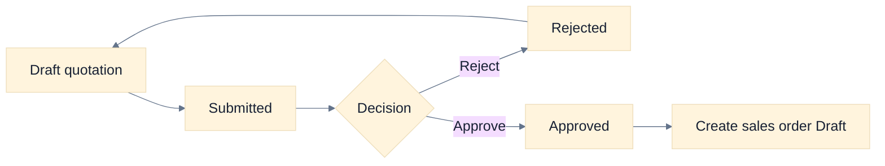
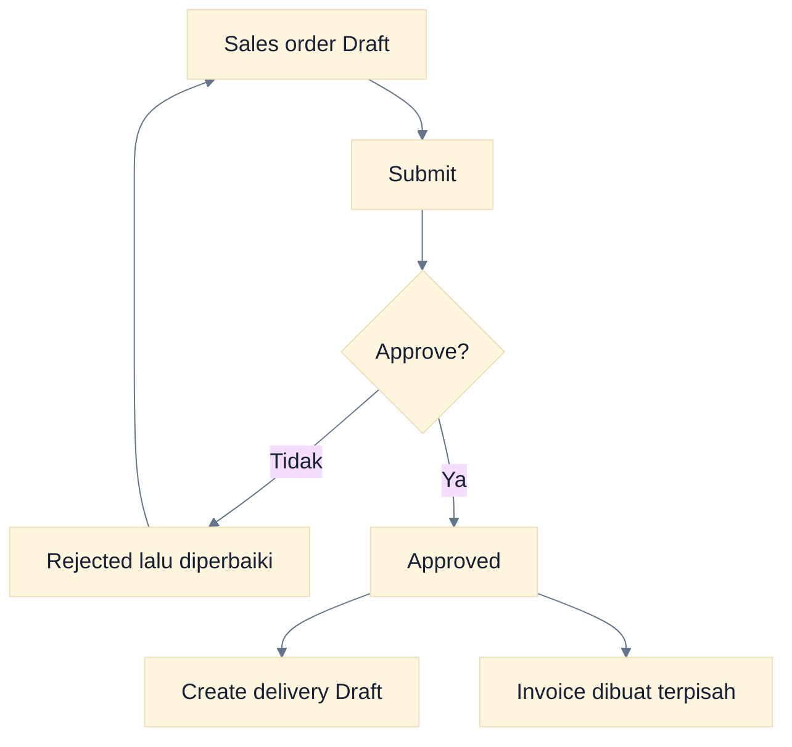
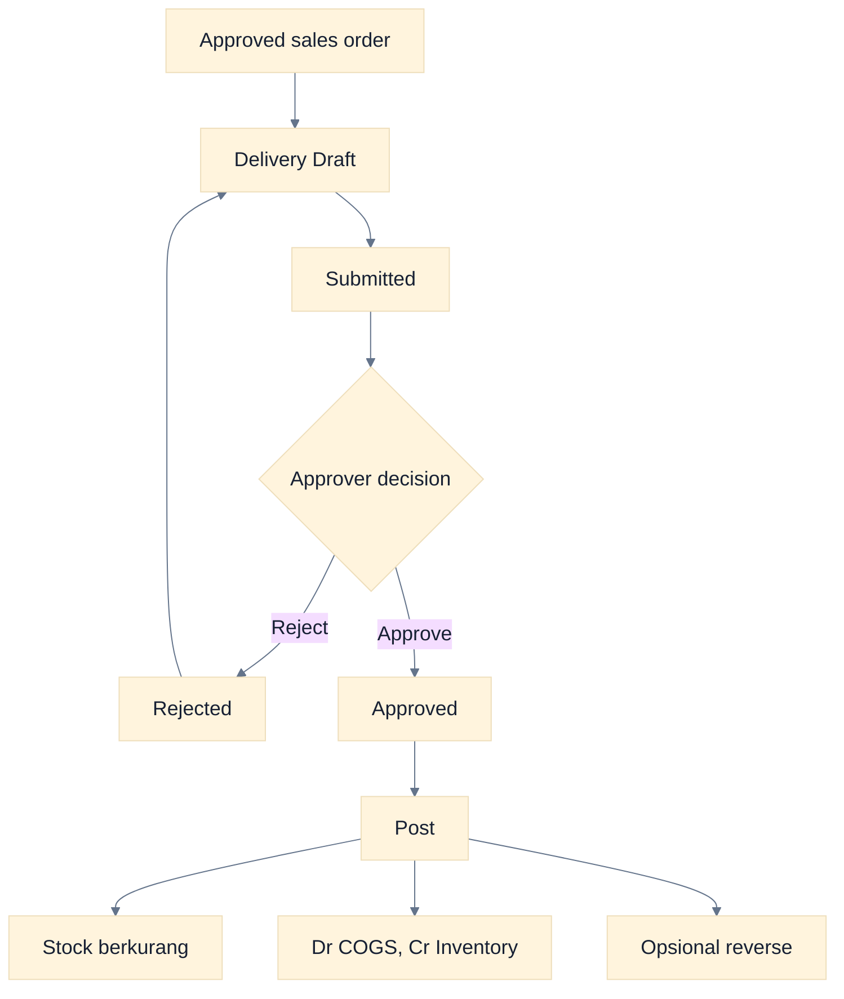
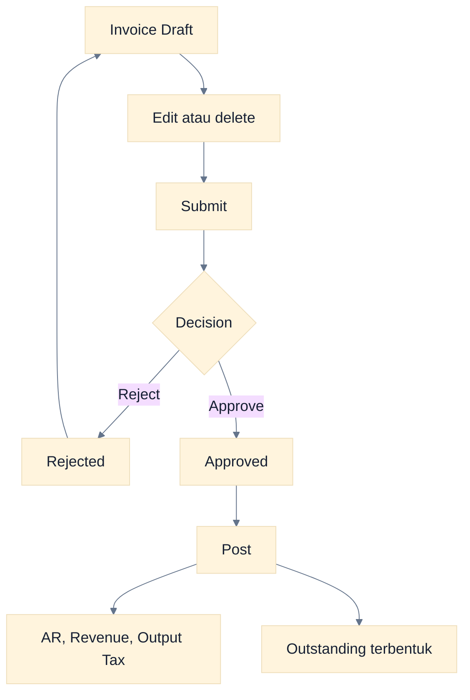
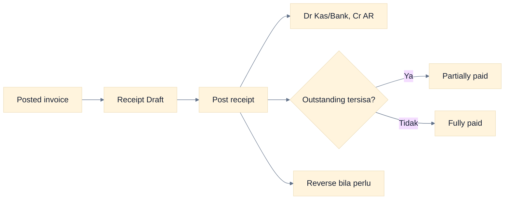
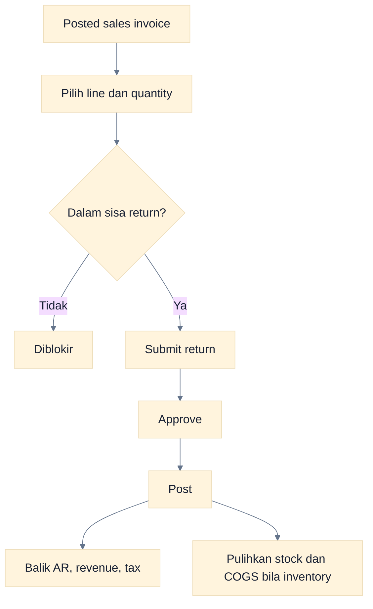
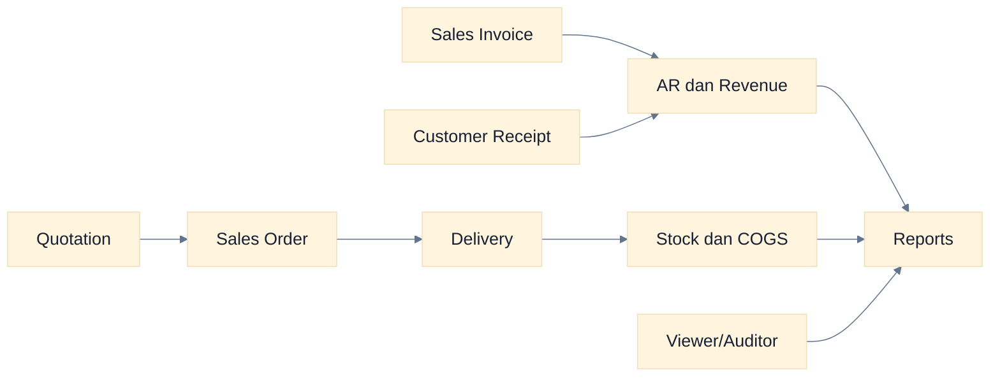

# Workflow Sales

Modul Sales mencakup quotation, sales order, delivery, sales invoice, customer receipt, dan sales return. Operator menyiapkan dokumen; Approver memutuskan serta memposting dokumen yang memiliki approval dan customer receipt Draft; Akuntan meninjau jurnal sesuai aksesnya.

> **Batas implementasi:** quotation dapat dikonversi menjadi sales order, dan approved sales order dapat membuat delivery Draft. Sales order belum dapat dikonversi langsung menjadi invoice; invoice dibuat terpisah.

## 1. Quotation

**Tujuan:** mencatat penawaran sebelum menjadi order. **Pelaku:** Operator dan Approver. **Prasyarat:** customer, produk/service, pajak, serta data harga tersedia.

1. Operator membuat quotation Draft dan mengisi customer, tanggal, line, quantity, harga, diskon, dan pajak.
2. Operator submit.
3. Approver approve atau reject dengan alasan.
4. Dari quotation Approved, buat sales order Draft.

### Cara Membaca Flowchart

Quotation tidak memengaruhi stock atau ledger. Konversi hanya tersedia setelah approval dan menghasilkan sales order yang masih Draft.

## 2. Sales Order

**Tujuan:** mencatat pesanan customer. **Pelaku:** Operator dan Approver. **Hasil:** sales order Approved yang dapat menjadi sumber delivery Draft.

### Cara Membaca Flowchart

Approved order membuka pembuatan delivery, bukan invoice. Tidak ada tracking invoiced quantity atau cancel remaining quantity pada versi ini.

## 3. Sales Delivery

**Tujuan:** mencatat barang keluar. **Prasyarat:** sales order Approved, warehouse dan stock cukup. **Dampak posting:** quantity turun; Dr COGS dan Cr Inventory.

### Cara Membaca Flowchart

Approval belum mengurangi stock. Posting melakukan stock movement dan jurnal sekaligus; reversal membalik keduanya jika syarat terpenuhi.

## 4. Sales Invoice

**Tujuan:** mengakui penjualan dan piutang. **Prasyarat:** customer, line, account/tax mapping, periode Open. **Dampak posting:** Dr AR, Cr Revenue, Cr Output Tax.

### Cara Membaca Flowchart

Edit/delete hanya untuk state yang diizinkan. Setelah Posted, gunakan customer receipt untuk settlement atau reversal jika invoice masih sepenuhnya outstanding.

## 5. Customer Receipt

**Tujuan:** mencatat pelunasan customer. **Pelaku:** Operator membuat; role dengan `sales.post`, biasanya Approver atau Administrator, memposting. **Prasyarat:** sales invoice Posted dan outstanding.

### Cara Membaca Flowchart

Receipt tidak melalui approval queue. Nilai tidak boleh melebihi batas yang diterima form; fitur overpayment dan write-off belum tersedia.

## 6. Sales Return

**Tujuan:** mengoreksi penjualan posted. **Prasyarat:** posted sales invoice, quantity return tersisa, dan warehouse untuk line inventory.

### Cara Membaca Flowchart

Dasol menghitung return kumulatif per line agar quantity tidak melebihi invoice. Posting memengaruhi finansial dan inventory sesuai tipe item.

## 7. Sales dari Awal sampai Audit

### Cara Membaca Flowchart

Alur fulfillment dan billing berjalan sebagai dua cabang yang belum terhubung otomatis. Auditor harus mencocokkan nomor, customer, line, quantity, tanggal, dan nilai secara prosedural.

## Status, Hasil, dan Koreksi

| Dokumen       | Status utama                                 | Saat jurnal/stock berubah | Koreksi                    |
| ------------- | -------------------------------------------- | ------------------------- | -------------------------- |
| Quotation     | Draft, Submitted, Approved, Rejected         | Tidak pernah              | Edit sebelum resubmit      |
| Sales order   | Draft, Submitted, Approved, Rejected         | Tidak pernah              | Edit sebelum resubmit      |
| Delivery      | Draft, Submitted, Approved, Posted, Reversed | Posted                    | Reverse                    |
| Sales invoice | Draft, Submitted, Approved, Posted, Reversed | Posted                    | Reverse jika belum settled |
| Receipt       | Draft, Posted, Reversed                      | Posted                    | Reverse                    |
| Sales return  | Draft, Submitted, Approved, Posted, Reversed | Posted                    | Reverse                    |

## Error dan Kontrol

- **Stock tidak cukup:** ubah quantity/warehouse atau selesaikan stock masuk yang sah.
- **Warehouse wajib:** pilih warehouse untuk line inventory.
- **Periode terkunci:** jangan mengganti tanggal sembarang; eskalasi kebutuhan reopen.
- **Invoice tidak bisa direverse:** reverse receipt terkait lebih dahulu.
- **Dokumen tidak muncul di approval:** pastikan sudah Submitted, company aktif benar, dan Approver punya permission domain.
- **Tidak ada tombol invoice dari order:** ini batas implementasi, bukan masalah permission.

## Panduan Terkait

- [Panduan Operator](./05-operator-guide.md)
- [Panduan Approver](./06-approver-guide.md)
- [Workflow Cash & Bank](./13-cash-bank-workflows.md)
- [Workflow Accounting](./09-accounting-workflows.md)
