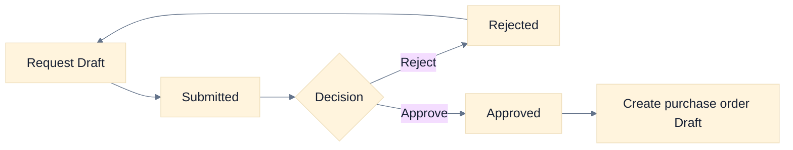
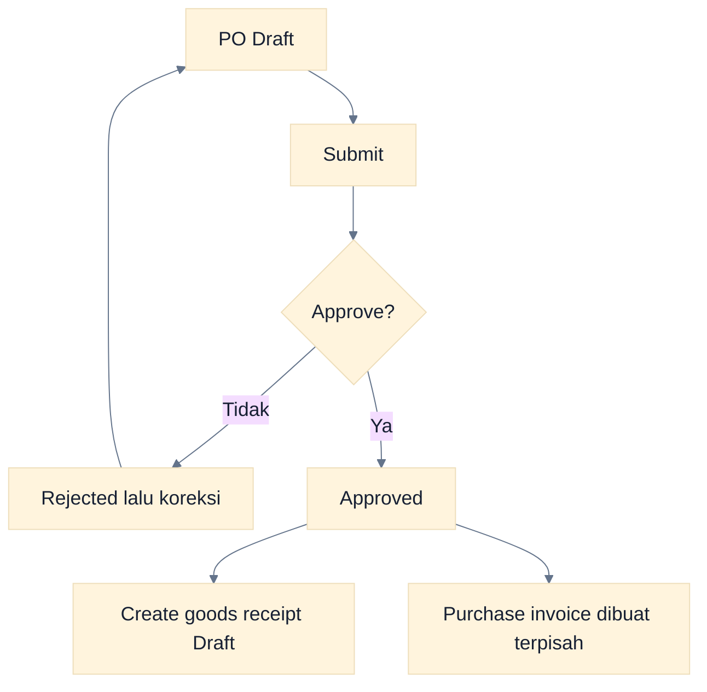
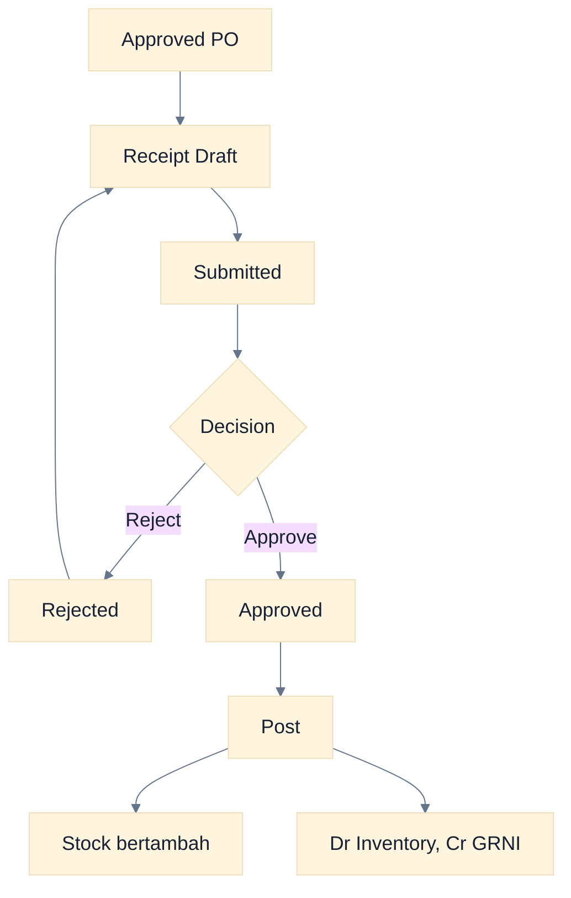
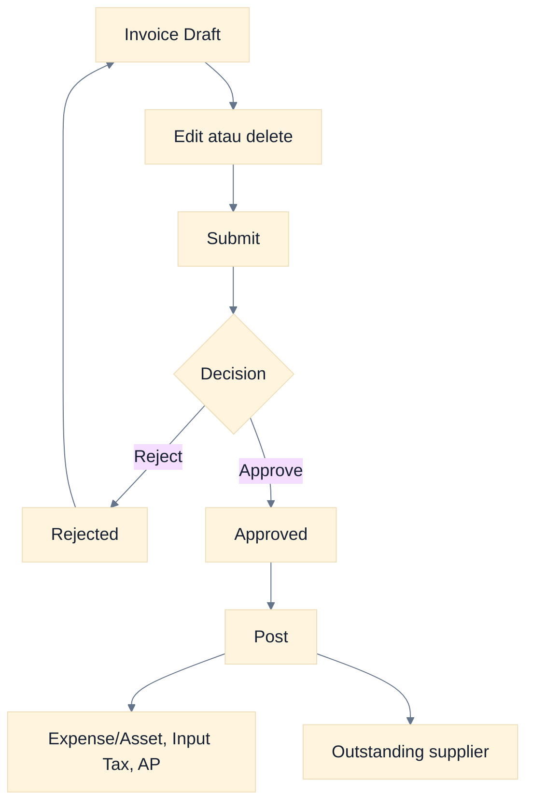
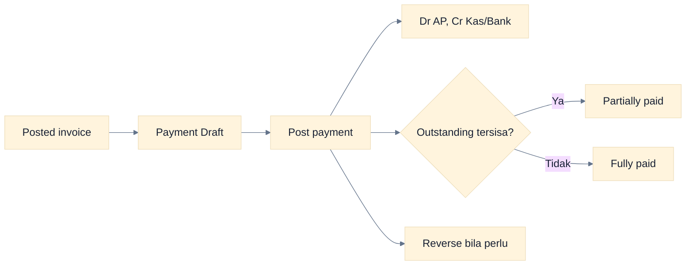
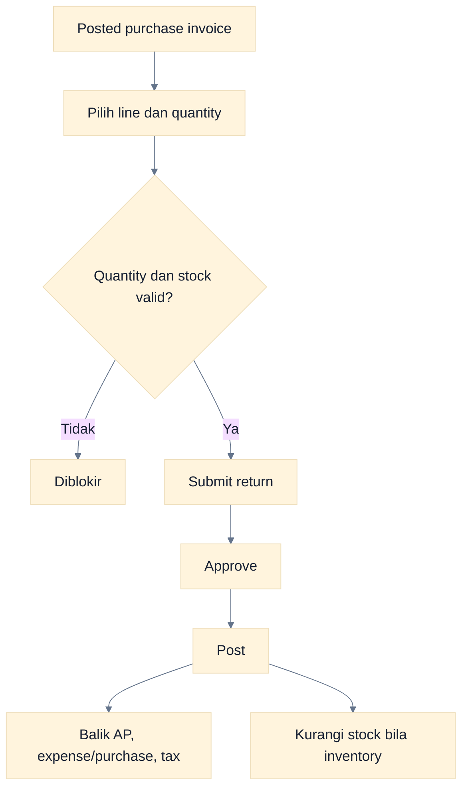
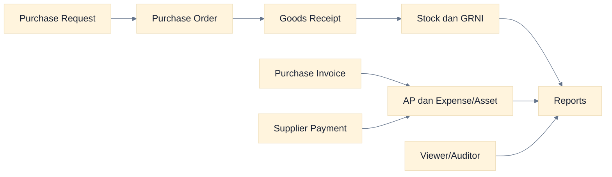

# Workflow Purchase

Modul Purchase mencakup purchase request, purchase order, goods receipt, purchase invoice, supplier payment, dan purchase return.

> **Batas implementasi:** purchase request dapat dikonversi ke purchase order, lalu approved purchase order dapat membuat goods receipt Draft. Purchase invoice dibuat terpisah; belum ada three-way matching otomatis.

## 1. Purchase Request

**Tujuan:** mencatat kebutuhan pembelian internal. **Pelaku:** Operator dan Approver. **Prasyarat:** item/service dan kebutuhan sudah jelas.

### Cara Membaca Flowchart

Purchase request adalah dokumen kebutuhan, tanpa journal atau stock movement. Konversi hanya menghasilkan PO Draft yang masih harus dilengkapi dan disetujui.

## 2. Purchase Order

**Tujuan:** mencatat komitmen pemesanan ke supplier. **Prasyarat:** supplier dan line pembelian tersedia.

### Cara Membaca Flowchart

Approved PO belum menambah stock dan belum membentuk utang. Ia menjadi referensi proses penerimaan barang.

## 3. Goods Receipt

**Tujuan:** mencatat barang masuk. **Prasyarat:** approved PO, warehouse, dan line penerimaan. **Dampak posting:** stock naik, Dr Inventory dan Cr GRNI.

### Cara Membaca Flowchart

Posting adalah saat kuantitas dan nilai persediaan berubah. Bila salah, reverse dokumen agar stock movement dan journal dibalik dengan jejak audit.

## 4. Purchase Invoice

**Tujuan:** mengakui tagihan supplier. **Prasyarat:** supplier, account/tax mapping, dan periode Open. **Dampak posting:** Dr Expense/Asset dan Input Tax, Cr AP.

### Cara Membaca Flowchart

Invoice tidak otomatis mengambil receipt. Cocokkan PO, receipt, dan invoice sebelum approval/post sebagai kontrol manual.

## 5. Supplier Payment

**Tujuan:** melunasi utang supplier. **Pelaku:** Operator membuat; role dengan `purchase.post`, biasanya Approver atau Administrator, memposting. **Prasyarat:** invoice Posted dan outstanding.

### Cara Membaca Flowchart

Payment tidak memakai approval queue. Reversal memulihkan outstanding invoice dan membentuk jurnal kebalikan.

## 6. Purchase Return

**Tujuan:** mengoreksi pembelian posted. **Prasyarat:** purchase invoice Posted, quantity return tersedia, warehouse untuk inventory, dan stock cukup.

### Cara Membaca Flowchart

Sumber return adalah purchase invoice, bukan goods receipt. Validasi kumulatif mencegah quantity retur melebihi quantity invoice.

## 7. Purchase dari Awal sampai Audit

### Cara Membaca Flowchart

Fulfillment dan billing merupakan cabang terpisah. Review manual harus memastikan barang yang diterima, invoice supplier, dan pembayaran konsisten.

## Status dan Koreksi

| Dokumen          | Status utama                                 | Saat jurnal/stock berubah | Koreksi                    |
| ---------------- | -------------------------------------------- | ------------------------- | -------------------------- |
| Purchase request | Draft, Submitted, Approved, Rejected         | Tidak pernah              | Edit sebelum resubmit      |
| Purchase order   | Draft, Submitted, Approved, Rejected         | Tidak pernah              | Edit sebelum resubmit      |
| Goods receipt    | Draft, Submitted, Approved, Posted, Reversed | Posted                    | Reverse                    |
| Purchase invoice | Draft, Submitted, Approved, Posted, Reversed | Posted                    | Reverse jika belum settled |
| Supplier payment | Draft, Posted, Reversed                      | Posted                    | Reverse                    |
| Purchase return  | Draft, Submitted, Approved, Posted, Reversed | Posted                    | Reverse                    |

## Error dan Kontrol

- **Supplier/item tidak tersedia:** periksa master dan company aktif.
- **Periode Locked:** eskalasi kebutuhan koreksi; jangan memundurkan tanggal tanpa dasar.
- **Payment ditolak:** periksa outstanding, rekening, dan status invoice.
- **Return gagal:** periksa sisa quantity, warehouse, serta stock yang tersedia.
- **Tidak ada tombol invoice dari PO/receipt:** fitur belum tersedia.
- **GRNI belum clear otomatis:** purchase invoice tidak otomatis direkonsiliasi ke receipt; lakukan review ledger secara manual.

## Panduan Terkait

- [Panduan Operator](./05-operator-guide.md)
- [Panduan Approver](./06-approver-guide.md)
- [Workflow Inventory](./12-inventory-workflows.md)
- [Workflow Accounting](./09-accounting-workflows.md)
