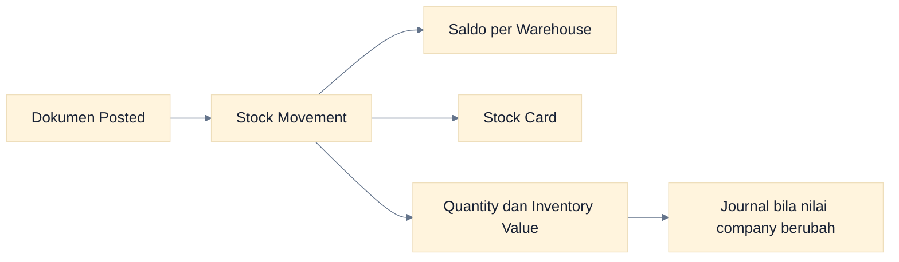
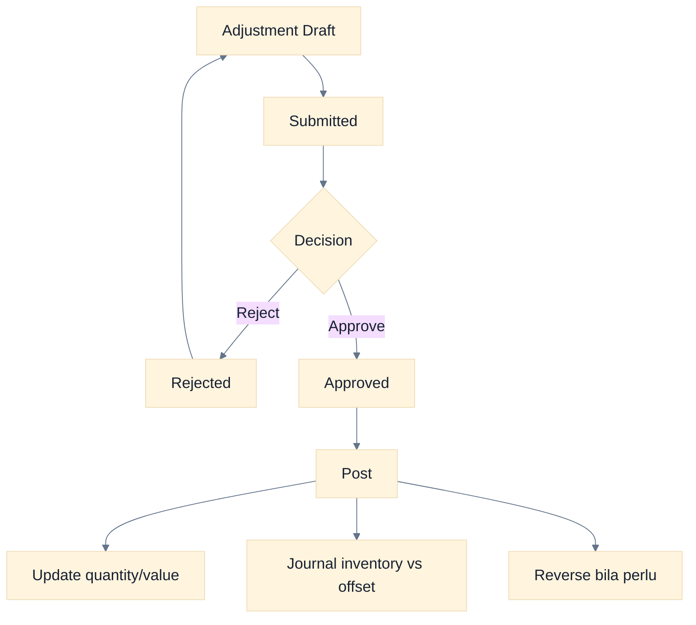
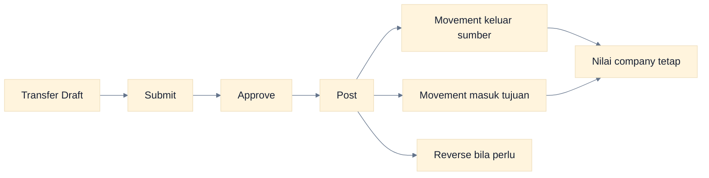
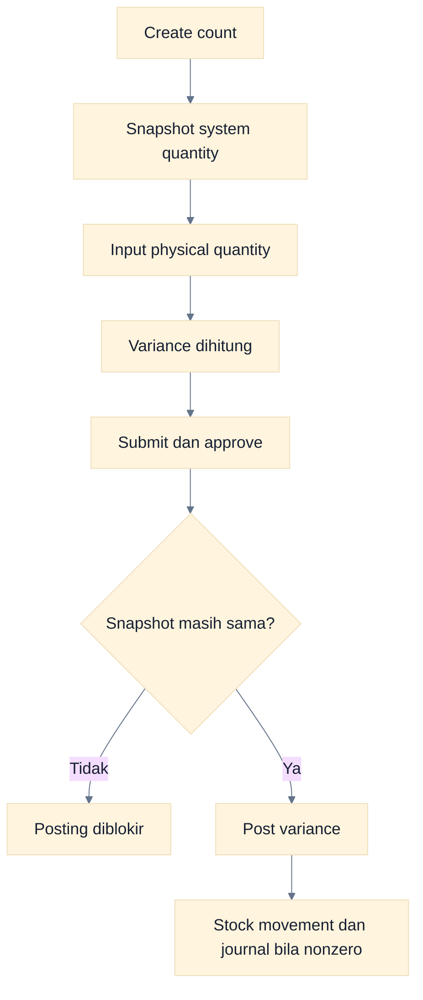
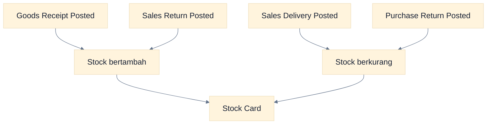
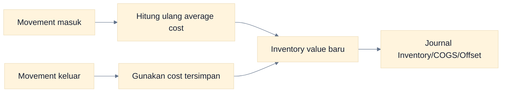
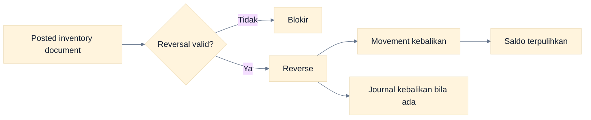

# Workflow Inventory

Inventory Dasol menyimpan saldo per company, produk, dan warehouse. Perubahan stock yang sah berasal dari dokumen posted dan dicatat sebagai stock movement; saldo tidak diedit langsung.

## Konsep Stock

### Cara Membaca Flowchart

Stock movement adalah jejak perubahan. Transfer memindahkan nilai antargudang tanpa journal, sedangkan receipt, delivery, adjustment, count, dan return dapat mengubah nilai perusahaan dan jurnal.

## Melihat Stock dan Stock Card

1. Buka **Inventory → Stock**.
2. Pastikan company aktif benar.
3. Pilih produk/warehouse yang ingin ditinjau.
4. Buka stock card untuk urutan movement.
5. Cocokkan tanggal, source type, source number, quantity, dan nilai.

## Stock Adjustment

**Tujuan:** koreksi resmi atas selisih yang diketahui. **Pelaku:** Operator membuat/submit; Approver approve/post/reverse. **Prasyarat:** item, warehouse, quantity, offset account, dan alasan.

### Cara Membaca Flowchart

Perubahan baru terjadi saat Post. Adjustment naik dan turun memakai arah journal yang berlawanan; reversal mengembalikan stock serta journal.

## Stock Transfer

**Tujuan:** memindahkan stock antar-warehouse dalam company yang sama. **Prasyarat:** source dan destination berbeda, stock sumber cukup.

### Cara Membaca Flowchart

Transfer diposting satu langkah: keluar dan masuk terjadi bersamaan. Belum ada status in-transit atau langkah penerimaan terpisah, dan tidak ada journal GL karena nilai total company tidak berubah.

## Stock Count / Opname

**Tujuan:** membandingkan snapshot quantity sistem dengan hitungan fisik. **Prasyarat:** warehouse dan item terpilih, physical quantity diisi, snapshot belum basi.

### Cara Membaca Flowchart

Dasol memeriksa ulang saldo sebelum posting. Jika ada movement setelah snapshot, count dianggap stale; buat ulang atau selesaikan berdasarkan prosedur stock opname.

## Fulfillment yang Mengubah Stock

### Cara Membaca Flowchart

Invoice saja tidak mengubah stock. Pada Dasol, barang masuk utama berasal dari goods receipt, sedangkan barang keluar utama berasal dari sales delivery.

## Average Cost dan Inventory Value

Saldo menyimpan `quantity_on_hand`, `quantity_reserved`, `average_cost`, dan `inventory_value`. Nilai aktual dihitung oleh posting engine; user tidak mengedit average cost langsung.

### Cara Membaca Flowchart

Movement masuk dapat mengubah average cost; movement keluar memakai cost yang tersimpan untuk menghitung nilai dan journal. Selalu review nilai hasil posting, bukan hanya quantity.

## Reversal Inventory

### Cara Membaca Flowchart

Reversal menjaga histori dan tidak menghapus movement awal. Validasi mencegah saldo negatif atau pembalikan yang melanggar state dokumen.

## Error dan Kontrol

| Masalah                    | Penyebab                                            | Tindakan                                    |
| -------------------------- | --------------------------------------------------- | ------------------------------------------- |
| Insufficient stock         | Quantity sumber kurang                              | Periksa stock card dan warehouse            |
| Warehouse wajib            | Line inventory belum memiliki warehouse             | Isi warehouse yang benar                    |
| Stock count stale          | Ada movement setelah snapshot                       | Buat/review count berdasarkan saldo terbaru |
| Tidak ada journal transfer | Perilaku normal                                     | Review dua stock movement                   |
| Post gagal                 | Status, permission, periode, atau mapping akun      | Periksa detail error dan master data        |
| Saldo terlihat salah       | Company/warehouse/filter atau movement belum posted | Samakan konteks dan telusuri stock card     |

## Batas Implementasi

- Belum ada in-transit/receive dua langkah untuk transfer.
- Belum ada reservation workflow yang lengkap di UI.
- Belum ada laporan inventory valuation/reconciliation tersendiri di menu Reports.
- Belum ada batch/serial/lot/expiry tracking.
- Tidak ada edit saldo langsung; gunakan dokumen koreksi yang sah.

## Panduan Terkait

- [Workflow Sales](./10-sales-workflows.md)
- [Workflow Purchase](./11-purchase-workflows.md)
- [Workflow Accounting](./09-accounting-workflows.md)
- [Troubleshooting](./16-troubleshooting.md)
