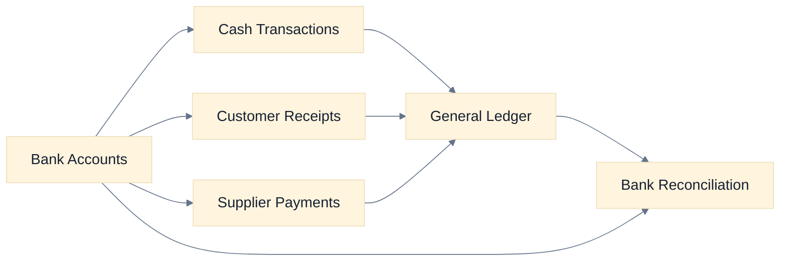
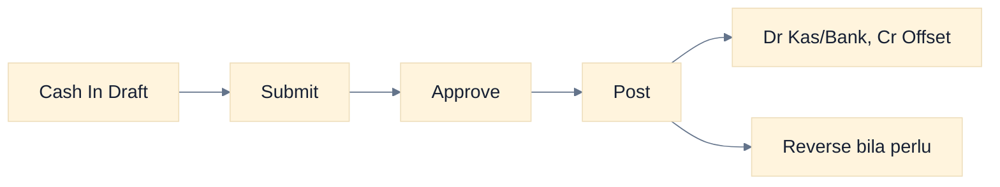
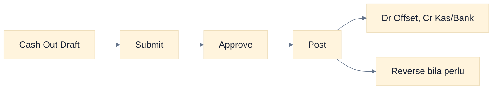
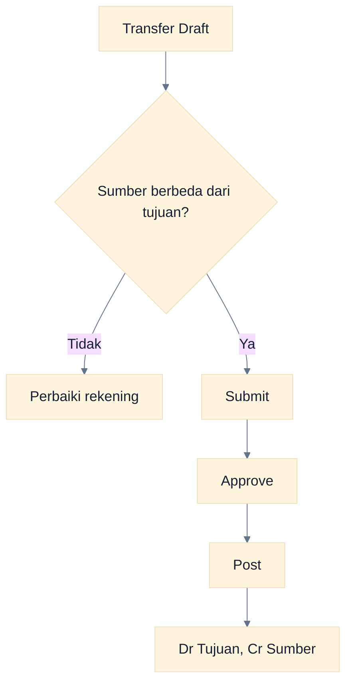
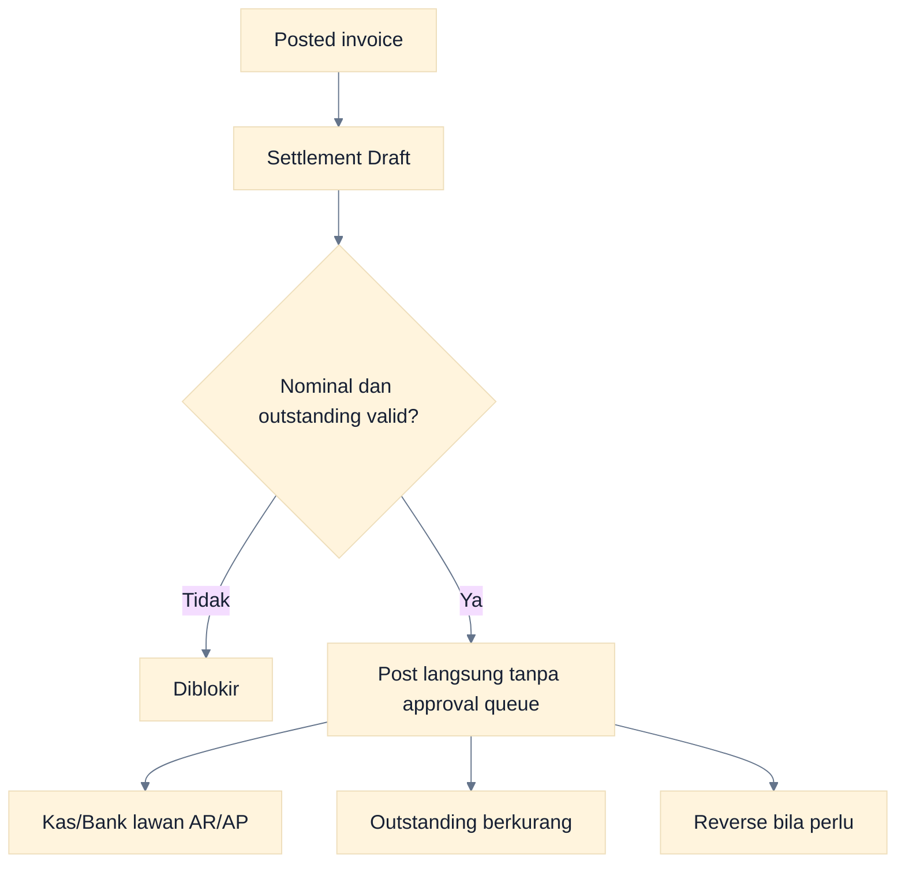
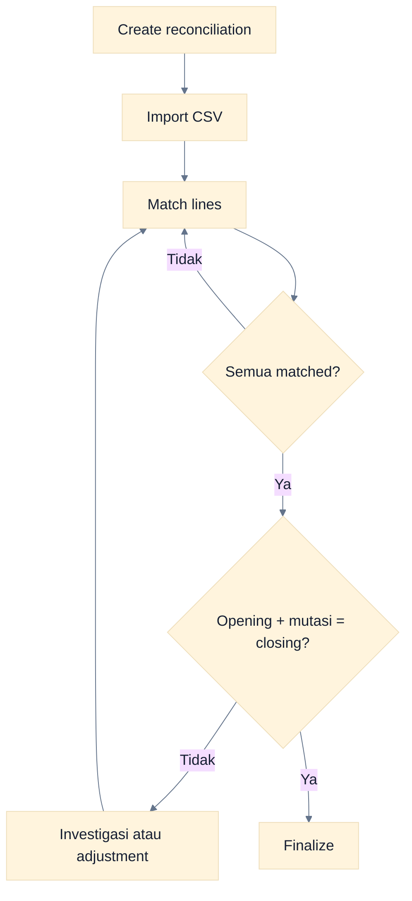
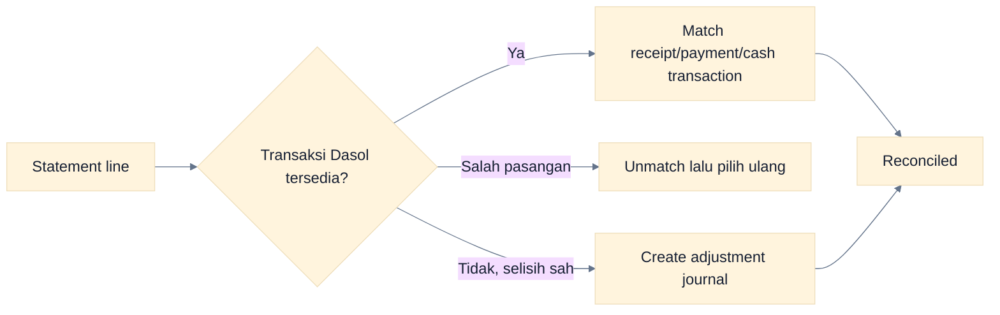

# Workflow Cash & Bank

Cash & Bank mencakup bank accounts, cash in, cash out, bank transfer, customer receipt, supplier payment, dan bank reconciliation.

## Peta Modul

### Cara Membaca Flowchart

Semua transaksi posted membentuk jurnal. Reconciliation membandingkan transaksi yang sudah ada dengan mutasi statement; ia tidak menggantikan pencatatan transaksi.

## Bank Accounts

Pastikan setiap rekening memiliki nama, nomor/identitas yang sesuai, mata uang, serta account mapping. Master bank account dapat dilihat sesuai permission; pengelolaannya mengikuti permission settings/master yang diberikan.

## Cash In

**Tujuan:** mencatat penerimaan yang bukan settlement customer invoice. **Dampak:** Dr Kas/Bank, Cr akun offset.

### Cara Membaca Flowchart

Cash transaction memakai approval workflow. Efek buku baru muncul saat Post dan dapat dibalik melalui Reverse.

## Cash Out

**Tujuan:** mencatat pengeluaran yang bukan settlement supplier invoice. **Dampak:** Dr akun offset, Cr Kas/Bank.

### Cara Membaca Flowchart

Pilih akun offset sesuai substansi pengeluaran. Jangan memakai cash out untuk melunasi purchase invoice; gunakan supplier payment agar AP ter-settle.

## Bank Transfer

**Tujuan:** memindahkan dana antar-bank/cash account company. **Dampak:** Dr rekening tujuan, Cr rekening sumber.

### Cara Membaca Flowchart

Transfer adalah satu dokumen dan satu journal yang memindahkan saldo. Gunakan rekening berbeda dan periode Open.

## Customer Receipt dan Supplier Payment

### Cara Membaca Flowchart

Receipt/payment berbeda dari cash transaction: ia memilih invoice dan memperbarui outstanding. Lifecycle-nya Draft → Posted → Reversed tanpa Submit/Approve.

Permission posting mengikuti domain invoice: `sales.post` untuk customer receipt dan `purchase.post` untuk supplier payment. Permission `cash.post` berlaku pada cash in, cash out, dan bank transfer, bukan settlement invoice.

## Bank Reconciliation

Preset permission menggunakan `settings.manage`; pada role bawaan, Administrator dan Akuntan dapat mengoperasikan reconciliation.

1. Buat reconciliation untuk bank account dan periode statement.
2. Isi opening balance serta closing balance.
3. Import CSV statement.
4. Match setiap line ke customer receipt, supplier payment, atau cash transaction.
5. Unmatch jika pasangan salah.
6. Bila ada selisih yang sah, buat adjustment journal.
7. Finalize setelah seluruh line matched dan saldo terhitung sama dengan closing balance.

### Cara Membaca Flowchart

Dua syarat finalize harus terpenuhi: seluruh statement line matched dan persamaan saldo cocok. Adjustment hanya dibuat untuk perbedaan yang valid dan terdokumentasi.

## Matching dan Adjustment

### Cara Membaca Flowchart

Utamakan matching ke transaksi yang benar. Adjustment journal bukan alat untuk menutupi transaksi yang belum dicatat atau kesalahan yang belum diselidiki.

## Error dan Kontrol

| Masalah                                | Tindakan                                                                     |
| -------------------------------------- | ---------------------------------------------------------------------------- |
| Invoice tidak tersedia saat settlement | Pastikan Posted, company/customer atau supplier benar, dan masih outstanding |
| Tidak dapat post                       | Periksa permission, rekening, nominal, periode, dan state                    |
| Tidak dapat finalize reconciliation    | Selesaikan unmatched lines dan cocokkan persamaan saldo                      |
| CSV tidak terbaca                      | Periksa header/format yang diharapkan, delimiter, tanggal, dan nominal       |
| Salah match                            | Unmatch lalu match ke transaksi yang benar                                   |
| Invoice tidak bisa reverse             | Reverse settlement terkait lebih dahulu                                      |

## Batas Implementasi

- Settlement belum mendukung overpayment, withholding, bank fee, write-off, dan credit allocation kompleks.
- Belum ada feed bank otomatis; statement diimpor sebagai CSV.
- Tidak ada approval queue untuk receipt/payment.
- Reconciliation bukan multi-user workflow approval terpisah.

## Panduan Terkait

- [Workflow Sales](./10-sales-workflows.md)
- [Workflow Purchase](./11-purchase-workflows.md)
- [Workflow Accounting](./09-accounting-workflows.md)
- [Panduan Laporan](./15-reporting-guide.md)
