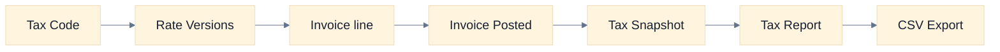
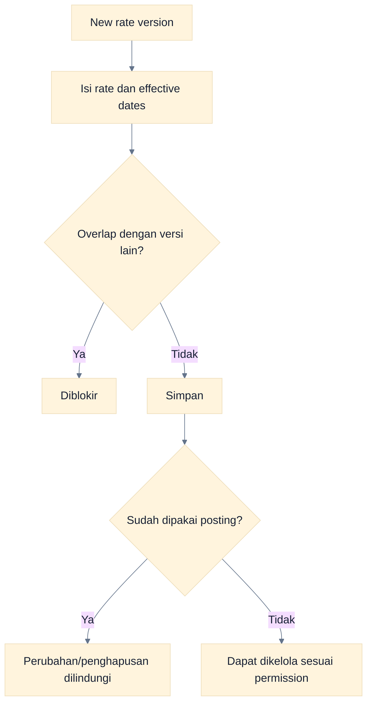
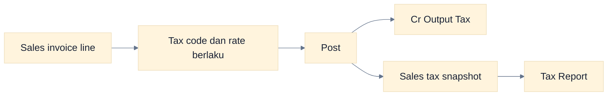
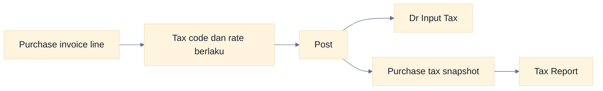
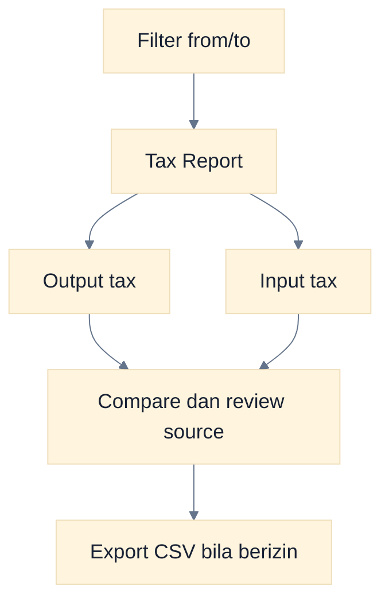
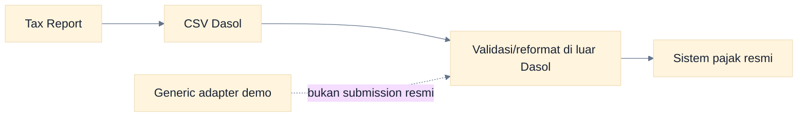

# Workflow Pajak

Dasol menyimpan tax code, versi tarif berbasis tanggal efektif, snapshot pajak pada invoice posted, dan Tax Report. Konfigurasi harus dilakukan sebelum transaksi diposting.

## Siklus Pajak

### Cara Membaca Flowchart

Tarif yang berlaku dipilih berdasarkan tanggal transaksi. Ketika invoice diposting, detail pajak disalin menjadi snapshot agar laporan historis tidak berubah akibat tarif baru.

## Tax Code dan Rate Version

1. Administrator/Akuntan dengan `settings.manage` membuka pengaturan Tax Codes.
2. Buat tax code dengan identitas dan account mapping yang benar.
3. Tambahkan rate version beserta tanggal efektif.
4. Hindari rentang tanggal yang tumpang tindih.
5. Uji pada invoice Draft sebelum digunakan luas.

### Cara Membaca Flowchart

Dasol mencegah overlap dan melindungi rate version yang sudah dipakai. Buat versi baru untuk perubahan tarif; jangan mengubah histori.

## Pajak Penjualan

### Cara Membaca Flowchart

Pajak keluaran diakui saat sales invoice diposting. Sales return posted membalik bagian pajak sesuai line dan quantity return.

## Pajak Pembelian

### Cara Membaca Flowchart

Pajak masukan berasal dari purchase invoice posted. Purchase return posted membalik pajak terkait sesuai nilai return.

## Tax Report

1. Buka **Reports → Tax Report**.
2. Pilih tanggal awal dan akhir.
3. Review pajak keluaran dan pajak masukan.
4. Telusuri ke invoice sumber bila nilai tidak sesuai.
5. Pengguna dengan `report.export` dapat mengunduh CSV.

### Cara Membaca Flowchart

Samakan cutoff laporan dengan periode pemeriksaan. Viewer dapat membaca report, tetapi preset Viewer tidak memiliki permission export.

## Export dan Coretax

Dasol memiliki adapter CSV/XML generik di kode dengan penanda **DEMO / NOT FOR OFFICIAL SUBMISSION**. Tidak ada tombol integrasi langsung ke Coretax, validasi skema resmi, submission, acknowledgement, atau sinkronisasi status.

### Cara Membaca Flowchart

Export Dasol adalah bahan rekonsiliasi, bukan file resmi siap kirim. Tim pajak tetap harus memvalidasi format dan memakai prosedur sistem resmi yang berlaku.

## Kontrol

- Batasi pengelolaan tax code kepada role berwenang.
- Jangan mengubah histori rate; buat versi efektif baru.
- Review account mapping input/output tax sebelum posting.
- Rekonsiliasi Tax Report dengan invoice, return, dan GL.
- Simpan bukti submission resmi di sistem/prosedur eksternal; attachment UI Dasol belum tersedia.

## Error Umum

| Masalah                      | Penyebab                                 | Tindakan                                |
| ---------------------------- | ---------------------------------------- | --------------------------------------- |
| Tax code tidak tersedia      | Tidak aktif/tidak sesuai company/tanggal | Periksa konfigurasi dan effective date  |
| Rate version ditolak         | Rentang overlap                          | Sesuaikan tanggal tanpa tumpang tindih  |
| Rate tidak dapat dihapus     | Sudah dipakai transaksi posted           | Buat versi baru; pertahankan histori    |
| Report kosong                | Tidak ada invoice posted pada rentang    | Periksa company, tanggal, dan status    |
| CSV tidak cocok format resmi | Export bukan adapter resmi Coretax       | Transformasi dan validasi di luar Dasol |

## Panduan Terkait

- [Panduan Administrator](./03-administrator-guide.md)
- [Panduan Akuntan](./04-accountant-guide.md)
- [Workflow Accounting](./09-accounting-workflows.md)
- [Panduan Laporan](./15-reporting-guide.md)
