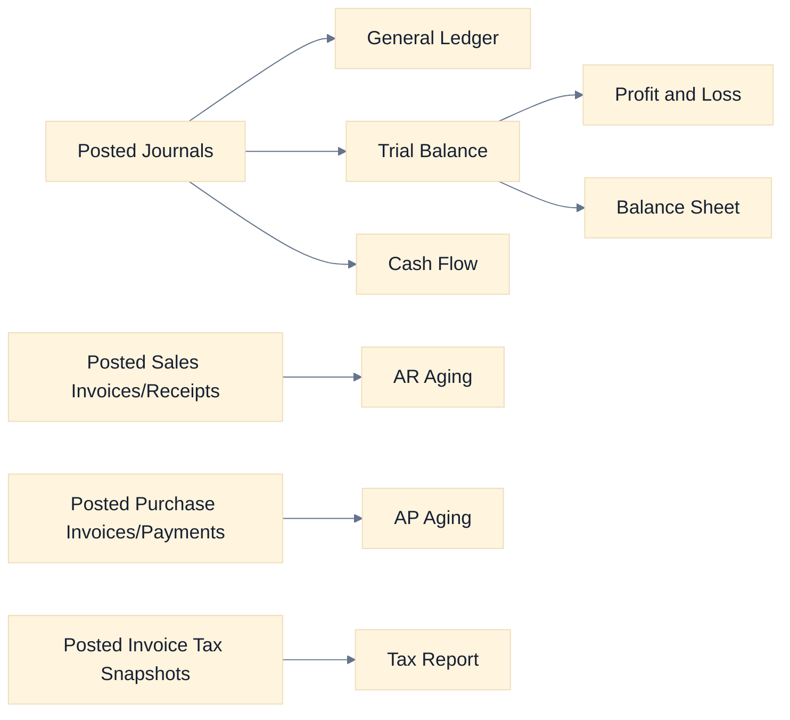
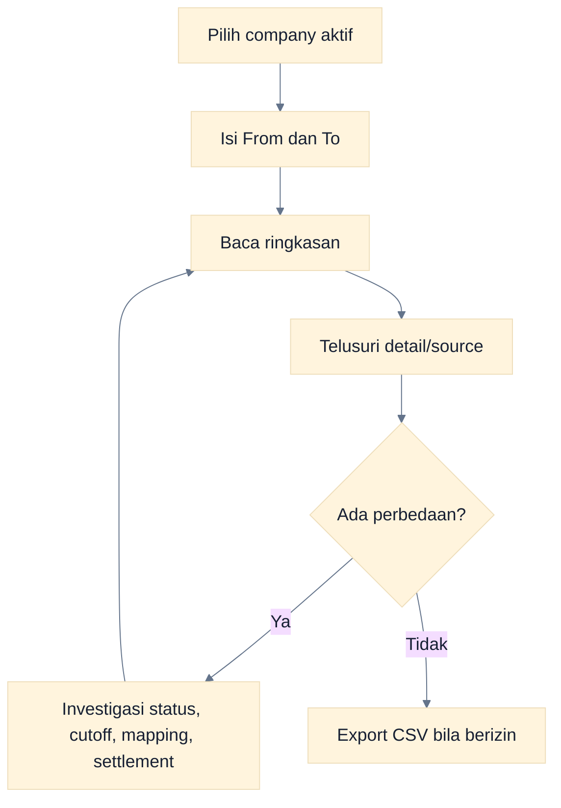
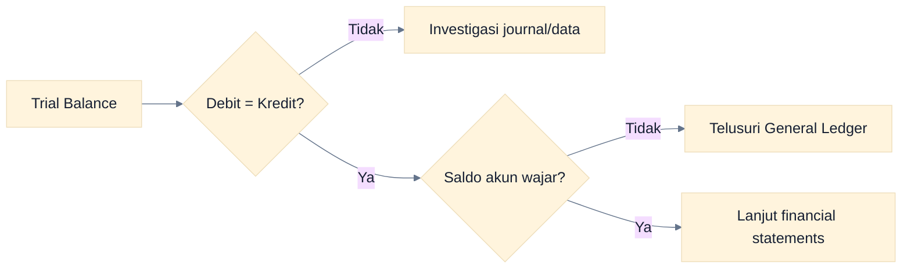
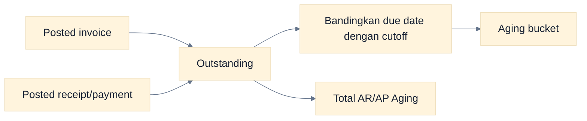
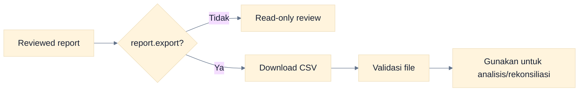

# Panduan Laporan

Menu Reports menyediakan delapan laporan berbasis company aktif dan transaksi/jurnal posted. Filter yang tersedia saat ini terutama **From** dan **To**; kemampuan search, sort, print, dan filter lanjutan tidak universal.

## Peta Laporan

### Cara Membaca Flowchart

Laporan keuangan utama berasal dari journal posted. Aging berasal dari invoice dan settlement; Tax Report berasal dari tax snapshot invoice posted.

## Daftar Laporan yang Tersedia

| Laporan        | Tujuan                                 | Fokus review                                    |
| -------------- | -------------------------------------- | ----------------------------------------------- |
| General Ledger | Melihat mutasi per akun                | Opening, debit, kredit, running balance, source |
| Trial Balance  | Memastikan saldo akun dan keseimbangan | Total debit = total kredit                      |
| Profit & Loss  | Melihat pendapatan, beban, laba        | Periode, klasifikasi akun, tren                 |
| Balance Sheet  | Melihat aset, liabilitas, ekuitas      | Posisi pada cutoff dan keseimbangan             |
| Cash Flow      | Melihat arus kas                       | Sumber/penggunaan kas sesuai klasifikasi        |
| AR Aging       | Melihat piutang per umur               | Outstanding, due date, overdue customer         |
| AP Aging       | Melihat utang per umur                 | Outstanding, due date, overdue supplier         |
| Tax Report     | Melihat pajak masukan/keluaran         | Snapshot invoice, periode, net tax              |

## Alur Review Laporan

### Cara Membaca Flowchart

Selalu tetapkan konteks company dan periode sebelum membaca angka. Export dilakukan setelah review, bukan sebagai pengganti rekonsiliasi.

## Financial Reports

### General Ledger

- **Tujuan:** menelusuri mutasi dan saldo akun dari journal posted.
- **Audience:** Akuntan, Administrator, Viewer/Auditor.
- **Filter:** tanggal From dan To pada company aktif.
- **Cara membaca:** ikuti opening, debit, kredit, running balance, journal, dan source.
- **Interpretasi:** nilai tidak lazim harus ditelusuri ke journal lalu source document; jangan menilai hanya dari memo.
- **Kapan digunakan:** rekonsiliasi akun, investigasi transaksi, dan persiapan closing.

### Trial Balance

- **Tujuan:** memeriksa saldo seluruh akun dan keseimbangan pembukuan.
- **Audience:** Akuntan, Administrator, Viewer/Auditor.
- **Filter:** tanggal From dan To pada company aktif.
- **Cara membaca:** bandingkan kolom debit/kredit dan sifat saldo setiap akun.
- **Interpretasi:** total debit = kredit adalah syarat dasar, tetapi tidak membuktikan akun atau tanggal sudah benar.
- **Kapan digunakan:** sebelum membaca financial statements dan sebelum period closing.

### Cara Membaca Flowchart

Keseimbangan adalah kontrol awal, bukan bukti seluruh klasifikasi benar. Saldo seimbang masih dapat berisi akun atau periode yang salah.

### Profit & Loss

- **Tujuan:** merangkum revenue, expense, dan profit/loss untuk suatu periode.
- **Audience:** manajemen, Akuntan, Administrator, Viewer/Auditor.
- **Filter:** tanggal From dan To.
- **Cara membaca:** mulai dari revenue, lanjutkan expense, lalu net profit; bandingkan komposisi akun.
- **Interpretasi:** nilai mengikuti klasifikasi COA dan cutoff posting, bukan status Draft/Approved.
- **Kapan digunakan:** review kinerja periode dan closing.

### Balance Sheet

- **Tujuan:** menunjukkan posisi aset, liabilitas, dan ekuitas pada cutoff.
- **Audience:** manajemen, Akuntan, Administrator, Viewer/Auditor.
- **Filter:** tanggal From dan To; gunakan To sebagai cutoff utama.
- **Cara membaca:** telaah kelompok aset, liabilitas, dan ekuitas serta keseimbangannya.
- **Interpretasi:** salah klasifikasi COA/account mapping dapat membuat penyajian keliru walaupun journal balance.
- **Kapan digunakan:** review posisi keuangan, closing, dan audit.

### Cash Flow

- **Tujuan:** menjelaskan arus masuk dan keluar kas dari journal posted.
- **Audience:** manajemen, treasury/finance, Akuntan, Viewer/Auditor.
- **Filter:** tanggal From dan To.
- **Cara membaca:** review sumber dan penggunaan kas sesuai klasifikasi akun.
- **Interpretasi:** klasifikasi yang tidak sesuai perlu ditelusuri ke account mapping dan source.
- **Kapan digunakan:** monitoring likuiditas dan review periode.

## Receivable Reports

### AR Aging

- **Tujuan:** mengelompokkan outstanding sales invoice menurut umur.
- **Audience:** collection/finance, manajemen, Akuntan, Viewer/Auditor.
- **Filter:** tanggal From dan To/cutoff pada company aktif.
- **Cara membaca:** lihat customer, invoice, due date, outstanding, dan aging bucket.
- **Interpretasi:** receipt posted mengurangi outstanding; invoice lewat due date masuk kelompok overdue.
- **Kapan digunakan:** collection follow-up, allowance review, dan rekonsiliasi AR.

### Customer Statement

Belum tersedia sebagai report tersendiri. Gunakan AR Aging dan detail/list invoice-receipt untuk penelusuran internal; jangan menjanjikan statement siap kirim dari Dasol.

## Payable Reports

### AP Aging

- **Tujuan:** mengelompokkan outstanding purchase invoice menurut umur.
- **Audience:** AP/finance, manajemen, Akuntan, Viewer/Auditor.
- **Filter:** tanggal From dan To/cutoff pada company aktif.
- **Cara membaca:** lihat supplier, invoice, due date, outstanding, dan aging bucket.
- **Interpretasi:** supplier payment posted mengurangi outstanding; bucket menunjukkan prioritas jatuh tempo.
- **Kapan digunakan:** payment planning, supplier reconciliation, dan closing AP.

### Supplier Statement

Belum tersedia sebagai report tersendiri. Gunakan AP Aging dan detail/list invoice-payment untuk penelusuran internal.

## Cara Membaca Aging

### Cara Membaca Flowchart

Invoice masuk bucket berdasarkan due date dan cutoff, sedangkan settlement posted mengurangi outstanding. Samakan cutoff saat membandingkan aging dengan ledger.

## Sales Reports

Belum ada sales register atau sales analysis report tersendiri. List/detail Sales Invoice, Order, Delivery, Receipt, dan Return adalah layar transaksi, bukan report agregat. Gunakan GL, P&L, AR Aging, dan Tax Report sesuai kebutuhan analisis yang tersedia.

## Purchase Reports

Belum ada purchase register atau purchase analysis report tersendiri. List/detail Purchase Invoice, Request, Order, Goods Receipt, Payment, dan Return adalah layar transaksi. Gunakan GL, P&L, AP Aging, dan Tax Report untuk kontrol yang tersedia.

## Inventory Reports

Belum ada inventory valuation atau inventory reconciliation report pada menu Reports. Gunakan **Persediaan** dan stock card untuk melihat quantity/movement, lalu General Ledger untuk akun inventory. Rekonsiliasi stock-to-GL dilakukan secara prosedural.

## Tax Reports

### Tax Report

- **Tujuan:** merangkum pajak masukan/keluaran dari tax snapshot invoice posted.
- **Audience:** tim pajak/finance, Akuntan, Administrator, Viewer/Auditor.
- **Filter:** tanggal From dan To.
- **Cara membaca:** pisahkan sales/output tax dan purchase/input tax, lalu telusuri invoice/return terkait.
- **Interpretasi:** perubahan rate setelah posting tidak mengubah snapshot historis; CSV bukan submission resmi Coretax.
- **Kapan digunakan:** rekonsiliasi pajak internal dan persiapan data pelaporan eksternal.

Lihat [Workflow Pajak](./14-tax-workflows.md) untuk konfigurasi dan batas integrasi.

## Audit Reports

Tidak ada report audit di dalam menu Reports. **Audit Log** adalah modul terpisah dengan list, detail, dan CSV export bagi role berizin.

- **Tujuan:** menelusuri event/action penting dan pelakunya.
- **Audience:** Administrator, Akuntan, Viewer/Auditor.
- **Filter:** gunakan kontrol yang tersedia pada halaman Audit Log; cakupan tetap company aktif.
- **Cara membaca:** mulai dari timestamp/action/actor, buka detail, lalu cocokkan entity/source terkait.
- **Interpretasi:** satu event adalah evidence perubahan, bukan bukti tunggal bahwa substansi transaksi benar.
- **Kapan digunakan:** investigasi, review akses, closing, dan audit.

## Export

- Tombol export hanya tersedia bagi pengguna dengan `report.export`.
- Preset Administrator dan Akuntan memilikinya; Viewer tidak.
- Format utama adalah CSV, bukan PDF/print pack.
- Validasi isi, delimiter, encoding, dan periode sebelum dipakai di sistem lain.

### Cara Membaca Flowchart

Permission export berdiri sendiri dari permission membaca laporan. File harus divalidasi sebelum diteruskan ke pihak atau sistem lain.

## Laporan yang Belum Tersedia

Jangan mencari menu berikut karena belum diimplementasikan sebagai laporan tersendiri:

- customer statement dan supplier statement;
- sales/purchase register khusus;
- inventory valuation dan inventory reconciliation report;
- budget versus actual;
- fixed asset register report/roll-forward terpisah;
- consolidated/multi-company report;
- official Coretax submission report;
- PDF/print pack laporan.

## Troubleshooting Laporan

| Gejala                         | Pemeriksaan                                             |
| ------------------------------ | ------------------------------------------------------- |
| Kosong                         | Company aktif, From/To, dan keberadaan transaksi posted |
| Nilai tidak berubah            | Dokumen mungkin baru Approved, belum Posted             |
| Aging tidak sesuai             | Cutoff, due date, settlement status, dan reversal       |
| Tax berbeda                    | Tax snapshot, return, tanggal invoice, dan rate version |
| Tidak ada Export               | Permission `report.export` tidak dimiliki               |
| Tidak bisa drill down tertentu | Detail/link tersebut belum tersedia di semua report     |

## Panduan Terkait

- [Workflow Accounting](./09-accounting-workflows.md)
- [Workflow Pajak](./14-tax-workflows.md)
- [Panduan Viewer/Auditor](./07-viewer-auditor-guide.md)
- [Troubleshooting](./16-troubleshooting.md)
