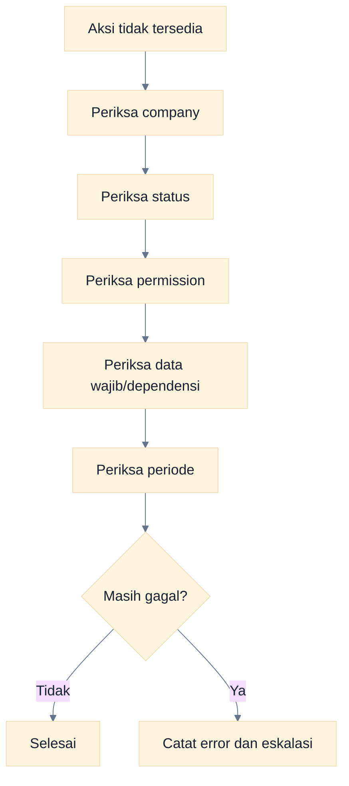

# Troubleshooting

Mulai dari tiga pemeriksaan sederhana: **company aktif**, **status dokumen**, dan **permission role**. Catat pesan error persis, nomor dokumen, waktu kejadian, serta langkah yang dilakukan sebelum eskalasi.

## Masalah Pengguna

| Masalah                             | Kemungkinan Penyebab                                                                                                     | Solusi                                                                                                             |
| ----------------------------------- | ------------------------------------------------------------------------------------------------------------------------ | ------------------------------------------------------------------------------------------------------------------ |
| Tidak bisa login                    | Email/password salah, user belum dibuat, atau sesi bermasalah                                                            | Periksa kredensial, gunakan Forgot Password bila email valid, lalu hubungi Administrator bila user belum aktif     |
| Perusahaan tidak muncul             | User belum memiliki membership pada company atau company aktif berbeda                                                   | Minta Administrator memeriksa membership; refresh lalu pilih company yang tersedia                                 |
| Tombol edit tidak ada               | Dokumen bukan Draft/Rejected yang dapat diedit atau role tidak punya update permission                                   | Periksa status dan peta role; jangan mengubah dokumen Posted                                                       |
| Tombol approve tidak ada            | Dokumen belum Submitted, permission approve domain tidak ada, company salah, atau self-approval dilarang                 | Buka dari Persetujuan, cek status/role/company, dan gunakan Approver lain bila pembuat tidak boleh approve sendiri |
| Dokumen tidak bisa diposting        | Belum Approved, permission post tidak ada, periode Locked, mapping akun/master tidak lengkap, atau validasi domain gagal | Baca pesan error; selesaikan approval, periode, akun, stock, dan data wajib                                        |
| Periode terkunci                    | Tanggal berada pada Accounting Period berstatus Locked                                                                   | Gunakan periode Open; jika koreksi sah diperlukan, minta Administrator reopen dengan alasan                        |
| Jurnal tidak balance                | Total debit dan kredit berbeda atau baris salah sisi                                                                     | Koreksi line sampai total debit = kredit; satu line tidak boleh berisi debit dan kredit sekaligus                  |
| Stok tidak cukup                    | Quantity warehouse sumber kurang atau movement masuk belum Posted                                                        | Periksa company/warehouse dan stock card; post penerimaan yang sah atau kurangi quantity                           |
| Customer tidak muncul               | Contact bukan customer, tidak aktif, berbeda company, atau belum dibuat                                                  | Periksa **Pelanggan & Pemasok**, tipe/status, dan company aktif                                                    |
| Supplier tidak muncul               | Contact bukan supplier, tidak aktif, berbeda company, atau belum dibuat                                                  | Periksa master contact dan company aktif                                                                           |
| Account tidak dapat dipilih         | Account tidak aktif, tipe tidak sesuai konteks, berbeda company, atau mapping belum ada                                  | Periksa **Daftar Akun** dan **Pemetaan Akun** dengan Administrator/Akuntan                                         |
| Invoice sudah Posted                | Posted bersifat immutable                                                                                                | Buat receipt/payment untuk settlement, return untuk retur, atau reverse bila syarat terpenuhi                      |
| Transaksi Rejected                  | Approver menolak dan menyertakan alasan                                                                                  | Baca alasan, koreksi Draft/Rejected sesuai UI, lalu submit kembali                                                 |
| Permission denied/unauthorized      | Preset/custom role tidak memiliki permission atau RLS menolak akses company                                              | Jangan mengakali URL; minta Administrator memeriksa role dan membership                                            |
| Report kosong                       | Tidak ada data Posted, filter tanggal/company salah, atau permission report tidak ada                                    | Samakan company/rentang dan pastikan source sudah Posted                                                           |
| Export gagal/tombol tidak ada       | Tidak memiliki `report.export`, respons terblokir, atau browser gagal mengunduh                                          | Minta role berizin melakukan export; periksa download browser dan coba ulang                                       |
| Dokumen tidak muncul di Persetujuan | Masih Draft/Approved/Posted, company lain, atau permission `approval.read`/domain tidak ada                              | Pastikan Submitted dan buka company yang benar                                                                     |
| Rejection gagal                     | Alasan kosong/terlalu pendek                                                                                             | Isi alasan yang spesifik dan memenuhi panjang minimum di form                                                      |
| Reversal gagal                      | Ada transaksi turunan/settlement, stock tidak memungkinkan, state salah, atau periode Locked                             | Balik dependensi lebih dahulu dan periksa pesan validasi                                                           |
| Notifikasi tidak berubah seketika   | Badge realtime/email belum tersedia                                                                                      | Buka/refresh halaman Notifikasi; read state disimpan permanen                                                      |
| Tidak ada attachment                | Attachment UI belum diimplementasikan                                                                                    | Gunakan prosedur penyimpanan bukti eksternal yang disetujui organisasi                                             |
| Tidak ada print/PDF/send/duplicate  | Fitur belum tersedia                                                                                                     | Gunakan export yang tersedia atau prosedur eksternal; jangan menganggap masalah permission                         |

## Diagnosis Berdasarkan Lifecycle



### Cara Membaca Flowchart

Ikuti pemeriksaan berurutan agar masalah konteks tidak disalahartikan sebagai bug. Eskalasi dengan bukti setelah semua pemeriksaan dasar dilakukan.

## Kasus Khusus per Modul

### Sales dan Purchase

- Order tidak memiliki tombol langsung ke invoice karena konversi tersebut belum diimplementasikan.
- Invoice tidak dapat direverse setelah settlement; reverse receipt/payment lebih dahulu.
- Return harus memilih invoice Posted dan tidak boleh melebihi quantity tersisa.

### Inventory

- Transfer tidak memiliki in-transit/receive; ia diposting satu langkah.
- Stock opname stale berarti saldo berubah setelah snapshot. Review movement lalu buat/ulangi count berdasarkan data terbaru.
- Transfer tidak membentuk journal karena nilai company tetap.

### Cash & Bank

- Receipt/payment tidak masuk approval queue; role berizin memposting Draft.
- Reconciliation hanya dapat difinalisasi jika semua statement line matched dan saldo cocok.
- Overpayment, withholding, bank fee, serta write-off settlement belum tersedia.

### Tax dan Reports

- Tax rate yang sudah digunakan dilindungi; buat rate version baru.
- Export Tax Report bukan file resmi Coretax.
- Viewer preset dapat membaca report tetapi tidak dapat export.

## Informasi untuk Eskalasi

Kirimkan kepada support/Administrator:

- email dan role pengguna, tanpa password;
- company aktif;
- URL/menu dan nomor dokumen;
- status dokumen serta tanggal/periode;
- pesan error lengkap dan waktu kejadian;
- langkah singkat untuk mengulang masalah;
- screenshot tanpa data rahasia yang tidak diperlukan.

Jangan pernah mengirim service-role key, access token, password, atau isi `.env.local`.

## Lampiran Pengelola Aplikasi: Supabase Tanpa Docker

Bagian ini untuk developer/pengelola deployment, bukan pengguna transaksi.

Laptop tanpa Docker dapat memakai **hosted Supabase project**. Perintah lokal berikut memang membutuhkan Docker/Podman dan akan gagal tanpa container runtime:

- `npm run db:start`
- `npm run db:reset`
- `npm run db:types` karena script memakai `--local`

Untuk project development hosted yang sudah di-link:

```powershell
npx supabase login
npx supabase link --project-ref <PROJECT_REF>
npx supabase db push --linked
npx supabase gen types typescript --linked > src/types/database.generated.ts
```

Gunakan project development/staging, review migration sebelum konfirmasi, dan **jangan menjalankan reset destruktif pada production**.

Untuk demo seed, isi semua email/password demo yang valid (password minimal 12 karakter), `NEXT_PUBLIC_SUPABASE_URL`, dan `SUPABASE_SERVICE_ROLE_KEY`; set `DEMO_SEED_ENABLED=true`. `DEMO_SEED_ALLOW_PRODUCTION` harus tetap `false` kecuali lingkungan memang sengaja diotorisasi. Package `ws` dan transport Node 20 sudah dikonfigurasi di repository saat ini.

## Panduan Terkait

- [Konsep Dasar Dasol](./01-konsep-dasar-dasol.md)
- [Peta role dan permission](./02-peta-role-dan-permission.md)
- [Quick Reference](./18-quick-reference.md)
