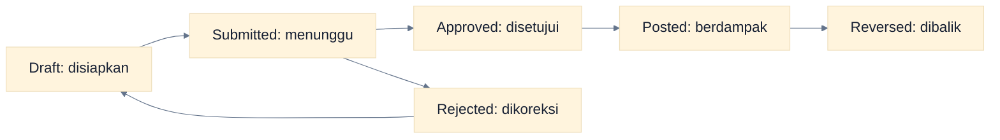

# Glosarium

Istilah berikut dijelaskan untuk pengguna non-akuntan dan mengikuti arti yang dipakai di Dasol.

| Istilah                  | Arti sederhana                                                                                                                        |
| ------------------------ | ------------------------------------------------------------------------------------------------------------------------------------- |
| Accounting Period        | Rentang tanggal pencatatan, biasanya satu bulan, yang dapat berstatus Open atau Locked.                                               |
| Accounts Payable (AP)    | Utang perusahaan kepada supplier dari purchase invoice yang belum dilunasi.                                                           |
| Accounts Receivable (AR) | Piutang perusahaan kepada customer dari sales invoice yang belum dilunasi.                                                            |
| Approval                 | Keputusan formal approve/reject atas dokumen Submitted. Approval belum sama dengan posting.                                           |
| Audit Trail              | Riwayat siapa melakukan apa, kapan, dan pada data mana. Riwayat membantu investigasi dan audit.                                       |
| Average Cost             | Biaya rata-rata unit persediaan yang digunakan engine untuk menilai stock movement keluar.                                            |
| Balance Sheet            | Laporan posisi aset, liabilitas, dan ekuitas pada tanggal tertentu.                                                                   |
| Bank Reconciliation      | Proses mencocokkan mutasi bank dengan transaksi yang dicatat di Dasol.                                                                |
| Chart of Accounts (COA)  | Daftar semua akun buku besar, misalnya Kas, Piutang, Pendapatan, dan Beban.                                                           |
| Closing Balance          | Saldo akhir pada periode atau statement.                                                                                              |
| COGS / HPP               | Harga Pokok Penjualan: biaya persediaan yang menjadi beban ketika barang diserahkan/dijual.                                           |
| Cost Center              | Dimensi untuk mengelompokkan biaya berdasarkan unit/tanggung jawab. Dukungan alur cost center lengkap belum tersedia di UI saat ini.  |
| Credit (Kredit)          | Sisi jurnal yang umumnya menambah liabilitas, ekuitas, dan pendapatan atau mengurangi aset/beban. Artinya tetap bergantung tipe akun. |
| Customer Receipt         | Penerimaan kas/bank yang dialokasikan ke sales invoice untuk mengurangi AR.                                                           |
| Debit                    | Sisi jurnal yang umumnya menambah aset dan beban atau mengurangi liabilitas/ekuitas/pendapatan. Artinya tetap bergantung tipe akun.   |
| Double Entry             | Prinsip bahwa setiap jurnal memiliki total debit yang sama dengan total kredit.                                                       |
| Draft                    | Status awal dokumen yang belum dikirim untuk persetujuan atau diposting.                                                              |
| Fiscal Year              | Tahun buku perusahaan yang terdiri dari accounting periods. UI pembuatan fiscal year/generator periode belum tersedia saat ini.       |
| General Ledger (GL)      | Buku besar yang menampilkan mutasi dan saldo setiap akun dari journal posted.                                                         |
| Goods Receipt            | Dokumen penerimaan barang yang saat Posted menambah stock dan mencatat Inventory lawan GRNI.                                          |
| GRNI                     | Goods Received Not Invoiced: akun sementara untuk barang yang sudah diterima tetapi belum direkonsiliasi dengan invoice supplier.     |
| Inventory                | Barang persediaan yang quantity dan nilainya disimpan per warehouse.                                                                  |
| Journal                  | Catatan debit dan kredit yang membentuk pembukuan. Dapat berasal dari posting dokumen atau input manual.                              |
| Outstanding              | Nilai invoice yang belum diselesaikan oleh receipt/payment atau koreksi.                                                              |
| Period Closing           | Tindakan Akuntan mengubah periode menjadi Locked agar transaksi pada tanggal tersebut tidak dimutasi.                                 |
| Posting                  | Tindakan final yang menghasilkan dampak ledger dan, sesuai modul, subledger atau stock.                                               |
| PPN                      | Pajak Pertambahan Nilai. Dasol mencatat pajak masukan dan keluaran dari tax code/rate pada invoice posted.                            |
| Profit & Loss (P&L)      | Laporan pendapatan, beban, dan laba/rugi untuk suatu periode.                                                                         |
| Reconciliation           | Pencocokan dua sumber data untuk memastikan saldo/transaksi dapat dijelaskan, misalnya bank statement dengan buku.                    |
| Rejected                 | Status dokumen yang ditolak Approver dan perlu dikoreksi sebelum diajukan kembali.                                                    |
| Reversal                 | Pembalikan transaksi Posted melalui catatan kebalikan; histori awal tidak dihapus.                                                    |
| RLS                      | Row Level Security: kontrol database yang membatasi data berdasarkan company membership dan permission.                               |
| Stock Card               | Riwayat movement quantity/nilai untuk produk dan warehouse.                                                                           |
| Submitted                | Status dokumen yang telah dikirim dan menunggu keputusan approval.                                                                    |
| Supplier Payment         | Pembayaran kas/bank yang dialokasikan ke purchase invoice untuk mengurangi AP.                                                        |
| Tax Snapshot             | Salinan detail pajak yang dibekukan saat invoice diposting agar histori laporan stabil.                                               |
| Trial Balance            | Daftar saldo akun untuk memeriksa total debit dan kredit serta menyiapkan laporan.                                                    |
| Withholding Tax          | Pajak yang dipotong saat pembayaran. Settlement Dasol saat ini belum memiliki alur withholding khusus.                                |
| Warehouse                | Lokasi penyimpanan yang menjadi dimensi saldo dan movement inventory.                                                                 |

## Status dalam Satu Kalimat

### Cara Membaca Flowchart

Ini adalah lifecycle umum, bukan aturan semua dokumen. Receipt/payment langsung Draft → Posted → Reversed, sedangkan quotation/order tidak memiliki posting accounting.

## Panduan Terkait

- [Konsep Dasar Dasol](./01-konsep-dasar-dasol.md)
- [Workflow Accounting](./09-accounting-workflows.md)
- [Quick Reference](./18-quick-reference.md)
