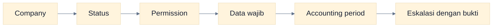

# Quick Reference

Cheat sheet ini memakai nama menu aktual. Menu yang terlihat tetap bergantung pada company, preset/custom role, dan permission pengguna.

## Jika Anda Ingin...

| Saya ingin...                      | Menu                 | Role umum                                      |
| ---------------------------------- | -------------------- | ---------------------------------------------- |
| Melihat ringkasan bisnis           | Dasbor               | Semua role                                     |
| Membaca/memutus approval           | Persetujuan          | Viewer membaca; Approver memutus sesuai domain |
| Membaca notifikasi                 | Notifikasi           | Semua role                                     |
| Membuat customer/supplier          | Pelanggan & Pemasok  | Operator, Administrator                        |
| Membuat produk/jasa                | Produk & Jasa        | Operator, Administrator                        |
| Mengelola akun                     | Daftar Akun          | Administrator, Akuntan                         |
| Membuat quotation                  | Sales Quotation      | Operator                                       |
| Membuat sales order                | Sales Order          | Operator                                       |
| Mencatat delivery                  | Sales Delivery       | Operator                                       |
| Membuat sales invoice              | Penjualan            | Operator                                       |
| Mencatat pembayaran customer       | Penerimaan Pelanggan | Operator membuat; Approver/Admin post          |
| Membuat sales return               | Retur Penjualan      | Operator                                       |
| Membuat purchase request           | Purchase Request     | Operator                                       |
| Membuat purchase order             | Purchase Order       | Operator                                       |
| Mencatat barang masuk              | Goods Receipt        | Operator                                       |
| Membuat purchase invoice           | Pembelian            | Operator                                       |
| Mencatat pembayaran supplier       | Pembayaran Pemasok   | Operator membuat; Approver/Admin post          |
| Membuat purchase return            | Retur Pembelian      | Operator                                       |
| Melihat saldo/stock card           | Persediaan           | Semua preset role                              |
| Koreksi stock                      | Stock Adjustment     | Operator membuat; Approver post                |
| Memindahkan stock                  | Stock Transfer       | Operator membuat; Approver post                |
| Stock opname                       | Stock Opname         | Operator membuat; Approver post                |
| Membuat manual journal             | Jurnal Umum          | Akuntan                                        |
| Menutup periode                    | Periode Akuntansi    | Akuntan                                        |
| Reopen periode                     | Periode Akuntansi    | Administrator                                  |
| Melihat laporan                    | Laporan              | Administrator, Akuntan, Viewer                 |
| Export laporan                     | Laporan              | Administrator, Akuntan preset                  |
| Mengelola aset tetap               | Aset Tetap           | Administrator, Akuntan                         |
| Mencatat kas masuk/keluar/transfer | Transaksi Kas & Bank | Operator membuat; Approver post                |
| Rekonsiliasi bank                  | Rekonsiliasi Bank    | Administrator, Akuntan preset                  |
| Mengelola tax code/rate            | Kode Pajak           | Administrator, Akuntan                         |
| Melihat histori perubahan          | Audit Log            | Administrator, Akuntan, Viewer                 |
| Mengatur company aktif             | Pengaturan           | Administrator                                  |
| Mengatur account mapping           | Pemetaan Akun        | Administrator, Akuntan                         |
| Mengatur membership user           | Pengguna             | Administrator                                  |
| Mengatur custom role               | Roles & Permission   | Administrator                                  |

## Siapa Melakukan Apa?

| Role preset    | Fokus                                                                           | Jangan diasumsikan                                       |
| -------------- | ------------------------------------------------------------------------------- | -------------------------------------------------------- |
| Administrator  | Company settings, user, role, master, reopen, audit                             | Bukan operator harian default                            |
| Akuntan        | COA, journal, posting finance, period close, report, tax, reconciliation, asset | Tidak memiliki sales/purchase create/approve pada preset |
| Operator       | Membuat master operasional dan transaksi lalu submit                            | Tidak approve/post/reverse/report pada preset            |
| Approver       | Review, approve/reject, post/reverse domain operasional/cash                    | Tidak membuat dokumen pada preset                        |
| Viewer/Auditor | Membaca transaksi, journal, report, stock, audit                                | Tidak mutation dan tidak export pada preset              |

## Status dan Aksi

| Status    | Arti                                    | Aksi lazim                                               |
| --------- | --------------------------------------- | -------------------------------------------------------- |
| Draft     | Sedang disiapkan                        | Edit, delete, submit sesuai permission                   |
| Submitted | Menunggu keputusan                      | Approve atau reject                                      |
| Rejected  | Ditolak dengan alasan                   | Perbaiki lalu submit ulang                               |
| Approved  | Disetujui, belum berdampak ledger/stock | Post                                                     |
| Posted    | Sudah berdampak                         | Review, settle, return, atau reverse sesuai syarat       |
| Reversed  | Efek posted sudah dibalik               | Review history; buat dokumen baru bila perlu             |
| Open      | Periode menerima mutation               | Posting/reversal dapat dilakukan jika kontrol lain lolos |
| Locked    | Periode terkunci                        | Administrator reopen hanya bila koreksi sah              |

## Journal Cepat

| Transaksi        | Debit                     | Kredit                   |
| ---------------- | ------------------------- | ------------------------ |
| Sales invoice    | AR                        | Revenue + Output Tax     |
| Customer receipt | Kas/Bank                  | AR                       |
| Purchase invoice | Expense/Asset + Input Tax | AP                       |
| Supplier payment | AP                        | Kas/Bank                 |
| Sales delivery   | COGS                      | Inventory                |
| Goods receipt    | Inventory                 | GRNI                     |
| Cash in          | Kas/Bank                  | Offset                   |
| Cash out         | Offset                    | Kas/Bank                 |
| Bank transfer    | Bank tujuan               | Bank sumber              |
| Depreciation     | Depreciation Expense      | Accumulated Depreciation |

## Sebelum Submit, Approve, dan Post

### Submit

- company, contact, tanggal, line, quantity, harga, pajak, serta warehouse benar;
- total dan memo/reference masuk akal;
- bukti disimpan melalui prosedur yang berlaku karena attachment UI belum tersedia.

### Approve

- sumber dan substansi bisnis valid;
- pemisahan tugas/self-approval policy dipatuhi;
- quantity, harga, pajak, rekening/warehouse, dan alasan dapat dijelaskan;
- pilih Reject dengan alasan bila perlu koreksi.

### Post

- status Approved untuk workflow yang memakai approval;
- periode Open dan account mapping lengkap;
- stock/outstanding cukup;
- journal serta subledger diperiksa setelah berhasil.

## Saat Ada Masalah

### Cara Membaca Flowchart

Periksa dari kiri ke kanan. Urutan ini menyelesaikan mayoritas masalah tombol hilang, data tidak tampil, dan posting ditolak.

## Tautan Cepat

- [Mulai dari pengenalan](./00-pengenalan-dasol.md)
- [Peta role dan permission](./02-peta-role-dan-permission.md)
- [Alur lintas role](./08-cross-role-workflows.md)
- [Troubleshooting lengkap](./16-troubleshooting.md)
- [Glosarium](./17-glossary.md)
