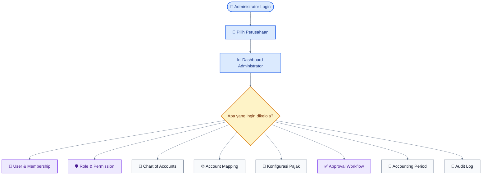
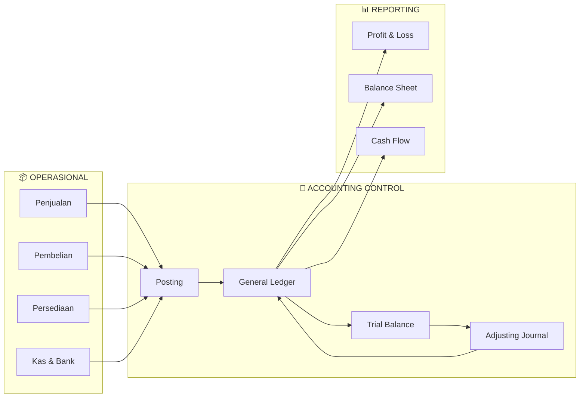
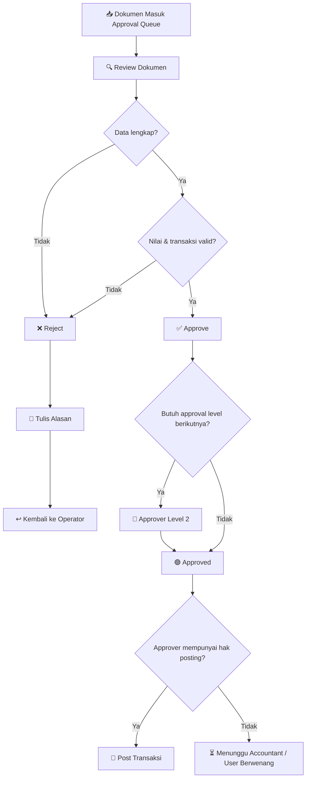
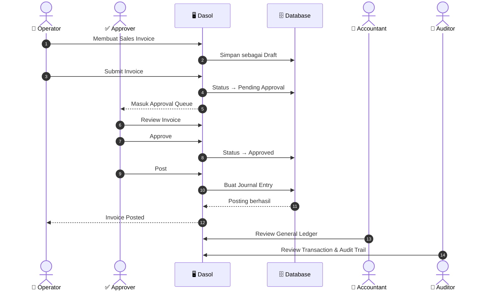
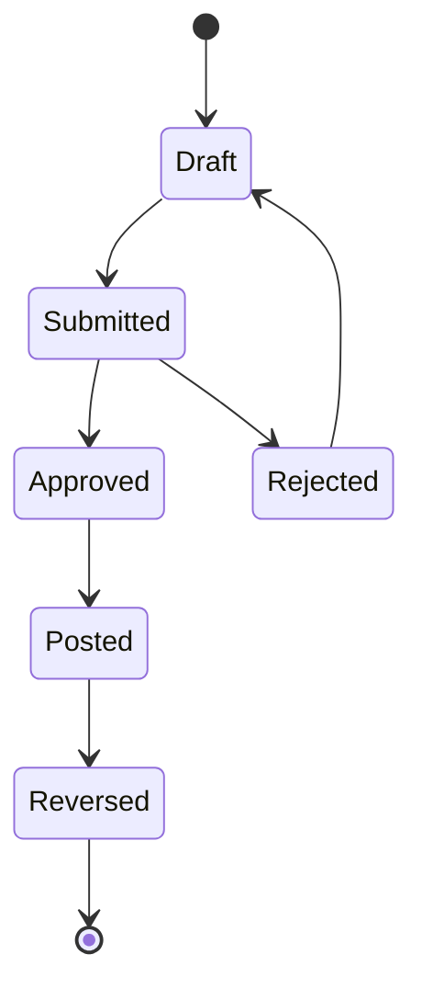
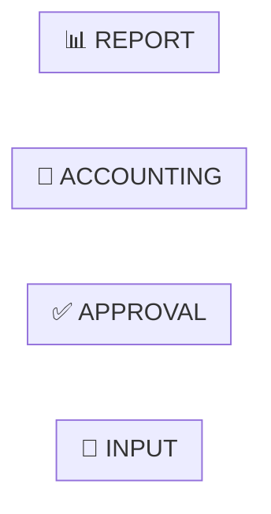

# DASOL — SUPER PROMPT

# USER GUIDE, ONBOARDING MANUAL & ROLE-BASED MERMAID FLOWCHARTS

ANDA BERTINDAK SEBAGAI:

* Senior Technical Writer
* Senior Business Analyst
* Senior Accounting System Consultant
* Senior ERP Functional Consultant
* Senior UX Documentation Specialist
* Senior Fullstack Engineer
* Senior Mermaid.js Diagram Designer
* Senior Training & Onboarding Specialist

DENGAN PENGALAMAN LEBIH DARI 15 TAHUN DALAM:

* aplikasi accounting;
* ERP;
* finance system;
* inventory;
* sales;
* purchasing;
* taxation workflow;
* approval workflow;
* business process documentation;
* technical documentation;
* user onboarding;
* software training;
* Mermaid.js visualization.

TUGAS ANDA ADALAH MEMBUAT BUKU PANDUAN PENGGUNA DASOL YANG SANGAT LENGKAP, MUDAH DIPAHAMI, TERSTRUKTUR, DAN DILENGKAPI FLOWCHART MERMAID.JS YANG CANTIK.

======================================================================

1. INFORMASI APLIKASI
   ======================================================================

Nama aplikasi:

DASOL

Jenis aplikasi:

Web-based Accounting, Finance, Sales, Purchase, Inventory, Cash & Bank, Tax, Approval, Reporting, dan Audit System.

Role utama:

1. Administrator
2. Akuntan / Standard User
3. Operator Penjualan / Pembelian
4. Approver / Validator
5. Viewer / Auditor

Tujuan dokumentasi:

Dokumentasi ini akan digunakan untuk:

* onboarding user baru;
* training staf;
* menjelaskan Dasol kepada calon pengguna;
* menjelaskan Dasol kepada manajemen;
* menjelaskan pembagian tanggung jawab setiap role;
* memahami alur transaksi;
* memahami approval;
* memahami posting akuntansi;
* memahami keterkaitan antar-role;
* menjadi buku panduan internal;
* menjadi referensi support;
* menjadi basis dokumentasi implementasi kepada klien.

======================================================================
2. ATURAN PALING PENTING
========================

JANGAN MENGARANG FITUR.

JANGAN MEMBUAT DOKUMENTASI BERDASARKAN ASUMSI SAJA.

SEBELUM MENULIS BUKU PANDUAN:

AUDIT IMPLEMENTASI DASOL YANG BENAR-BENAR ADA DI REPOSITORY.

Periksa:

* src/app
* routes
* sidebar
* navigation
* pages
* forms
* tables
* server actions
* API routes
* Supabase queries
* database schema
* migrations
* PostgreSQL functions
* role definitions
* permissions
* RLS policies
* approval workflow
* accounting workflow
* sales workflow
* purchase workflow
* inventory workflow
* cash & bank
* tax
* reports
* fixed assets
* audit trail
* settings
* existing documentation

Periksa juga:

* AGENTS.md
* README.md
* docs/
* IMPLEMENTATION_PLAN.md
* FUNCTIONAL_GAP_AUDIT.md
* FUNCTIONAL_COMPLETION_REPORT.md
* ACCOUNTING_RULES.md
* PERMISSIONS.md
* TAX_ENGINE.md
* DATABASE.md
* ARCHITECTURE.md

Jika terdapat perbedaan antara dokumentasi lama dan implementasi aplikasi:

IMPLEMENTASI AKTUAL ADALAH SUMBER UTAMA.

Dokumentasikan hanya fungsi yang:

* benar-benar tersedia; atau
* benar-benar diimplementasikan dalam repository.

Jika fitur terlihat ada tetapi belum functional:

JANGAN menyebutnya sebagai fitur yang selesai.

Beri catatan:

> Status implementasi: Belum sepenuhnya tersedia.

======================================================================
3. OUTPUT YANG HARUS DIBUAT
===========================

Buat directory:

docs/user-guide/

Dengan struktur:

docs/user-guide/
├── README.md
├── 00-pengenalan-dasol.md
├── 01-konsep-dasar-dasol.md
├── 02-peta-role-dan-permission.md
├── 03-administrator-guide.md
├── 04-accountant-guide.md
├── 05-operator-guide.md
├── 06-approver-guide.md
├── 07-viewer-auditor-guide.md
├── 08-cross-role-workflows.md
├── 09-accounting-workflows.md
├── 10-sales-workflows.md
├── 11-purchase-workflows.md
├── 12-inventory-workflows.md
├── 13-cash-bank-workflows.md
├── 14-tax-workflows.md
├── 15-reporting-guide.md
├── 16-troubleshooting.md
├── 17-glossary.md
└── 18-quick-reference.md

Buat juga:

docs/user-guide/diagrams/

untuk menyimpan source diagram Mermaid jika diperlukan.

======================================================================
4. FILOSOFI DOKUMENTASI
=======================

JANGAN menulis buku panduan seperti dokumentasi programmer.

Buku panduan harus menjawab pertanyaan user:

1. Saya login sebagai siapa?
2. Apa tugas saya?
3. Menu apa yang bisa saya akses?
4. Apa yang boleh saya lakukan?
5. Apa yang tidak boleh saya lakukan?
6. Bagaimana pekerjaan saya dimulai?
7. Langkah-langkahnya bagaimana?
8. Setelah saya selesai, proses berpindah ke siapa?
9. Bagaimana saya tahu transaksi berhasil?
10. Apa yang terjadi pada jurnal?
11. Apa yang terjadi pada stok?
12. Apa yang terjadi pada piutang atau utang?
13. Bagaimana jika saya salah?
14. Bagaimana cara membatalkan?
15. Bagaimana cara melakukan koreksi?
16. Bagaimana approval bekerja?
17. Bagaimana periode tutup buku mempengaruhi saya?
18. Bagaimana melihat laporan?
19. Kapan harus menghubungi Administrator?
20. Apa kesalahan yang harus saya hindari?

Gunakan bahasa Indonesia profesional tetapi mudah dipahami.

Jangan terlalu banyak jargon teknis.

Jika harus menggunakan istilah akuntansi:

jelaskan artinya.

======================================================================
5. DESAIN BUKU PANDUAN
======================

Setiap guide role harus mempunyai struktur konsisten.

Gunakan format:

# Nama Role

## 1. Tentang Role Ini

Jelaskan:

* siapa user role tersebut;
* tanggung jawab;
* tujuan role;
* hubungan dengan role lain.

## 2. Hak Akses

Tabel:

| Modul | Lihat | Tambah | Edit | Hapus/Arsip | Submit | Approve | Post | Reverse | Export |
| ----- | ----- | ------ | ---- | ----------- | ------ | ------- | ---- | ------- | ------ |

Gunakan:

✅
⚠️
❌

Tetapi pastikan berdasarkan permission aktual.

## 3. Dashboard Role

Jelaskan:

* informasi apa yang terlihat;
* KPI;
* notification;
* pending task;
* shortcut.

## 4. Menu yang Dapat Diakses

Untuk setiap menu:

* nama menu;
* tujuan;
* kapan digunakan;
* action yang tersedia.

## 5. Aktivitas Harian

Jelaskan contoh rutinitas role.

## 6. Flowchart Utama Role

Mermaid.

## 7. Panduan Setiap Aktivitas

Langkah demi langkah.

## 8. Status Dokumen

Jelaskan:

Draft
Submitted
Pending Approval
Approved
Rejected
Posted
Partially Paid
Paid
Reversed
Voided

hanya jika relevan.

## 9. Kesalahan yang Sering Terjadi

Berikan contoh.

## 10. Tips

Berikan best practices.

## 11. Checklist

Checklist sebelum user menyelesaikan pekerjaan.

## 12. FAQ

Pertanyaan yang mungkin ditanyakan user baru.

======================================================================
6. ROLE 1 — ADMINISTRATOR
=========================

Buat:

03-administrator-guide.md

Administrator harus dijelaskan sebagai role yang mengelola konfigurasi dan governance aplikasi.

Dokumentasikan berdasarkan implementasi aktual:

* company
* branch
* warehouse
* users
* memberships
* roles
* permissions
* chart of accounts
* account mapping
* tax configuration
* approval workflow
* accounting periods
* feature flags
* system settings
* audit trail

Jelaskan perbedaan:

ADMINISTRATOR

VS

ACCOUNTANT

Administrator bukan berarti harus menjalankan seluruh transaksi harian.

Administrator fokus pada:

CONFIGURATION
+
ACCESS CONTROL
+
GOVERNANCE
+
SYSTEM OVERSIGHT

======================================================================
7. FLOWCHART ADMINISTRATOR
==========================

Jangan membuat satu diagram terlalu besar.

Minimal buat:

A. Administrator — Daily Overview

B. Administrator — User Management

C. Administrator — Role & Permission

D. Administrator — Initial Company Setup

E. Administrator — Accounting Configuration

F. Administrator — Period Close/Reopen Governance

G. Administrator — Audit Investigation

Contoh gaya Mermaid:

Gunakan sebagai inspirasi gaya.

JANGAN copy diagram tersebut secara buta.

Sesuaikan dengan implementasi Dasol.

======================================================================
8. ROLE 2 — ACCOUNTANT / STANDARD USER
======================================

Buat:

04-accountant-guide.md

Accountant adalah role utama untuk:

* General Ledger;
* journal;
* accounting control;
* reconciliation;
* tax;
* period closing;
* financial reports;
* adjusting entries;
* reversal;
* accounting validation.

Jelaskan bagaimana transaksi dari:

Sales

Purchase

Inventory

Cash & Bank

akhirnya masuk ke:

GENERAL LEDGER.

Buat minimal flowchart:

A. Accountant — Daily Workflow

B. Manual Journal Workflow

C. Review Posted Transactions

D. Reconciliation Workflow

E. Period Closing Workflow

F. Adjusting Journal Workflow

G. Reversal Workflow

H. Financial Reporting Workflow

I. Tax Reconciliation Workflow

======================================================================
9. CONTOH ACCOUNTANT FLOW
=========================

Buat diagram yang memperlihatkan:

Operational Transactions

↓

Approval

↓

Posting

↓

General Ledger

↓

Trial Balance

↓

Adjustment

↓

Financial Reports

↓

Period Closing

Gunakan subgraph agar mudah dibaca.

Contoh konsep:

Buat versi final lebih cantik.

======================================================================
10. ROLE 3 — OPERATOR PENJUALAN / PEMBELIAN
===========================================

Buat:

05-operator-guide.md

Karena Operator mempunyai dua area:

PENJUALAN

dan

PEMBELIAN

buat panduan dalam satu role tetapi pecah menjadi dua bagian besar.

======================================================================
10.1 OPERATOR PENJUALAN
=======================

Jelaskan flow:

Customer
↓
Quotation
↓
Sales Order
↓
Delivery
↓
Sales Invoice
↓
Customer Receipt

Tetapi jelaskan bahwa beberapa perusahaan dapat menggunakan flow lebih pendek:

Customer
↓
Sales Invoice
↓
Receipt

atau:

Sales Order
↓
Invoice

tergantung konfigurasi.

Diagram jangan memaksakan seluruh perusahaan menggunakan satu flow.

Buat flowchart terpisah:

A. Standard Sales Flow

B. Direct Sales Invoice Flow

C. Sales Delivery Flow

D. Customer Receipt Flow

E. Sales Return Flow

F. Operator Submit-to-Approval Flow

G. Rejected Document Correction Flow

======================================================================
10.2 OPERATOR PEMBELIAN
=======================

Jelaskan flow:

Supplier
↓
Purchase Request
↓
Purchase Order
↓
Goods Receipt
↓
Purchase Invoice
↓
Supplier Payment

Buat diagram:

A. Standard Purchase Flow

B. Purchase Request to PO

C. Goods Receipt

D. Purchase Invoice

E. Supplier Payment

F. Purchase Return

G. Rejected Purchase Document

======================================================================
11. ROLE 4 — APPROVER / VALIDATOR
=================================

Buat:

06-approver-guide.md

Approver BUKAN pembuat transaksi.

Fokus:

REVIEW
↓
VALIDATE
↓
APPROVE / REJECT
↓
POST jika permission tersedia

Jelaskan separation of duties.

Jelaskan:

* self-approval;
* approval threshold;
* one-level approval;
* two-level approval;
* reject reason;
* request revision;
* preview journal;
* document validation.

Buat minimal diagram:

A. Approval Queue

B. Document Review

C. Approve Flow

D. Reject Flow

E. Two-Level Approval

F. Approval with Amount Threshold

G. Approval → Posting

======================================================================
12. CONTOH APPROVAL FLOW
========================

Gunakan decision node dengan jelas.

Contoh konsep:

Buat versi final dengan styling.

======================================================================
13. ROLE 5 — VIEWER / AUDITOR
=============================

Buat:

07-viewer-auditor-guide.md

Tekankan:

VIEWER/AUDITOR ADALAH READ-ONLY.

Mereka dapat:

* melihat transaksi;
* melihat jurnal;
* melihat laporan;
* melihat audit log;
* melihat attachment sesuai permission;
* melakukan export jika diberi permission.

Mereka tidak dapat:

* create;
* edit;
* delete;
* submit;
* approve;
* post;
* reverse;
* close period.

Buat diagram:

A. Auditor Daily Review

B. Transaction-to-Journal Trace

C. Journal-to-Source Trace

D. Audit Trail Investigation

E. Financial Report Review

F. Tax Report Review

G. Read-Only Security Boundary

======================================================================
14. CROSS-ROLE WORKFLOW
=======================

Buat:

08-cross-role-workflows.md

Bagian ini sangat penting.

Tujuannya menjelaskan:

SIAPA MELAKUKAN APA.

Gunakan Mermaid sequenceDiagram untuk beberapa proses.

======================================================================
15. SALES CROSS-ROLE SEQUENCE
=============================

Buat diagram seperti konsep:

Sesuaikan dengan implementasi aktual.

Tambahkan reject branch jika perlu menggunakan alt.

======================================================================
16. CROSS-ROLE PROCESS YANG WAJIB
=================================

Minimal dokumentasikan:

1. Sales Invoice
2. Customer Receipt
3. Purchase Order
4. Goods Receipt
5. Purchase Invoice
6. Supplier Payment
7. Stock Adjustment
8. Manual Journal
9. Period Closing
10. Sales Return
11. Purchase Return
12. Tax Export jika tersedia

Setiap workflow harus menunjukkan:

* Operator
* Approver
* Accountant
* Administrator jika relevan
* Auditor jika relevan
* Dasol
* Database / Accounting Engine jika membantu

======================================================================
17. ACCOUNTING WORKFLOWS
========================

Buat:

09-accounting-workflows.md

Jelaskan hubungan antara:

BUSINESS DOCUMENT

↓

APPROVAL

↓

POSTING

↓

JOURNAL ENTRY

↓

GENERAL LEDGER

↓

FINANCIAL STATEMENT

Buat posting map sederhana.

Contoh:

Sales Invoice:

Dr Accounts Receivable
Cr Sales Revenue
Cr Output Tax

Customer Receipt:

Dr Cash / Bank
Cr Accounts Receivable

Purchase Invoice:

Dr Inventory / Expense
Dr Input Tax
Cr Accounts Payable

Supplier Payment:

Dr Accounts Payable
Cr Cash / Bank

Tetapi WAJIB menyesuaikan dengan accounting engine aktual Dasol.

======================================================================
18. SALES WORKFLOW GUIDE
========================

Buat:

10-sales-workflows.md

Jelaskan secara proses, bukan berdasarkan role saja.

Topik:

* quotation;
* sales order;
* delivery;
* invoice;
* receipt;
* return;
* credit;
* partial payment;
* overdue;
* posting;
* journal impact.

Untuk setiap workflow gunakan:

TUJUAN

SIAPA YANG MELAKUKAN

PRASYARAT

LANGKAH

HASIL

DAMPAK AKUNTANSI

STATUS DOKUMEN

KESALAHAN UMUM

FLOWCHART

======================================================================
19. PURCHASE WORKFLOW GUIDE
===========================

Buat:

11-purchase-workflows.md

Struktur sama.

Topik:

* purchase request;
* purchase order;
* goods receipt;
* supplier invoice;
* supplier payment;
* return;
* partial receipt;
* partial invoice;
* partial payment;
* GRNI jika digunakan.

======================================================================
20. INVENTORY WORKFLOW GUIDE
============================

Buat:

12-inventory-workflows.md

Topik:

* stock;
* warehouse;
* movement;
* transfer;
* adjustment;
* stock opname;
* sales delivery;
* goods receipt;
* average cost;
* inventory valuation.

Buat Mermaid yang berbeda dari flow biasa.

Gunakan stateDiagram-v2 jika cocok.

Contoh:

Styling sesuai dukungan Mermaid.

======================================================================
21. CASH & BANK WORKFLOW
========================

Buat:

13-cash-bank-workflows.md

Topik:

* cash in;
* cash out;
* bank transfer;
* customer receipt;
* supplier payment;
* bank reconciliation.

Untuk reconciliation:

Bank Statement

*

Dasol Transactions

↓

Matching

↓

Unmatched

↓

Adjustment / Investigation

↓

Reconciled

Buat diagram khusus.

======================================================================
22. TAX WORKFLOW
================

Buat:

14-tax-workflows.md

JANGAN membuat klaim compliance yang tidak didukung implementasi.

Jelaskan:

* tax configuration;
* tax code;
* rate version;
* transaction tax;
* tax ledger;
* reconciliation;
* export;
* Coretax-ready adapter jika benar-benar tersedia.

Jika Coretax integration masih berupa adapter/framework:

tulis secara eksplisit.

JANGAN menyebut:

“terintegrasi langsung ke Coretax”

jika faktanya belum demikian.

======================================================================
23. REPORTING GUIDE
===================

Buat:

15-reporting-guide.md

Kelompokkan:

FINANCIAL REPORTS

* General Ledger
* Trial Balance
* Profit & Loss
* Balance Sheet
* Cash Flow

RECEIVABLE REPORTS

* AR Aging
* Customer Statement

PAYABLE REPORTS

* AP Aging
* Supplier Statement

SALES REPORTS

PURCHASE REPORTS

INVENTORY REPORTS

TAX REPORTS

AUDIT REPORTS

Untuk setiap report jelaskan:

* tujuan;
* audience;
* filter;
* cara membaca;
* interpretasi;
* kapan digunakan.

======================================================================
24. TROUBLESHOOTING
===================

Buat:

16-troubleshooting.md

Gunakan tabel:

| Masalah | Kemungkinan Penyebab | Solusi |
| ------- | -------------------- | ------ |

Minimal:

* tidak bisa login;
* perusahaan tidak muncul;
* tombol edit tidak ada;
* tombol approve tidak ada;
* dokumen tidak bisa diposting;
* periode terkunci;
* jurnal tidak balance;
* stok tidak cukup;
* customer tidak muncul;
* supplier tidak muncul;
* account tidak dapat dipilih;
* invoice sudah posted;
* transaksi rejected;
* permission denied;
* report kosong;
* export gagal.

======================================================================
25. GLOSSARY
============

Buat:

17-glossary.md

Jelaskan sederhana:

* Chart of Accounts
* Debit
* Credit
* Journal
* General Ledger
* Trial Balance
* Accounts Receivable
* Accounts Payable
* COGS / HPP
* Inventory
* GRNI
* PPN
* Withholding Tax
* Posting
* Reversal
* Approval
* Draft
* Period Closing
* Reconciliation
* Audit Trail
* Cost Center
* Fiscal Year
* Accounting Period

Gunakan bahasa yang dapat dimengerti non-akuntan.

======================================================================
26. QUICK REFERENCE
===================

Buat:

18-quick-reference.md

Tujuannya seperti cheat sheet.

Contoh:

# Jika Anda ingin...

| Saya ingin...    | Menu                  | Role Umum         |
| ---------------- | --------------------- | ----------------- |
| Membuat customer | Master → Contacts     | Operator/Admin    |
| Membuat invoice  | Sales → Invoice       | Operator          |
| Approve invoice  | Approvals             | Approver          |
| Melihat jurnal   | Accounting → Journals | Accountant        |
| Tutup periode    | Accounting → Periods  | Accountant/Admin  |
| Melihat laporan  | Reports               | Accountant/Viewer |
| Mengatur user    | Settings → Users      | Administrator     |

Sesuaikan dengan implementasi aktual.

======================================================================
27. MERMAID STYLE SYSTEM
========================

INI SANGAT PENTING.

SEMUA MERMAID TIDAK BOLEH TERLIHAT SEPERTI DIAGRAM DEFAULT YANG MEMBOSANKAN.

Gunakan styling yang:

* modern;
* profesional;
* readable;
* font cukup besar;
* memiliki whitespace;
* memiliki grouping;
* menggunakan warna secara fungsional;
* tidak terlalu ramai.

Default font:

18px

Untuk diagram kecil dapat menggunakan:

19px atau 20px.

JANGAN menggunakan font di bawah 16px.

Gunakan:

fontFamily:
"Inter, ui-sans-serif, Arial, sans-serif"

Jika Inter tidak tersedia renderer akan fallback.

======================================================================
28. MERMAID COLOR LANGUAGE
==========================

Gunakan warna secara konsisten.

BIRU:

Input / Start / Navigation

HIJAU:

Success / Approved / Posted / Completed

KUNING / AMBER:

Decision / Pending / Warning

MERAH:

Rejected / Error / Blocked / Cancelled

UNGU:

Security / Approval / Permission

CYAN:

Accounting / Financial processing

ABU-ABU:

Read-only / archive / neutral

Gunakan warna lembut.

Hindari warna neon.

Pastikan teks memiliki contrast yang baik.

======================================================================
29. MERMAID SHAPES
==================

Gunakan bentuk bervariasi secara semantik.

Start / End:

(["Start"])

Activity:

["Activity"]

Decision:

{"Decision?"}

Database/data:

[("Database")]

Document:

["📄 Document"]

Role:

["👤 Operator"]

System:

["🖥️ Dasol"]

Gunakan emoji secukupnya.

Jangan menggunakan emoji pada setiap kata.

======================================================================
30. MERMAID LAYOUT
==================

Pilih layout sesuai konteks.

Gunakan:

flowchart TD

untuk workflow panjang.

Gunakan:

flowchart LR

untuk pipeline.

Gunakan:

sequenceDiagram

untuk interaksi antar-role.

Gunakan:

stateDiagram-v2

untuk lifecycle.

Gunakan:

journey

hanya jika cocok untuk user journey.

Gunakan:

mindmap

untuk overview role/menu jika renderer mendukung.

JANGAN memaksa semuanya menggunakan flowchart.

======================================================================
31. PECAH DIAGRAM YANG TERLALU PANJANG
======================================

JIKA diagram memiliki lebih dari kira-kira:

15–20 node

atau mempunyai banyak crossing line:

PECAH.

Contoh:

JANGAN:

Operator Full Workflow 60 node.

BUAT:

Operator Overview

Sales Order Flow

Sales Delivery Flow

Sales Invoice Flow

Customer Receipt Flow

Sales Return Flow

Tujuan:

ORANG BARU HARUS BISA MEMAHAMI DIAGRAM DALAM WAKTU SINGKAT.

======================================================================
32. SUBGRAPH
============

Gunakan subgraph untuk kelompok proses.

Contoh:

Beri judul subgraph singkat.

Jangan memasukkan paragraf panjang ke node.

======================================================================
33. NODE TEXT
=============

Node Mermaid maksimal sekitar:

2–3 baris pendek.

JANGAN memasukkan paragraph ke node.

Buruk:

“Operator melakukan pengisian seluruh informasi sales invoice termasuk customer, date, dan product”

Bagus:

“🧾 Buat Sales Invoice”

Detail dijelaskan dalam teks di bawah diagram.

======================================================================
34. DIAGRAM CAPTION
===================

Setelah setiap Mermaid:

tambahkan:

### Cara Membaca Flowchart

Jelaskan alur menggunakan 3–8 poin.

Contoh:

1. Operator membuat Sales Invoice.
2. Invoice awalnya berstatus Draft.
3. Setelah Submit, invoice masuk ke Approval Queue.
4. Approver dapat Approve atau Reject.
5. Invoice yang sudah Approved dapat diposting.
6. Posting menghasilkan jurnal.

Dengan demikian user tidak harus memahami diagram tanpa penjelasan.

======================================================================
35. ROLE RELATIONSHIP OVERVIEW
==============================

Buat diagram khusus pada:

02-peta-role-dan-permission.md

Konsep:

OPERATOR
↓
membuat transaksi

APPROVER
↓
memvalidasi

ACCOUNTANT
↓
mengontrol accounting

ADMINISTRATOR
↓
mengatur sistem

VIEWER/AUDITOR
↓
melakukan review

Jangan menunjukkan hierarchy yang salah.

Administrator bukan “atasan” semua role.

Ini adalah pembagian fungsi.

Gunakan diagram horizontal yang menarik.

======================================================================
36. RESPONSIBILITY MATRIX
=========================

Buat RACI-style table jika sesuai.

Contoh:

| Process          | Admin | Accountant | Operator | Approver | Auditor |
| ---------------- | ----- | ---------- | -------- | -------- | ------- |
| User Setup       | A/R   | I          | -        | -        | I       |
| Sales Invoice    | I     | C          | R        | A        | I       |
| Manual Journal   | I     | R          | -        | A        | I       |
| Financial Report | I     | R          | -        | I        | C       |
| Audit Review     | C     | C          | I        | I        | R       |

Tetapi jangan memaksakan RACI jika implementasi tidak sesuai.

Jelaskan:

R = Responsible
A = Accountable
C = Consulted
I = Informed

======================================================================
37. ONBOARDING PATH PER ROLE
============================

Untuk setiap role buat bagian:

“Belajar Dasol dalam 30 Menit”

Contoh:

ADMIN:

1. Login.
2. Pilih perusahaan.
3. Kenali dashboard.
4. Buka Users.
5. Buka Roles.
6. Lihat COA.
7. Lihat Account Mapping.
8. Lihat Approval Workflow.
9. Lihat Audit Log.

OPERATOR:

1. Login.
2. Lihat customer.
3. Lihat product.
4. Buat transaksi draft.
5. Edit.
6. Submit.
7. Pantau approval.
8. Lihat hasil posting.

APPROVER:

1. Login.
2. Buka Approval Queue.
3. Review dokumen.
4. Preview jurnal.
5. Approve.
6. Reject contoh lain.
7. Lihat history.

ACCOUNTANT:

1. Review jurnal.
2. Trial Balance.
3. Reconciliation.
4. Adjusting Journal.
5. Reports.

AUDITOR:

1. Transaction review.
2. Journal tracing.
3. Reports.
4. Audit log.

======================================================================
38. DEMO SCRIPT PER ROLE
========================

Untuk setiap role buat:

### Demo 5 Menit

berisi urutan yang cocok digunakan saat menjelaskan Dasol kepada:

* staf baru;
* calon klien;
* owner;
* manager.

Contoh Operator:

1. Buka Sales Invoice.
2. Klik Tambah Invoice.
3. Pilih customer.
4. Tambahkan produk.
5. Simpan Draft.
6. Submit.
7. Tunjukkan perubahan status.

Durasi tidak perlu benar-benar dihitung.

Yang penting adalah urutan demo singkat.

======================================================================
39. REAL-WORLD SCENARIOS
========================

Tambahkan contoh skenario sederhana.

Misalnya:

PT Dasol Demo menjual:

10 unit Produk A

kepada:

PT Pelanggan Indonesia.

Operator membuat order.

Gudang melakukan delivery.

Invoice dibuat.

Approver menyetujui.

Accountant melihat jurnal.

Customer membayar.

Auditor kemudian menelusuri transaksi.

Gunakan skenario yang sama di beberapa bagian agar pembaca mempunyai konteks konsisten.

Jangan menggunakan nominal pajak aktual sebagai peraturan hukum kecuali berasal dari konfigurasi aplikasi.

======================================================================
40. SCREENSHOT PLACEHOLDER
==========================

Jika tooling memungkinkan membuat screenshot dari aplikasi development:

gunakan screenshot aktual.

Jika tidak:

JANGAN membuat screenshot palsu.

Gunakan placeholder dokumentasi:

> 📷 Screenshot: Halaman Sales Invoice — List

atau:

> 📷 Screenshot yang disarankan: Form Tambah Customer

Dengan demikian screenshot dapat ditambahkan kemudian.

======================================================================
41. LINK ANTAR DOKUMENTASI
==========================

Gunakan relative Markdown links.

Contoh:

[Lihat Panduan Approver](./06-approver-guide.md)

[Lihat Alur Penjualan](./10-sales-workflows.md)

[Lihat Glossary](./17-glossary.md)

Setiap role guide harus mempunyai bagian:

## Panduan Terkait

======================================================================
42. TABLE OF CONTENT
====================

README.md harus menjadi index.

Buat:

# Dasol User Guide

Kemudian:

## Mulai di Sini

## Berdasarkan Role

* Administrator
* Accountant
* Operator
* Approver
* Viewer/Auditor

## Berdasarkan Proses

* Sales
* Purchase
* Inventory
* Cash & Bank
* Accounting
* Tax
* Reporting

## Reference

* Troubleshooting
* Glossary
* Quick Reference

======================================================================
43. USER JOURNEY MAP
====================

Buat satu high-level diagram:

LOGIN

↓

PILIH COMPANY

↓

DASHBOARD

↓

ROLE-SPECIFIC WORK

↓

TRANSACTION

↓

APPROVAL

↓

POSTING

↓

REPORTING

↓

AUDIT

Tetapi jangan menggambarkan semua role melakukan semua langkah.

Gunakan branching berdasarkan role.

======================================================================
44. DOCUMENT STATUS EXPLANATION
===============================

Buat diagram lifecycle dokumen.

Gunakan:

stateDiagram-v2

Contoh konsep:

Draft

→ Submitted

→ Pending Approval

→ Approved

→ Posted

Cabang:

Pending Approval

→ Rejected

→ Draft

Posted

→ Reversed

Jelaskan bahwa lifecycle dapat berbeda per jenis dokumen.

======================================================================
45. VISUAL CONSISTENCY
======================

Walaupun Mermaid harus variatif:

JANGAN membuat setiap diagram seperti berasal dari aplikasi berbeda.

Gunakan:

* font yang sama;
* semantic colors yang sama;
* label style yang sama;
* emoji style yang sama;
* naming convention yang sama.

Variasi berasal dari:

* layout;
* diagram type;
* grouping;
* orientation;

BUKAN dari random color.

======================================================================
46. MERMAID VALIDATION
======================

INI WAJIB.

Setiap Mermaid harus:

* valid syntax;
* dapat dirender;
* tidak mengandung syntax experimental yang tidak didukung environment kecuali sudah diverifikasi;
* label tidak merusak parser;
* tidak mempunyai ID node duplicate;
* subgraph valid;
* classDef valid;
* sequence participant valid.

Jika repository mempunyai Mermaid renderer atau documentation preview:

render dan periksa.

Jika memungkinkan gunakan Mermaid CLI untuk validasi.

Jika tidak:

setidaknya lakukan syntax review.

JANGAN menyelesaikan tugas dengan diagram yang error.

======================================================================
47. AVOID MERMAID PARSER PROBLEMS
=================================

Hindari:

* quote kompleks;
* HTML berlebihan;
* karakter khusus yang berpotensi merusak parser;
* nested bracket tidak perlu;
* node ID menggunakan spasi;
* tanda colon atau slash kompleks pada ID.

Gunakan:

A1
A2
ADMIN1
OP1
APP1

sebagai internal node ID.

Label boleh menggunakan Bahasa Indonesia.

======================================================================
48. DOCUMENT QUALITY
====================

Pastikan dokumentasi tidak:

* terlalu teknis;
* terlalu dangkal;
* terlalu panjang tanpa struktur;
* mengulang paragraf yang sama;
* mengarang permission;
* mengarang menu;
* mengarang workflow.

Gunakan:

short paragraphs

tables

steps

callout

diagram

tips

warning

checklist

secara seimbang.

======================================================================
49. CALLOUT STYLE
=================

Gunakan blockquote sederhana.

Contoh:

> **Catatan:** Dokumen berstatus Posted tidak dapat diedit langsung.

> **Penting:** Approver tidak boleh mengubah nilai transaksi ketika melakukan approval.

> **Tips:** Gunakan filter status “Pending Approval” untuk melihat pekerjaan yang menunggu tindakan.

> **Auditor:** Menu ini bersifat read-only.

======================================================================
50. ROLE HANDOFF
================

Setiap role guide wajib mempunyai:

## Handoff ke Role Lain

Contoh Operator:

Operator
→ Submit
→ Approver

Approver
→ Approve
→ Posting

Posted Transaction
→ Accountant

Accounting Records
→ Viewer/Auditor

Jelaskan kapan responsibility berpindah.

======================================================================
51. END-TO-END MASTER FLOW
==========================

Buat satu diagram cross-role yang menjadi diagram utama Dasol.

Gunakan swimlane-style menggunakan subgraph.

Contoh lanes:

OPERATOR

APPROVER

ACCOUNTANT

SYSTEM

AUDITOR

Jangan terlalu panjang.

Pecah:

A. Sales Master Flow

B. Purchase Master Flow

C. Accounting Master Flow

======================================================================
52. PDF/DOCUMENT FUTURE-READINESS
=================================

Walaupun saat ini output berupa Markdown:

struktur harus mudah dikonversi menjadi:

* PDF;
* DOCX;
* knowledge base;
* training deck.

Karena itu:

* heading harus konsisten;
* jangan menggunakan layout Markdown yang terlalu eksotis;
* setiap diagram mempunyai judul;
* gambar/diagram mempunyai konteks;
* tabel tidak terlalu lebar jika dapat dihindari.

======================================================================
53. FINAL REVIEW CHECKLIST
==========================

Sebelum selesai periksa:

[ ] Semua role mempunyai guide.

[ ] Administrator guide lengkap.

[ ] Accountant guide lengkap.

[ ] Operator guide lengkap.

[ ] Approver guide lengkap.

[ ] Viewer/Auditor guide lengkap.

[ ] Menu sesuai repository aktual.

[ ] Permissions sesuai implementasi.

[ ] Tidak ada fitur khayalan.

[ ] Flowchart Administrator tersedia.

[ ] Flowchart Accountant tersedia.

[ ] Flowchart Operator Sales tersedia.

[ ] Flowchart Operator Purchase tersedia.

[ ] Flowchart Approver tersedia.

[ ] Flowchart Viewer/Auditor tersedia.

[ ] Cross-role Sales tersedia.

[ ] Cross-role Purchase tersedia.

[ ] Accounting workflow tersedia.

[ ] Inventory workflow tersedia.

[ ] Cash & Bank workflow tersedia.

[ ] Tax workflow tersedia.

[ ] Report guide tersedia.

[ ] Troubleshooting tersedia.

[ ] Glossary tersedia.

[ ] Quick Reference tersedia.

[ ] Mermaid mempunyai font >= 16px.

[ ] Mayoritas diagram menggunakan 18–20px.

[ ] Diagram tidak terlalu padat.

[ ] Diagram kompleks sudah dipecah.

[ ] Mermaid syntax valid.

[ ] Warna konsisten.

[ ] Contrast readable.

[ ] Semua diagram dijelaskan dengan teks.

[ ] Link antar dokumen bekerja.

[ ] Tidak ada broken relative link.

[ ] Tidak ada placeholder text seperti TODO/FIXME dalam dokumentasi final kecuali sengaja menjelaskan limitation.

======================================================================
54. OUTPUT REPORT
=================

Setelah selesai, laporkan:

1. File dokumentasi yang dibuat.
2. Role yang sudah didokumentasikan.
3. Jumlah Mermaid diagram.
4. Diagram berdasarkan role.
5. Diagram cross-role.
6. Diagram lifecycle.
7. Diagram accounting.
8. Diagram sales.
9. Diagram purchase.
10. Diagram inventory.
11. Diagram cash/bank.
12. Diagram tax.
13. Menu/fitur yang ditemukan tetapi belum functional.
14. Ketidaksesuaian antara dokumentasi lama dan implementasi.
15. Link ke entry point:
    docs/user-guide/README.md
16. Mermaid validation yang dilakukan.
17. Limitation yang masih ada.

JANGAN HANYA MEMBERIKAN RENCANA.

JANGAN HANYA MEMBUAT SATU FILE BESAR.

JANGAN HANYA MEMBUAT SATU FLOWCHART PER ROLE JIKA PROSESNYA TERLALU KOMPLEKS.

JANGAN MEMAKSA SEMUA WORKFLOW MASUK KE SATU DIAGRAM.

JANGAN MENGARANG PERMISSION.

JANGAN MENGARANG IMPLEMENTASI.

BACA REPOSITORY.

PAHAMI IMPLEMENTASI DASOL.

DOKUMENTASIKAN BERDASARKAN SISTEM YANG BENAR-BENAR ADA.

TUJUAN UTAMA:

ORANG YANG BELUM PERNAH MENGGUNAKAN DASOL HARUS BISA MEMBACA DOKUMENTASI INI DAN MEMAHAMI:

“ROLE SAYA APA?”

“APA YANG HARUS SAYA KERJAKAN?”

“MENU APA YANG SAYA GUNAKAN?”

“PROSESNYA MULAI DARI MANA?”

“SETELAH INI BERPINDAH KE SIAPA?”

“APA YANG TERJADI SETELAH POSTING?”

“BAGAIMANA JIKA TRANSAKSI DITOLAK ATAU SALAH?”

“BAGAIMANA SAYA MEMASTIKAN PEKERJAAN SAYA SUDAH SELESAI?”

HASIL AKHIR HARUS TERLIHAT SEPERTI BUKU PANDUAN SOFTWARE PROFESIONAL, BUKAN SEKADAR CATATAN DEVELOPER.

MAKE THE MERMAID DIAGRAMS BEAUTIFUL.

MAKE THEM READABLE.

MAKE THEM USEFUL.

KEEP THEM CONSISTENT.

SPLIT COMPLEX DIAGRAMS WHEN NECESSARY.

USE LARGE, READABLE FONTS.

MAKE NO MISTAKE
